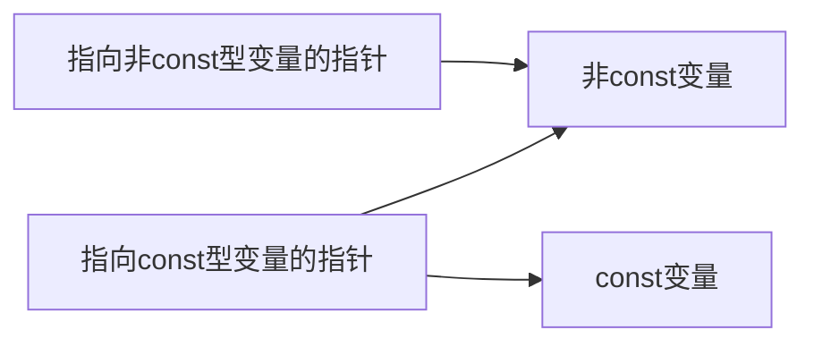

# 怎样使用类和对象

## 一、利用构造函数对类和对象进行初始化

### ·对象的初始化

### ·用构造函数实现数据成员的初始化

构造函数：C++中提供了构造函数，来处理对象的初始化。构造函数是一种特殊的成员函数，与其他成员函数不同，不需要用户来调用，而是在建立对象时自动执行。

**构造函数的名字必须与类名同名，不能任意命名。**

```c++
class Student
{
private:
    string name;
    int sex;
    int age;
    string number;
public:
    void display();
    int grade;
    Student();//构造函数
    Student(int age_val,int sex_val,string name_val,string number_val);
    Student(int age_val,int sex_val);
    Student(int sex_val,string name_val,int age_val=100000);
};

Student::Student()
{
    //构造函数
    name="default";
    sex=0;
    age=0;
    number="default";
}
```

有关构造函数的说明：

（1）什么时候调用构造函数？

在建立类对象时会自动调用构造函数。

（2）构造函数的返回值

构造函数没有返回值，它的作用只是对对象进行初始化。

（3）构造函数的调用

构造函数不需要用户调用，**同时也不能被用户调用**！

（4）可以用一个类对象初始化另一个类对象，如

```c++
Student stu1;
Student stu2=stu1;
```

此时，把对象t1的各数据成员的值拷贝到t2相应各个成员，而不调用构造函数stu2.Student()

（5）在构造函数的函数体中不仅可以对数据成员赋初值，而且可以包含其他语句，例如cout语句。但一般不提倡在构造函数中加入与初始化无关的内容，以保证程序的清晰度。

（6）如果用户自己没有定义构造函数，则C++系统会自动生成一个构造函数，只是这个构造函数函数体是空的，也没有参数，不执行初始化操作。

### ·带参数的构造函数

语法：**构造函数名（类型1 形参1，类型2 形参2  ......）**

定义对象格式：**类名 对象名（实参1，实参2……）**

```c++
Student::Student(int age_val,int sex_val,string name_val,string number_val)
{
    name=name_val;
    age=age_val;
    sex=sex_val;
    number=number_val;
}
```


### ·用参数初始化表对数据成员初始化

语法：

**类名::构造函数名（[参数表]）: [成员初始化表]**

**{**

​		**[构造函数体]**

**}**

```c++
Student::Student(int age_val,int sex_val):age(age_val),sex(sex_val) {}
```


### ·构造函数的重载

```c++
Student();//构造函数
Student(int age_val,int sex_val,string name_val,string number_val);
Student(int age_val,int sex_val);
Student(int sex_val,string name_val,int age_val=100000);
```

注意：一个类只能有一个默认构造函数。

定义对象的语句也要进行注意：

```c++
Student stu;				//使用的是默认构造函数，正确
Student stu1();				//向使用默认构造函数，但是格式错误，不应该右括号
```

尽管在一个类中可以有多个构造函数，但是对于每一个对象来说，建立对象时只执行其中一个构造函数，并非每个构造函数都被执行。

### ·使用默认参数的构造函数

构造函数中参数的值既可以通过实参传递，也可以指定为某些默认值，即如果用户不指定实参，编译系统就使实参的值为默认值。

```c++
Student(int sex_val,string name_val,int age_val=100000);

Student::Student(int sex_val,string name_val,int age_val)
{
    age=age_val;
    name=name_val;
    number="???";
    sex=sex_val;
}
```


## 二、利用析构函数进行清理工作

析构函数也是一个特殊的成员函数，它的作用与构造函数相反，它的名字使类名的前面加一个“~”符号。

当对象的生命周期结束时，会自动执行析构函数。具体以下几种情况，程序会执行析构函数：

（1）如果在一个函数中定义了一个对象（局部对象），当这个函数被调用结束时，对象应该释放，在对象释放前自动执行析构函数。

（2）静态局部对象在函数调用结束时对象并不释放，只在main函数结束或调用exit时，才调用static局部对象的析构函数。

（3）如果定义了一个全局对象，则在程序的流程离开其作用域时（如main函数结束），调用该全局的对象的析构函数。

（4）如果用new运算符动态地建立了一个对象，当delete时，先调用该对象的析构函数。

## 三、调用构造函数和析构函数的顺序


## 四、对象数组

```c++
Student stud[50];
Student stud1[3]={1,2,3};//合法，3个实参分别传递给3个数组元素的构造函数
```


## 五、对象指针

### ·指向对象的指针

一个对象存储空间的起始地址就是对象的指针。可以定义一个指针变量，用来存放对象的地址，这就是指向对象的指针变量。

```c++
Student *pt;//定义pt为指向Student类对象的指针变量
Student stu;//定义t1为Student类对象
pt=&stu;//将t1的起始地址赋给pt
```

```c++
(*pt).age//访问age
```

### ·指向对象成员的指针

#### （1）指向对象数据成员的指针

语法：

**数据类型名 *指针变量名**

```c++
p1=&t1.hour;	//指向t1对象的数据成员hour的指针 p1
cout<<*p1<<endl;//输出p1指向的值，就是t1.hour
```


#### （2）指向对象成员函数的指针

##### ①指向普通函数的指针

语法

**类型名 （*指针变量名）（参数表列）;**

```c++
void (*p)(); //p是指向void型函数的指针变量
p=fun;
(*p)();//调用fun函数
```

##### ②指向成员函数的指针

三个匹配：①函数参数的类型和参数个数匹配；②函数返回值的类型匹配；③所属的类匹配

语法：

**数据类型名 （类名::*指针变量名）（参数表列）**

```c++
void (Time::*p2)(); //定义p2为指向time类中公用成员函数的指针变量
p2=&Time::get_time;//使指针变量指向一个公用成员函数的一般形式
```


### ·指向当前对象的指针：this指针

在每一个成员函数中都包含一个特殊的指针，这个指针的名字是固定的，称为this。

this指针是指向本类对象的指针，它的值是当前被调用的成员函数所在的对象的起始地址。

this指针是隐式使用的，它是作为参数被传递给成员函数的。本来成员函数volume的定义是

```c++
int Box::volume()
{
	return height*width*length;
}
```

C++把它处理为

```c++
int Box::volume(Box *this)
{
	return (this->height*this->width*this->length);
}
```

在调用该成员函数时，实际上是用以下面的方式调用的：

```c++
a.volunme(&a);
```

之后将对象a的地址传递给形参this指针，然后按this的指向去引用其他成员。

## 六、公用数据的保护

再多人合作编程时，公用数据的保护很重要。

若某数据既要在一定范围内可以共享，又不能被随便修改，那么可以把有关的数据定义为常量。

### ·常对象

（1）常对象格式：

**1、类名 const 对象名[(实参表)];**

**2、const 类名 对象名[(实参表)];**

二者等价。定义常对象时，必须同时对之初始化，之后不能再改变。

说明：如果一个对象被声明为常对象，则通过该对象只能调用它的常成员函数，而不能调用该对象的普通成员函数（除了由系统自动调用的隐式的构造函数和析构函数）。**常成员函数是常对象唯一的对外接口。**

（2）常成员函数，如：

```c++
void display() const;//将函数声明为const，常成员函数可以访问对象中的成员，但不可以修改
```

（3）可以被常成员函数修改的类成员

```c++
mutable int count;//定义count可以被常成员函数修改它的值。
```

### ·常对象成员

可以将对象的成员声明为const，包括常数据成员和常成员函数。

#### 1、常数据成员

用const声明

注意：**只能通过构造函数的参数初始化表对常数据成员进行初始化，任何其他函数都不能对常数据成员进行修改**。

```c++
const int hour;//定义hour为常数据成员
Time::Time(int h)
{hour=h;}//非法，不能通过构造函数中的赋值对其进行赋值
Time::Time(int h):hour(h) {}//合法，通过参数初始化表对常数据成员hour初始化
```

注意：常对象的数据成员都是常数据成员，**因此在定义常对象时，构造函数只能用参数初始化表对常数据成员进行初始化。**

#### 2、常成员函数

特性：

（1）常对象只能调用常成员函数

（2）常成员函数只能引用本类中的数据成员， 而不能修改它们。

|       数据成员        |  非const的普通成员函数   |      const成员函数       |
| :-------------------: | :----------------------: | :----------------------: |
| 非const的普通数据成员 |   可以引用，可以改变值   | 可以引用，但不可以改变值 |
|     const数据成员     | 可以引用，但不可以改变值 | 可以引用，但不可以改变值 |
|       const对象       |  不允许调用普通成员函数  | 可以引用，但不可以改变值 |

### ·指向对象的常指针

将指针变量声明为const型，这样指针变量始终保持为初值，不能改变，即其指向不变。如：

```c++
Time t1(10,12,15),t2;//定义对象
Time *const ptr1;	 //const位置在指针变量名前面，指定ptr1为常指针变量
ptr1=&t1;			 //ptr1指向对象t1，之后就不能再被改变
ptr1=&t2;			 //企图改变，错误！
```

如果一个指针固定地与一个对象相联系，那就把这个指针声明为const类型

往往用常指针作为函数的形参，目的是不允许在函数执行过程中改变指针变量的值，使其始终指向原来的对象。

### ·指向常对象的指针变量

表示指针变量指向的变量是常变量，不能通过此指针来改变其值。

格式：**const 类型名 *指针变量名；**

说明：

（1）与上不同，如果一个变量已被声明为常变量，只能用指向常变量的指针变量指向它，而不能用一般的指针变量指向它。

```c++
const char c[]="aoligei";//定义const型数组
const char *p;//定义指向const型的char变量的指针
p=c;//p指向c的第一个元素   合法
char *p1=c;//p1不是指向常变量的指针，不合法。
```

（2）指向常变量的指针变量除了可以指向常变量外，还可以指向未被声明为const的变量。此时不能通过此指针变量改变变量的值。

```c++
char c1='a';//声明char变量
const char *p;//定义指向常变量的指针p
p=&c1;//p指向c1
*p='b';//企图通过p修改c1的值，不合法
c1='b';//直接修改，合法
```

（3）如果函数的形参是指向普通变量的指针，实参只能用指向普通变量的指针，而不可以用指向const变量的指针。

|          形参           |       实参        | 合法否 | 改变指针所指向的变量的值 |
| :---------------------: | :---------------: | :----: | :----------------------: |
| 指向非const型变量的指针 | 非const变量的地址 |  合法  |           可以           |
| 指向非const型变量的指针 |  const变量的地址  | 不合法 |           ///            |
|  指向const型变量的指针  |  const变量的地址  |  合法  |          不可以          |
|  指向const型变量的指针  | 非const变量的地址 |  合法  |          不可以          |




### ·对象的常引用


### ·const型数据的小结

|          形式           |                             含义                             |
| :---------------------: | :----------------------------------------------------------: |
|     Time const t1;      |           t1是常对象，其值在任何情况下都不能被改变           |
| void Time::fun() const; | fun是Time类中的常成员函数，可以引用，但不能修改本类中的数据成员 |
|     Time *cosnt p;      |               p是对象的常指针，p的指向不能改变               |
|     const Time *p;      |      p是常对象的指针，p指向的类对象的值不能通过p来改变       |
|    const Time &t1=t;    |     t1是对象t的引用，二者指向同一存储空间，t的值不能改变     |

## 七、对象的动态建立和释放

```c++
new Box;//建立一个新对象


Box *pt;//定义一个指向Box类对象的指针变量pt
pt = new Box;//在pt中存放了新建对象的起始地址
cout<<pt->height;//输出成员height

//执行new时，对新建对象初始化
Box *pt=new box123(1,2,3);
//释放空间
delete pt;
```


## 八、对象的赋值和复制

### ·对象的赋值

### ·对象的复制

（1）一般形式：

**①类名 对象2（对象1）；**

用对象1复制出对象2。很方便。

**②类名 对象名1=对象名2**

（2）复制构造函数

```c++
//The copy constructor definiton
Box::Box(const Box& b)
{
	//<所有成员赋值>
	...
}
```

（3）复制构造函数和普通构造函数的区别

在编写时，需要注意：

**①类名（形参列表）;    //普通构造函数的声明**

**②类名（类名 &对象名）；//复制构造函数的声明**

## 九、静态成员

### 1、静态数据成员

如果想在同类的多个对象之间实现数据共享，可以用静态的数据成员

静态数据成员是一种特殊的数据成员。它以关键字static开头，如：

```c++
class Box
{
	public:
    int volume();
    private:
    static int number;
    int h;
    int w;
    int l;
};
```

（1）在一个类中可以有一个或多个静态数据成员，所有的对象都共享这些静态数据成员，都可以引用它。

（2）静态数据成员不随对象的建立而分配空间，不随对象的撤销而释放。

（3）静态数据成员可以初始化，但只能在类体外进行初始化。如：

```c++
int Box::number=1;//只能这么做，不可以用参数初始化表对静态成员初始化
```

（4）静态数据成员既可以通过对象名引用，又可以通过类名来引用。

### 2、静态成员函数

成员函数也可以定义为静态的，如

```c++
static int volume();
```

和静态数据成员一样，静态成员函数是类的一部分而不是对象的一部分。如果要在类外调用公用的静态成员函数，要用类名和域运算符“::”。如：

```c++
Box::volume();
//或者
a.volume();
```

值得注意：**静态成员函数中没有this指针，因此不能访问本类中的非静态成员**。

## 十、友元

### 1、友元函数

#### ①将普通函数声明为友元函数

#### ②友元成员函数

**friend函数不仅可以是一般函数，而且可以是另一个类中的成员函数。**

### 2、友元类

## 十一、类模板

格式：

```c++
template <class numtype>
class Compare
{
    public:
    Compare(numtype a,numtype b)
    {x=a;y=b}
    numtype min()
    {return (x<y)?x:y;}
    private:
    numtype x,y;
};
```

类模板定义对象格式：

**类模板名 <实际类型名> 对象名(参数表);**

```c++
Compare <int> cmp(4,7);//实际类型为int，对象名cmp，调用构造函数x=4，y=7
```

