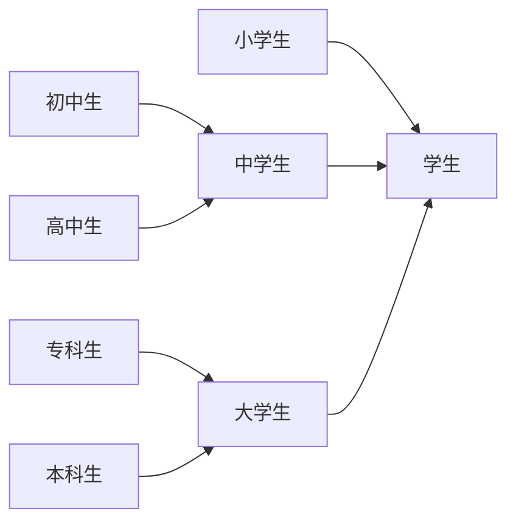
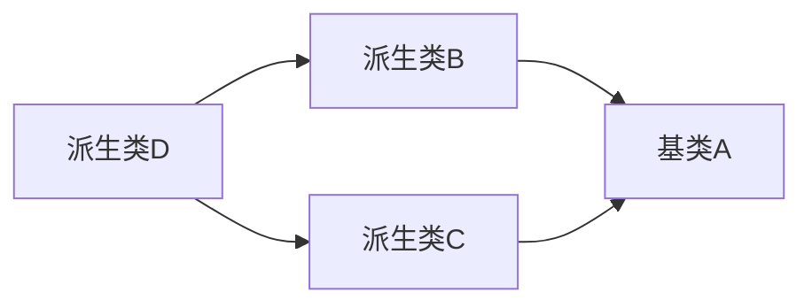

# 继承与派生

## 一、继承与派生的概念

C++中可重用性是通过“继承”这一机制来实现的。因此继承是C++的一个重要组成部分。

一个新类从已有的类那里获得其已有特性，这种现象称为类的继承。子类继承父类的全部特征。

**单继承：**一个派生类只从一个基类派生

**多重继承：**一个派生类有两个或多个基类的称为多重继承

·关于基类和派生类的关系：**派生类是基类的具体化，而基类则是派生类的抽象**。




## 二、派生类的声明方式

格式：

**class 派生类名：[继承方式] 基类名**

**{**

​	**派生类新增加的成员**

**};**

```c++
class Student1:public Student//继承基类Student，继承方式：公有继承
{
	public:
    	...
    private:
    	...
};
```

继承方式：public、private、protected

## 三、派生类的构成

派生类中的成员包括从基类继承过来的成员和自己增加的成员两大部分。

构造一个派生类的步骤：

1. **从基类接受成员**：派生类把基类全部的成员（不包括构造函数和析构函数）接收过来，不能选择接收谁不接收谁。

2. **调整从基类接受的成员：**

   1. 改变基类成员在派生类中的访问属性
   2. 创建新的成员来覆盖基类的同名成员

   **3.在声明派生类是增加的成员**

## 四、派生类成员的访问属性

比较容易混淆的问题：

1、派生类的成员函数访问基类的成员。

2、在派生类外访问基类的成员。

**基类成员在派生类中的访问属性决定于两点：①不同的继承方式②基类成员所声明的访问属性**

### ·公有继承

说明：基类的**公有成员**和**保护成员**在派生类中保持原有属性，其**私有成员**仍为基类私有。

| 在基类的访问属性 | 继承方式 | 在派生类中的访问属性 |
| :--------------: | :------: | :------------------: |
|     private      |  public  |       不可访问       |
|      public      |  public  |        public        |
|    protected     |  public  |      protected       |

基类的私有成员还是只能由基类的成员函数访问。在派生类外，可以访问公用基类中的公用成员函数。

### ·私有继承

说明：积累的公有成员和保护成员在派生类中成了私有成员。**其私有成员仍为基类私有**，派生类还是不能访问。

| 在基类的访问属性 | 继承方式 | 在派生类中的访问属性 |
| :--------------: | :------: | :------------------: |
|     private      | private  |       不可访问       |
|      public      | private  |       private        |
|    protected     | private  |       private        |


### ·保护成员和保护继承

基类的公有成员和保护成员在派生类中成了保护成员，其私有成员仍为基类私有。

保护成员：**不能被外界引用，但可以被派生类的成员引用**。

| 在基类的访问属性 | 继承方式  | 在派生类中的访问属性 |
| :--------------: | :-------: | :------------------: |
|     private      | protected |       不可访问       |
|      public      | protected |      protected       |
|    protected     | protected |      protected       |


### ·多级派生时的访问属性

## 五、※派生类的构造函数和析构函数

声明一个派生类对象时，需要调用基类的构造函数和派生类的构造函数。因此在执行派生类构造函数时系统自动调用基类构造函数。

### ·简单的派生类的构造函数

简单的派生类构造函数一般形式：

​     **派生类构造函数名（总参数表）：基类构造函数名（参数表）**

​     **{派生类中新增数据成员初始化语句}**

```c++
Student1(int n,string name1,char s,int a,string ad):Student(n,name1,s)
//前三个参数由基类的构造函数参数传递，后两个参数为新增成员初始化语句，在下面进行初始化
//调用基类的构造函数，因此这些参数是实参而不是形参
{
 	age=a;
    addr=ad;
}
```

```c++
//也可以用参数初始化列表进行初始化
Student1(int n,string name1,char s,int a,string ad):Student(n,name1,s),age(a),addr(ad)
{}
```


### ·有子对象的派生类的构造函数

若类中包含类，下面介绍这样的类的构造函数。

派生类构造函数的任务应该包括3个部分：

（1）对基类数据成员初始化

（2）对子对象数据成员初始化

（3）对派生类数据成员初始化

·语法：

   **派生类构造函数名（总参数表）：基类构造函数名（参数表），子对象名（参数表）**

   **{派生类中新增数据成员初始化语句}**

```c++
Student1(int n,string nam,int n1,string name1,int a,string ad):monitor(n1,name1),Student(n,nam)
{addr=ad;age=a}
//1、调用基类构造函数，对基类数据成员初始化
//2、调用子对象构造函数，对子对象数据成员初始化
//3、再执行派生类构造函数本身，对派生类数据成员初始化
```


### ·多层派生时的构造函数

一个类可以派生出一个派生类，派生类还可以继续派生，形成派生的层次结构。这种构造函数结构同上述所讲解。

```c++
Student(int a,string name);//基类构造函数
Student1(int a,string name,string ad):Student(a,name);//第一级派生类构造函数
Student2(int a,string name,string ad,char c):Student1(a,name,ad);//第二级派生类构造函数
//注意：子类构造函数只需写出其上一层派生类的构造函数即可。构造函数会一层一层调用
//1、初始化基类的数据成员age和name
//2、再初始化Student1的数据成员addr
//3、最后再初始化Student2的数据成员ch
```


### ·派生类构造函数的特殊形式

### ·派生类的析构函数

先执行派生类的析构函数，再执行基类的析构函数。

## 六、多重继承

### ·声明多重继承的方法

如果已经声明了类A、类B、类C，可以声明多重继承的派生类D：

```c++
class D:public A,private B,protected C
{//D类新增加的成员}
```

D是多重继承的派生类，它以公用继承方式继承A类、以私有继承方式继承B类、以保护继承方式继承C类。D按不同的继承方式的规则继承A、B、C的属性，确定各基类的成员在派生类中的访问权限。

### ·多重继承派生类的构造函数

与单继承时构造函数形式基本相同，只是在初始化表中包含多个基类的构造函数。语法：

​    **派生类构造函数名（总参数表）：基类1构造函数（参数表），基类2构造函数（参数表）......**

​    **{派生类中新增数据成员初始化}**

### ·多重继承引起的二义性问题

### ·虚基类

#### 1、虚基类的作用

如果一个派生类有多个直接基类，而这些直接基类又有一个共同的基类，则在最终的派生类中会保留该间接共同基类数据成员的多份同名成员。

为了避免此情况，C++提供**虚基类**的方法，**使得在继承间接共同基类时只保留一份成员**。



如上图，此时派生类D中既有从B类继承的成员也有从C类继承的成员，B、C类都有从A类继承的成员，因此，D类中有了同名的成员。占用空间大而且会有二义性。

采用虚基类：

```C++
class A//声明基类A
{...};
class B:virtual public A//声明类B是类A的公用派生类，A是B的虚基类
{...};
class C:virtual public A//声明类C是类A的公用派生类，A是C的虚基类
{...};

//注意：虚基类并不是在声明基类时声明的，而是在声明派生类时，指定继承方式时声明的。
```

经过这样的声明，当基类通过多条派生路线被一个派生类继承时，该派生类只继承该基类一次，也就是说，基类成员只保留一次。

#### 2、虚基类的初始化

如果在虚基类中定义了带参数的构造函数，而且没有定义默认的构造函数，则在其所有派生类（包括直接派生或间接派生的派生类）中，通过构造函数的初始化表对虚基类进行初始化

#### 3、虚基类的简单应用举例

## 七、基类与派生类的转换

​		三种继承方式中，只有公有继承能较好地保留基类的特征，它保留了除了构造函数和析构函数以外的基类所有成员，非公有派生类不能实现基类的全部功能。**因此，只有公有派生类才是基类真正的子类型，它完整继承了基类的功能。**

·Question：基类与派生类对象之间是否也有赋值兼容的关系，可否进行类型间的转换？

·Answer：可以。基类与派生类对象之间有赋值兼容关系，由于派生类中包含从基类继承的成员，**因此可以将派生类对象的值赋给基类对象，在用到基类对象的时候可以用其子类对象代替。**

#### 1、派生类对象可以向基类对象赋值

可以用子类（公有派生类）对象对其基类对象赋值

```c++
A a1; //定义基类A的对象a1
B b1; //定义A类的公用派生类B的对象b1
a1=b1； //用派生类B对象b1对基类对象a1赋值
```

说明：由于派生类中有基类的所有成员变量以及成员函数（除构造函数与析构函数），所以执行赋值操作时，舍弃派生类的新成员，将基类的成员赋值给基类对象。

**※注意：此操作不可逆！**

```c++
A a1; //基类
B b1; //派生类
b1=a1; //错误！基类中无派生类的新对象，不可以这么做
```

也就是说：赋值时，等号右侧没有等号左侧需要的变量时，不可赋值。如：一个基类的不同子类也不可互相赋值。

#### 2、派生类对象可以替代基类对象向基类对象的引用进行赋值或初始化

如已定义了基类A对象a1，可以定义a1的引用变量

```c++
A a1;
B b1;
A& r=a1; //定义基类A对象的引用r，并用a1对其初始化
//若这么写：合法
A& r=b1; //定义基类A对象的引用r，并用派生类B对象b1对其初始化
```

注意：此时r并不是b1的别名，也不是与b1共享同一段存储单元。它只是b1中基类部分的别名，与b1中基类部分共享同一存储单元，r与b1具有相同的起始地址。

#### 3、如果函数的参数是基类对象或基类对象的引用，相应的实参可以用子类对象

```c++
//有一函数fun
void fun(A& r)
{
    //形参为类A的对象的引用
    cout<<r.num<<endl;
}
int main()
{
    ...
    B b1;
    fun(b1);//用派生类作为实参，只能输出派生类中基类成员的值
    return 0;
}
```


#### 4、派生类对象的地址可以赋值给指向基类对象的指针变量（指向基类对象的指针变量也可以用来指向派生类对象）

通过指向基类对象的指针，只能访问派生类中的基类成员，而不能访问派生类增加的成员

```c++

```


## 八、继承与组合

## 九、继承在软件开发中的重要意义

