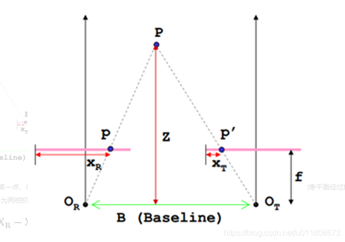

# 双目测距原理

参考：

https://blog.csdn.net/jinking01/article/details/112852419

https://blog.csdn.net/u011808673/article/details/90641589

## 1、基本原理

如图，P是待测物体上的某一点，OR和OT分别是两个相机的光心，p和p'为成像点，f为焦距。B为两相机中心距，Z为所求深度信息。
$$
设P到点p'的举例为dis:\\
dis=B-(X_r-X_T)\\
\frac{dis}{B}=\frac{Z-f}{Z}\\
Z=\frac{f·B}{X_R-X_T}
$$
**XR-XT就是视差，有了视差就可以求深度信息。**

有关dis的推导：成像平面相同，长度设为L
$$
\frac{L}{2}+p_x=X_R\\
\frac{L}{2}-p'_x=X_T\\
X_R-X_T=p_x+p'_x\\
B=p_x+p'_x+pp'=dis+p_x+p'_x=dis+(X_R-X_T)
$$

## 2、实际测距过程

分成四个步骤：**相机标定——双目校正——双目匹配——计算深度信息**

### 2.1 相机标定

计算相机内参以及畸变系数。

### 2.2 双目校正

​	双目校正是根据摄像头定标后获得的单目内参数据（焦距、成像原点、畸变系数）和双目相对位置关系（旋转矩阵和平移向量），分别对左右视图进行消除畸变和行对准，使得左右视图的成像原点坐标一致（CV_CALIB_ZERO_DISPARITY标志位设置时发生作用）、两摄像头光轴平行、左右成像平面共面、对极线行对齐。**这样一幅图像上任意一点与其在另一幅图像上的对应点就必然具有相同的行号，只需在该行进行一维搜索即可匹配到对应点。**

### 2.3 双目匹配

​	**双目匹配的作用是把同一场景在左右视图上对应的像点匹配起来，这样做的目的是为了得到视差图。**双目匹配被普遍认为是立体视觉中最困难也是最关键的问题。得到视差数据，通过上述原理中的公式就可以很容易的计算出深度信息。

https://blog.csdn.net/weixin_40524689/article/details/124929419

https://blog.csdn.net/chx725/article/details/81169593

