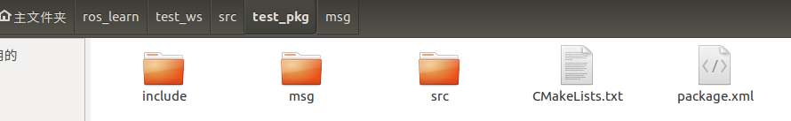

# Ros基础

## 一、Ros编写代码基本过程

### ·工作空间介绍

工作空间（workspace）是一个存放工程开发相关文件的文件夹

| 工作空间中的文件夹 | 作用                          |
| :----------------- | ----------------------------- |
| src                | 代码空间（Source Space）      |
| build              | 编译空间（Build Space）       |
| devel              | 开发空间（Development Space） |
| install            | 安装空间（Install Space）     |

※补充：上述四个空间的具体作用。

### ·创建工作空间

此操作相当于Windows下编译器（IDE）中创建编译环境以及编程环境。如codeblocks创建的project。

#### 1、创建工作空间命令

```shell
mkdir -p /catkin_ws/src  #catkin_ws是工作空间名，命名随意；src为代码空间，必须是src
cd ./catkin_ws/src #进入工作空间src目录
catkin_init_workspace  #初始化工作空间
```

注意：初始化工作空间要在src中实现！也就是说CMakeLists.txt要在src文件中，否则执行catkin_make命令会报错。

#### 2、编译工作空间

```shell
cd catkin_ws
catkin_make
```

#### 3、设置环境变量

```shell
source devel/setup.bash #让系统可以找到自创工作空间和功能包
```

#### 4、检查环境变量

```shell
echo $ROS_PACKAGE_PATH
```

### ·创建功能包

语法：**工作空间src根目录**下：

catkin_create_pkg <package_name> [depend1] [depend2] [msg_type]

解释：package_name为功能包的命名，随意。但是同一个工作空间不能有相同名字的功能包

depend1、2等等为支持的功能包，比如roscpp（C++），rospy（python）

msg_type为消息类型，如：std_msgs

```shell
catkin_create_pkg test_pkg rospy roscpp std_msgs
```

### ·编写程序

在目录：test_ws/src/test_pkg/src中编写所要执行的程序

test_ws为工作空间命，test_pkg为功能包名

### ·CMakeLists.txt文件编写※

#### 1、介绍最简易的CMakeLists.txt

```shell
cmake_minimum_required(VERSION 3.0.2)   #设定最低版本的cmake
project(test_pkg)	#功能包

find_package(catkin REQUIRED COMPONENTS
  roscpp
  rospy
  std_msgs
)#找到功能包涉及的库

catkin_package(
)

include_directories(
# include
  ${catkin_INCLUDE_DIRS}
)

add_executable(xxx src/xxx.cpp) #生成可执行文件xxx，代码在src下的xxx.cpp中
target_link_libraries(xxx ${catkin_LIBRARIES}) #库连接
```

其实CMakeLists.txt这个文件在之前已经被创建好，自己只需要写最后一句话生成可执行文件即可。

其余的复杂编写在后续介绍

### ·运行可执行文件

命令：rosrun

前提：设置环境变量

```shell
source devel/setup.bash #让系统可以找到自创工作空间和功能包
rosrun test_pkg xxx  #test_pkg为功能包名，xxx为可执行文件名
```

## 二、发布者Publisher的编程实现

### ·如何实现一个发布者

1、初始化Ros节点

2、向Ros Master注册节点信息，包括发布的话题名和话题中的消息类型

3、创建消息数据

4、按照一定频率循环发布消息

```C++
//发布turtle1/cmd_vel话题，消息类型为geometry_msgs：：Twist
#include <ros/ros.h>
#include <geometry_msgs/Twist.h>

int main(int argc,char **argv)
{
	//初始化节点
	ros::init(argc,argv,"velocity_publisher");
	//创建句柄
	ros::NodeHandle n;
	//创建一个Publisher，发布/turtle1/cmd_vel的topic
    //说明：geometry_msgs::Twist为消息类型 /turtle1/cmd_vel话题名 10为队列长度
    //话题名一定要和订阅者的订阅话题名相同，不然无法数据通信
	ros::Publisher turtle_vel_pub = n.advertise<geometry_msgs::Twist>("/turtle1/cmd_vel",10);
	//循环频率
    ros::Rate loop_rate(10);
    int count =0;
    while (ros::ok())
    {
        //初始化消息
        geometry_msgs::Twist vel_msg;
        vel_msg.linear.x=0.5;
        vel_msg.angular.z=0.2;
        //发布消息
        turtle_vel_pub.publish(vel_msg);
        ROS_INFO("Publish turtle velocity command[%0.2f m/s,%0.2f 					rad/s]",vel_msg.linear.x,vel_msg.angular.z);
        //按照设置的循环频率进行休眠
    	loop_rate.sleep();
    }
    return 0;
}
```

## 三、订阅者Subscriber的编程实现

1、初始化ROS节点

2、订阅需要的话题

3、循环等待话题消息，接收到消息后进入回调函数

4、在回调函数中完成消息处理

例子：创建一个订阅者节点，订阅海龟发出的pose（姿态）消息，并处理消息

```c++
//订阅turtle1/pose话题，消息类型turtlesim::Pose
#include <ros/ros.h>
#include <geometry_msgs/Twist.h>

//接收到订阅的消息后，会进入消息回调函数（可以理解成中断）
void poseCallback(const turtlesim::Pose::ConstPtr& msg)
{
    //将收到的消息打印
    ROS_INFO("Turtle pose: x:%0.6f,y:%0.6f",msg->x,msg->y);
}

int main(int argc, char **argv)
{
    //初始化Ros节点
    ros::init(argc,argv,"pose_subscriber");
    
    //创建节点句柄
    ros::NodeHandle n;
    
    //创建一个Subscriber，订阅名为/turtle1/pose的topic，注册回调函数poseCallback
    ros::Subscriber pose_sub=n.subscribe("/turtle1/pose",10,poseCallback);
    
    //循环等待回调函数
    ros::spin();
    
    return 0
}
```

## 四、话题消息的定义与使用

### ·如何自定义话题信息

#### 1、定义msg文件

.msg文件是定义消息数据类型的文件，这个文件可以让编译器将我们想要的消息类型编译为相应语言（python，C++等）的程序（头文件）。

创建位置：**功能包中创建msg文件夹，msg文件中放自定义的话题消息。**



例子：创建一个个人信息的消息类型

```
string name
uint8 sex
uint8 age

uint8 unknown = 0
uint8 male = 1
uint8 female = 2
```

注意：上述代码并非某些语言代码。上三行是数据类型，下三行可以理解为宏定义，方便后续使用。

#### 2、在package.xml中添加对功能包的依赖

```
<build_depend>message_generation</build_depend>
<exec_depend>message_runtime</exec_depend>
```

添加一个动态生成程序代码的功能包的依赖

添加位置如图：


#### 3、在CMakeLists.txt添加编译选项

part1：由于上面添加了一个功能包的依赖，所以此处也要添加

```
find_package(...... message_generation)
```

添加位置如图：


part2：添加将.msg文件编译成不同语言的程序的编译项

```
add_message_files(FILES Person.msg)
generate_messages(DEPENDENCIES std_msgs)
```

添加位置如图（下图中应为：generate_messages）


part3：创建message运行的依赖

```
catkin_package(...... message_runtime)
```

添加位置如图：


### ·发布者与订阅者的程序编写

程序编写大体情况还是和一开始的一样，需要注意的是自定义的消息管道要相同，否则无法接收到数据

#### 1、发布者程序

```c++
#include <iostream>
#include <ros/ros.h>
#include "test_pkg/Person.h"

using namespace std;

int main(int argc,char **argv)
{
	//初始化ros节点
	ros::init(argc,argv,"Person_Publisher");
	//创建句柄
	ros::NodeHandle n;
	//注册节点信息
	ros::Publisher person_info_pub = n.advertise<test_pkg::Person>("/Person_info",10);
	//设置循环频率
	ros::Rate loop_rate(1);
	
	while(ros::ok())
	{
		//初始化消息类型
		test_pkg::Person person_msg;//定义消息
		person_msg.name="Gzh";
		person_msg.sex=test_pkg::Person::male;
		person_msg.age=20;

		//发布消息
		person_info_pub.publish(person_msg);
		
		loop_rate.sleep();
	}
	return 0;
}

```

#### 2、订阅者程序

```c++
#include <iostream>
#include <ros/ros.h>
#include "test_pkg/Person.h"
#include <string.h>

using namespace std;

void PersonInfoCallback(const test_pkg::Person::ConstPtr& msg)
{
	//string sex_str[3]={"unknown","male","female"};
	char *sex_str[3]={"unknown","male","female"};
	ROS_INFO("Person Info: Name:%s,sex:%s,age:%d,",msg->name.c_str(),sex_str[msg->sex],msg->age);
}

int main(int argc, char **argv)
{
	//创建ros节点
	ros::init(argc,argv,"Person_Subcriber");
	//创建节点句柄
	ros::NodeHandle n;
	//创建订阅者
	ros::Subscriber person_sub=n.subscribe("/Person_info",10,PersonInfoCallback);

	ros::spin();
	return 0;
}
```

#### 3、修改CMakeLists.txt文件

```shell
add_executable(Person_Subscriber src/Person_Subscriber.cpp)
target_link_libraries(Person_Subscriber ${catkin_LIBRARIES})
add_dependencies(Person_Subscriber ${PROJECT_NAME}_generate_messages_cpp)

add_executable(Person_Publisher src/Person_Publisher.cpp)
target_link_libraries(Person_Publisher ${catkin_LIBRARIES})
add_dependencies(Person_Publisher ${PROJECT_NAME}_generate_messages_cpp)
```

将上述代码添加到CMakeLists.txt文件相应位置中，如图：


#### 4、运行程序结果：


