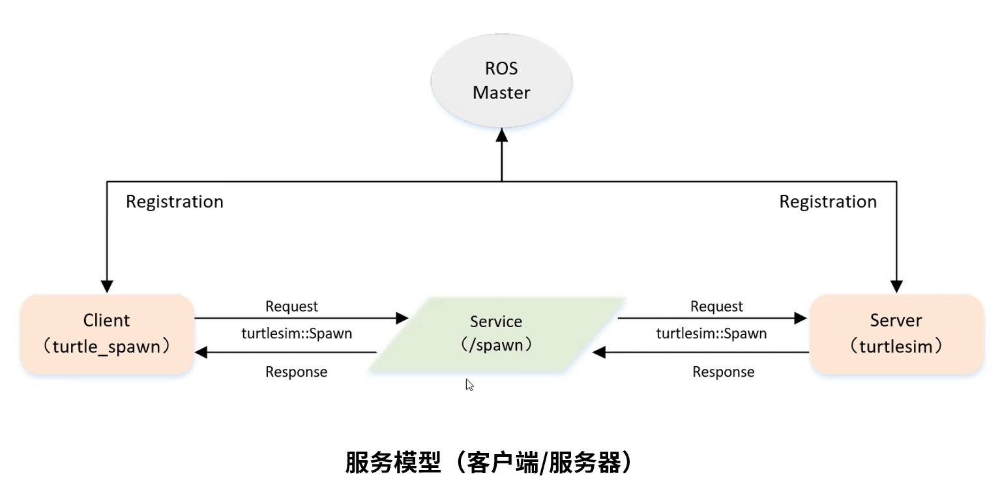
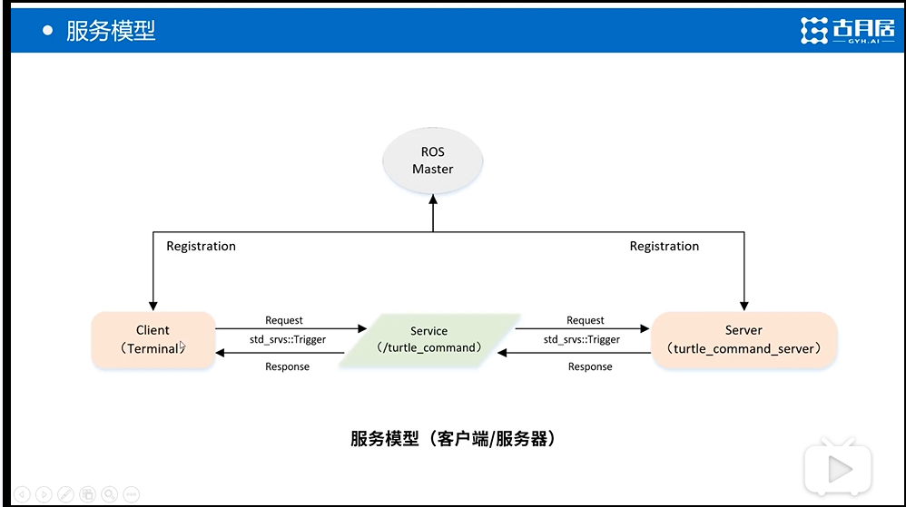

# ROS客户端服务端程序编写



客户端向服务端请求（Request），服务端接收到后处理请求并回复（Response）

请求时，客户端调用call以及相应的参数(参数由服务端决定)，服务器接收到消息后，进入回调函数并且执行回调函数，且对客户端返回数据。

## 一、客户端Client的程序实现

### ·创建服务器功能包

在src目录下

```shell
catkin_create_pkg test_service roscpp rospy std_msgs geometry_msgs turtlesim
```

### ·客户端编程

操作步骤：

（1）初始化ROS节点

（2）创建一个Client实例

（3）发布服务请求数据

（4）等待Server处理之后的应答结果

```c++
//请求/spawn服务，服务数据类型turtlesim::Spawn
#include <ros/ros.h>
#include <turtlesim/Spawn.h>

int main(int argc,char** argv)
{
    //初始化ROS节点
    ros::init(argc,argv,"turtle_spawn");
    
    //创建节点句柄
    ros::NodeHandle node;
    
    //发现/spawn服务后，创建一个服务客户端，连接名为/spawn的service
    ros::service::waitForService("/spawn");
    ros::ServiceClient add_turtle = node.serviceClient<turtlesim::Spawn>("/spawn");
    
    //初始化turtlesim::Spawn的请求数据
    turtlesim::Spawn srv;
    srv.request.x=2.0;
    srv.request.y=2.0;
    srv.request.name="turtle2";
    
    //请求服务器调用
    ROS_INFO("Call service to spawn turtle[x:%0.6f,y:%0.6f,name:%s]",srv.request.x,srv.request.y,srv.request.name.c_str());
    
    add_turtle.call(srv);
    
    //显示服务器调用结果
    ROS_INFO("Spawn turtle successfully [name:%s]",srv.request.name.c_str());
    
    return 0;
}
```

解释：主程序：

第三行：（阻塞型函数）等待服务器（spawn）响应，如果没有就一直等待，如果有就进行下一步。其中括号内为服务器的名字

第四行：创建客户端（命令：ros命名空间下的ServicClient类型），名字为add_turtle。<>中为数据类型，请求位置（/spawn）。

第十行：与发布者订阅者类似（发布者为publish函数），call是将封装好的请求数据发送出去。（call为阻塞型函数，一直发送并且等待回应直到服务端回应）

### ·修改对应的CMakeLists.txt文件

在相应位置添加如下代码：

```cmake
add_executable(turtle_spawn src/turtle_spawn.cpp)
target_link_libraries(turtle_spawn ${catkin_LIBRARIES})
```

### ·运行程序

**※注意**：每个程序对应的本步骤都不一样，这个程序是这样操作的。

先运行一个海龟节点，之后再启用客户端程序。这是因为客户端程序向海龟服务器发送请求。

```ros
roscore
rosrun turtlesim turtlesim_node
rosrun learning_service turtle_spawn
```

## 二、服务端Server的程序实现



### ·服务端编程

操作步骤：

（1）初始化ROS节点

（2）创建Server实例

（3）循环等待服务请求，进入回调函数

（4）在回调函数中完成服务功能的处理，并反馈应答数据

```c++
//
#include <ros/ros.h>
#include <geometry_msgs/Twist.h>
#include <std_srvs/Trigger.h>

ros::Publisher turtle_vel_pub;
bool pubCommand = false;

//service回调函数，输入参数req，输出参数res
bool commandCallback(std_srvs::Trigger::Request &req,std_srvs::Trigger::Response &res)
{
    pubCommand = !pubCommand;
    
    //显示请求数据
    ROS_INFO("Publish turtle velocity command [%s]",pubCommand==true?"Yes":"No");
    
    //设置反馈数据
    res.success = true;
    res.message = "Change turtle command state!";
    
    return true;
}

int main(int argc,char **argv)
{
    //Ros节点初始化
    ros::init(argc,argv,"turtle_command_server");
    
    //创建节点句柄
    ros::NodeHandle n;
    
    //创建一个名为/turtle_command的server,注册回调函数commandCallback
    ros::ServiceServer command_service = n.advertiseService("/turtle_command",commandCallback);
    //创建一个Publisher，发布名为/turtle1/cmd_vel的topic，消息类型为geometry_msgs::Twist，队列长度为10
    turtle_vel_pub=n.advertise<geometry_msgs::Twist>("/turtle1/cmd_vel",10);
    
    //循环等待回调函数
    ROS_INFO("Ready to receive turtle command");
    //设置循环频率
    ros::Rate loop_rate(10);
    
    while(ros::ok())
    {
        //查看一次回调函数队列
        ros::spinOnce();
        
        if(pubCommand)
        {
            geometry_msgs::Twist vel_msg;
            vel_msg.linear.x=0.5;
            vel_msg.angular.z=0.2;
            turtle_vel_pub.publish(vel_msg);
        }
        
        //按照循环时间设置频率
        loop_rate.sleep();
    }
}
```

服务端与订阅者的编程类似，都注册了回调函数等待消息。

### ·修改CMakeLists.txt文件

添加代码：

```cmake
add_executable(turtle_command_server src/turtle_command_server.cpp)
target_link_libraries(turtle_command_server ${catkin_LIBRARIES})
```

### ·运行程序

不同程序运行方式不同，针对本程序

```shell
roscore
rosrun turtlesim turtlesim_node
rosrun test_service turtle_command_server
rosservice call /turtle_command 
```

最后一句命令为呼叫服务器/turtle_command，每执行一次这个命令，小乌龟则会改变运动状态（停止到运动或运动到停止）

### ·附：编写相应launch文件

```xml
<launch>
    <node pkg="turtlesim" type="turtlesim_node" name="turtle1" output="screen"/>
    <node pkg="test_service" type="turtle_command_server" name="turtle_service1" output="screen"/>
</launch>
```

