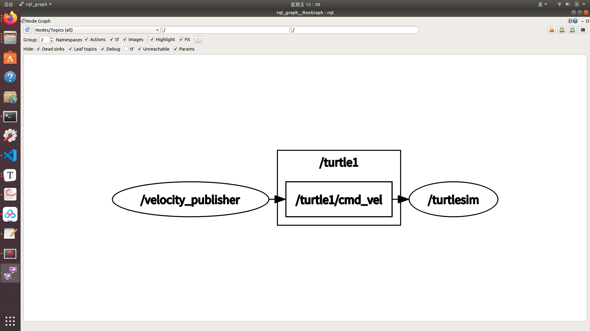
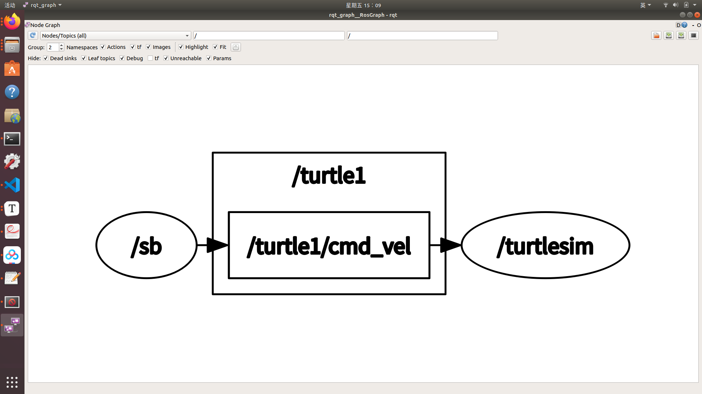
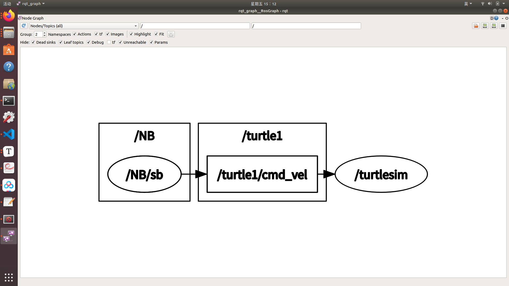
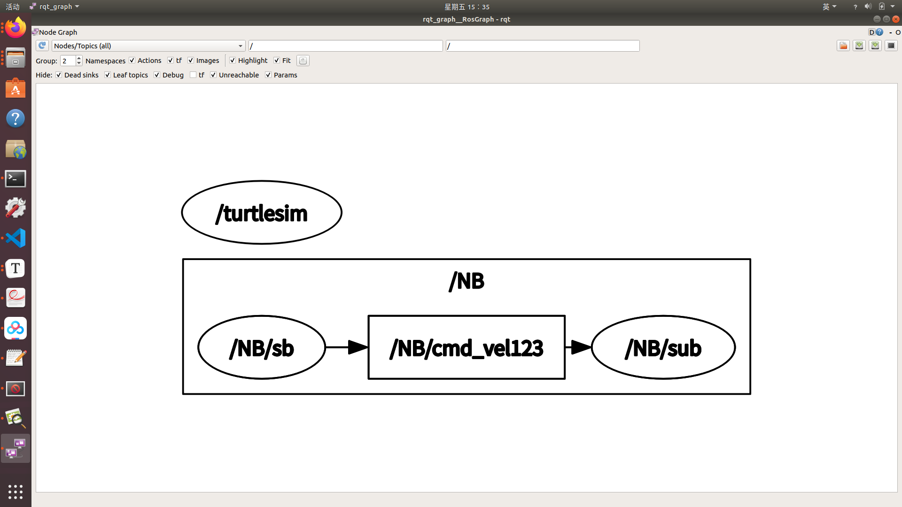
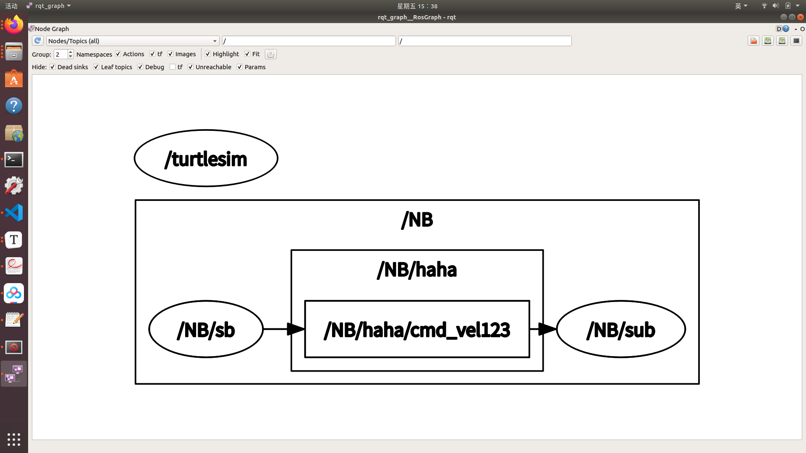
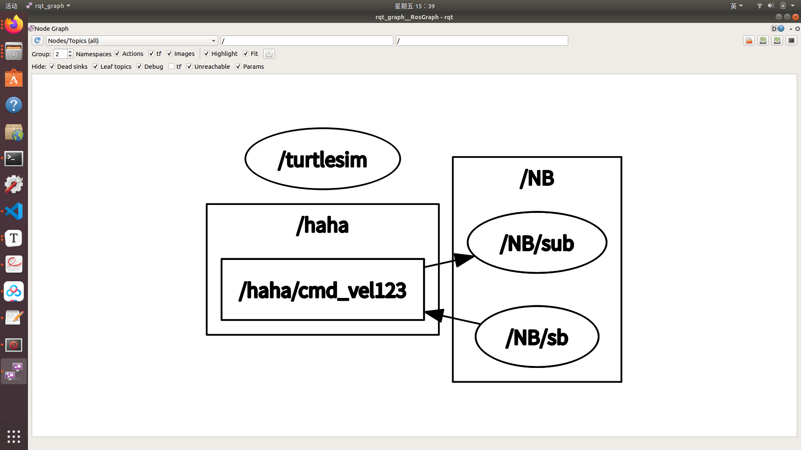

# launch启动文件的使用方法

## 一、launch文件用途

可以一次启动多个ros节点，避免不必要的命令行输入。如果节点较多，则建议使用launch文件启动。

## 二、launch文件语法

### 1、launch

launch文件中的根元素采用< launch >标签定义

### 2、node启动节点

语法：

**< node pkg="package-name" type="executable-name" name="node-name" / >**

解释：

·pkg：节点所在的功能包名称（rosrun后面紧跟的功能包名称）

·type：节点的可执行文件名称（rosrun中的可执行文件名称）

·name：节点运行时的名称**（节点运行时在ros中的名字，若用此语法启动，会改变源文件中节点的名称）**

·output：节点信息在终端输出

·respawn：若节点运行中意外终止，可以用此命令重启节点

有关name变量：

程序代码C++：

```c++
cout<<"Publisher of Twist_msgs"<<endl;
//初始化节点
ros::init(argc,argv,"velocity_publisher");
//创建句柄
ros::NodeHandle n;
//创建一个Publisher，发布/turtle1/cmd_vel的topic
//说明：geometry_msgs::Twist为消息类型 /turtle1/cmd_vel话题名 10为队列长度
//话题名一定要和订阅者的订阅话题名相同，不然无法数据通信
ros::Publisher turtle_vel_pub = n.advertise<geometry_msgs::Twist>("/turtle1/cmd_vel",10);
```

launch文件：

```xml
<launch>
	<node pkg="nstest" type="testsb" name ="sb" output = "screen"/>
</launch>
```

用rosrun运行时：rqtgraph：



用roslaunch nstest testlaunch.launch运行时：rqtgraph：



### 3、param rosparam

设置ROS系统运行中的参数，存储在参数服务器中

param语法（保存某一个参数）：

**< param name="output_frame" value-"odom"/ >**

解释：

·name：参数名

·value：参数值

rosparam加载参数文件中的多个参数：

**< rosparam file="params.yaml" command="load" ns="params" />**

### 4、arg

launch文件内的局部变量，仅限于launch文件使用

**< arg name="arg-name" default="arg-value" / >**

解释：

·name：参数名

·value：参数值

调用：

**< param name="foo" value="$(arg arg-name)" >**

**< node name="node" pkg="package" type="type" args="arg arg-name" / >**

### 5、remap重映射

重映射ROS计算图资源的命名

**< remap from ="/turtlebot/cmd_vel" to="/cmd_vel"/>**

·from：原命名

·to：映射之后的命名

**注意：需要嵌套在启动节点中，如下所示**

```xml
<launch>
    <node pkg = "myslam" type = "imagefilter" name="RGBD" output="screen">
        <remap from ="/rgb" to ="/camera/rgb/image_raw" />
        <remap from ="/depth" to ="/camera/depth_registered/image_raw" />
    </node>
</launch>
```

不嵌套不能实现重映射

### 6、include嵌套

包含其他launch文件，类似C语言中的头文件包含

**< include file="$(dirname)/other.launch" / >**

·file：包含的其他launch文件路径

### 7、namespace

我们修改launch文件如下：

```xml
<launch>
	<group ns="NB">
		<node pkg="nstest" type="testsb" name ="sb" output = "screen"/>
	</group>
</launch>

```

运行roslaunch后的rqtgraph：



​	但这仍然能控制小乌龟运动，因为节点仍向/turtle1/cmd_vel话题发布消息。我们若把话题改为/turtle2/cmd_vel第一个小乌龟则无法运动。

​	我们想话题也添加namespace，那该怎么办？如下：

```xml
<launch>
	<group ns="NB">
		<node pkg="nstest" type="testsb" name ="sb" output = "screen">
		</node>
		<node pkg="nstest" type="testsub" name = "sub" output = "screen" />
	</group>
</launch>
```

这样，rqtgraph中显示：



节点、节点发布(订阅)的话题都在一个命名空间下，这要求节点

### 8、全局话题以及话题在namespace下的情况

​	首先是关于"/"符号的问题，我们经常看到有些发布的topic中有"/"，有些发布的topic没"/" 。 **符号"/"是指定当前发布的topic作用于全局。**

例如：

```c++
	ros::Publisher turtle_vel_pub = n.advertise<geometry_msgs::Twist>("/cmd_vel123",10);
```

结合上面的第七点命名空间：我们若发布如此节点且在命名空间NB下：

```c++
	ros::Publisher turtle_vel_pub = n.advertise<geometry_msgs::Twist>("haha/cmd_vel123",10);
```

rqt_graph显示：



依旧属于我们的命名空间。

​	但是，我们若如此发布节点在命名空间NB下：

```c++
	ros::Publisher turtle_vel_pub = n.advertise<geometry_msgs::Twist>("/haha/cmd_vel123",10);
```

rqt_graph显示：



这个/haha 属于全局话题，不能被launch中的命名空间所覆盖。

## 三、launch文件创建

### 1、创建launch功能包

方法：在src文件下创建test_launch功能包，命令：

```shell
catkin_create_pkg test_launch
```

### 2、创建launch文件夹

目的：方便文件管理

方法：在功能包目录下创建launch文件夹

### 3、编写 launch文件

#### （1）简单的launch文件

创建文档simple.launch

```xml
<launch>
	<node pkg="test_pkg" type="Person_Subscriber" name="talker" output="screen" />
    <node pkg="test_pkg" type="Person_Publisher" name="listener" output="screen" />
</launch>
```

### 4、启动launch文件

格式：roslaunch xxx_pkg xxx.launch

xxx_pkg为launch功能包，xxx.launch为launch文件

```shell
roslaunch test_launch simple.launch
```

注意：启动launch文件前也要配置环境变量。

## 四、更加高级的launch文件示例

#### 1、launch文件

```xml
<launch>
    <param name="/turtle_number"  value="2"/>
    
    <node pkg="turtlesim" type="turtlesim_node" name="turtlesim_node">
        <param name="turtle_name1"  value="Tom"/>
        <param name="turtle_name2"  value="Jerry"/>
        
        <rosparam file="$(find test_launch)/config/param.yaml" command="load"/>
    </node>
    
    <node pkg="turtlesim" type="turtle_teleop_key" name="turtle_teleop_key" output="screen"/>
</launch>
```

第一行：设置ROS运行参数，名为turtle_number 值为2

第二行：运行节点：turtlesim_node（小乌龟仿真器）

第三第四行：设置ROS运行参数，在turtlesim命名空间下，名为turtle_name1、turtle_name2，值分别为Tom、Jerry

第五行：加载参数文件（/config/param.yaml）中多个参数。在test_launch功能包中。

第六行：启动键盘控制节点。

#### 2、yaml文件

```yaml
A: 123
B: "Gzh"

group:
   C: 565
   D: "???ffffffff"
```

注意：group命名空间下的缩进要一致，而且必须要有行的缩进，否则会报错。