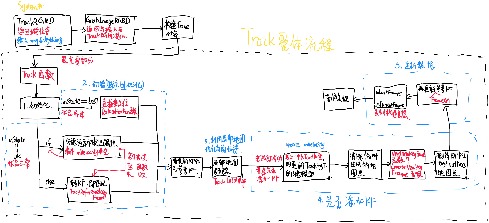
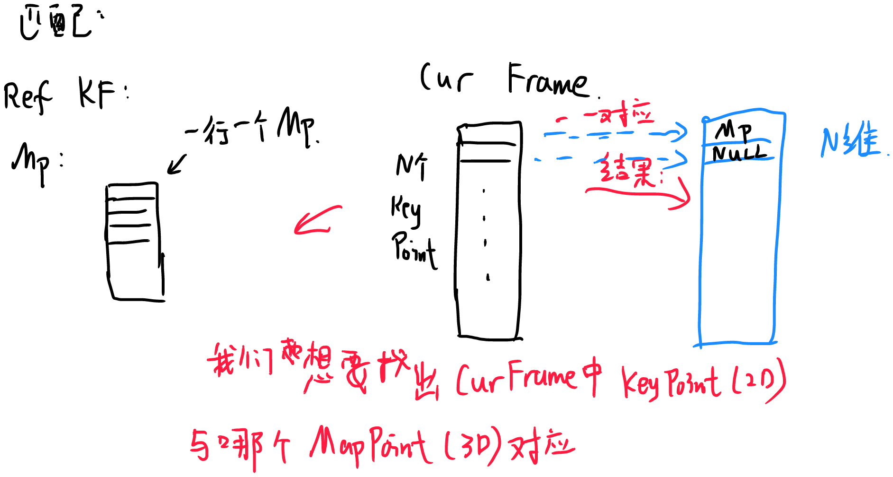

# ORB-SLAM

## 一、System.h

整体流程图：


### 1、概况讲解

#### 跟踪函数

​	有三个：Stereo、RGBD、Monocular。其返回值为相机位姿，若跟踪失败则为空(empty)。

```c++
// Proccess the given stereo frame. Images must be synchronized and rectified.
// Input images: RGB (CV_8UC3) or grayscale (CV_8U). RGB is converted to grayscale.
// Returns the camera pose (empty if tracking fails).
cv::Mat TrackStereo(const cv::Mat &imLeft, const cv::Mat &imRight, const double &timestamp);

// Process the given rgbd frame. Depthmap must be registered to the RGB frame.
// Input image: RGB (CV_8UC3) or grayscale (CV_8U). RGB is converted to grayscale.
// Input depthmap: Float (CV_32F).
// Returns the camera pose (empty if tracking fails).
cv::Mat TrackRGBD(const cv::Mat &im, const cv::Mat &depthmap, const double &timestamp);

// Proccess the given monocular frame
// Input images: RGB (CV_8UC3) or grayscale (CV_8U). RGB is converted to grayscale.
// Returns the camera pose (empty if tracking fails).
cv::Mat TrackMonocular(const cv::Mat &im, const double &timestamp);
```

#### 私有变量(SLAM系统中需要用到的部分)

1. ORB词典：用于位置识别和特征点匹配

   ```c++
   // ORB vocabulary used for place recognition and feature matching.
   ORBVocabulary* mpVocabulary;
   ```

2. 关键帧数据库：用于重定位以及闭环检测

   ```c++
   KeyFrameDatabase* mpKeyFrameDatabase;
   ```

3. 地图：存储所有地图点以及关键帧

   ```c++
   Map* mpMap;
   ```

4. 跟踪线程：接到图片后计算相机位姿，并且负责插入关键帧、地图点。当跟踪失败时负责重定位方式跟踪估计位姿。

   ```c++
   Tracking* mpTracker;
   ```

5. 局部地图：负责局部建图和局部地图BA

   ```c++
   LocalMapping* mpLocalMapper;
   ```

6. 闭环检测：对每个新关键帧都搜索闭环，若有闭环，则启动位姿图优化和一个完整全局BA

   ```c++
   LoopClosing* mpLoopCloser;
   ```


其余部分变量不太重要，后续遇到问题再讲。

#### 构造函数

​	初始化一些变量，后续讲解。

```c++
  // Initialize the SLAM system. It launches the Local Mapping, Loop Closing and Viewer threads.
    System(const string &strVocFile, const string &strSettingsFile, const eSensor sensor, const bool bUseViewer = true);
```

我们现在看一下构造函数：

首先：选择我们想要的传感器(单目、RGBD、双目)、其次，读取配置文件以及ORB词典(ORB Vocabulary)。

##### 词典初始化

```c++
mpVocabulary = new ORBVocabulary();
bool bVocLoad = mpVocabulary->loadFromTextFile(strVocFile);
```

​	其中调用了DBoW2库函数。判定若词典读取失败则退出程序。

##### 初始化一系列SLAM模块

```c++
//Create KeyFrame Database
mpKeyFrameDatabase = new KeyFrameDatabase(*mpVocabulary);

//Create the Map
mpMap = new Map();

//Create Drawers. These are used by the Viewer
mpFrameDrawer = new FrameDrawer(mpMap);
mpMapDrawer = new MapDrawer(mpMap, strSettingsFile);

//Initialize the Tracking thread
//(it will live in the main thread of execution, the one that called this constructor)
mpTracker = new Tracking(this, mpVocabulary, mpFrameDrawer, mpMapDrawer,
                         mpMap, mpKeyFrameDatabase, strSettingsFile, mSensor);

//Initialize the Local Mapping thread and launch
mpLocalMapper = new LocalMapping(mpMap, mSensor==MONOCULAR);
mptLocalMapping = new thread(&ORB_SLAM2::LocalMapping::Run,mpLocalMapper);

//Initialize the Loop Closing thread and launch
mpLoopCloser = new LoopClosing(mpMap, mpKeyFrameDatabase, mpVocabulary, mSensor!=MONOCULAR);
mptLoopClosing = new thread(&ORB_SLAM2::LoopClosing::Run, mpLoopCloser);
```

​	这里，我们后续必须详细研究跟踪、局部地图以及闭环检测线程。

​	之后，我们还要设置三个线程之间的指针，用途目前未知。

### 2、跟踪线程

​	我们在ROS模块的ros_mono.cc中可以看到：回调函数中每次执行的是函数TrackMonocular

```c++
mpSLAM->TrackMonocular(cv_ptr->image,cv_ptr->header.stamp.toSec());
```

​	因此，我们要研究这个函数(跟踪系列函数)。这个函数中，先包含了模式转换部分(目前不看)，**之后就是GrabImageMonocular函数**，这个函数中包含了跟踪线程。

​	//而跟踪线程结束后，

## 二、跟踪线程Tracking.h

### 1、概述

​	主要函数：GrabImageXX(以单目举例GrabimageMonocular)，返回值为当前相机位姿。

```c++
cv::Mat GrabImageStereo(const cv::Mat &imRectLeft,const cv::Mat &imRectRight, const double &timestamp);
cv::Mat GrabImageRGBD(const cv::Mat &imRGB,const cv::Mat &imD, const double &timestamp);
cv::Mat GrabImageMonocular(const cv::Mat &im, const double &timestamp);
```

​	跟踪线程状态：

```c++
enum eTrackingState{
    SYSTEM_NOT_READY=-1,
    NO_IMAGES_YET=0,
    NOT_INITIALIZED=1,
    OK=2,
    LOST=3
};
```

##### 整体流程图	

### 2、成员

| 主要成员            | 用处           |
| ------------------- | -------------- |
| Frame mCurrentFrame | 当前帧         |
| cv::Mat mImGray     | 当前帧的灰度图 |
|                     |                |
|                     |                |
|                     |                |

### 3、Track()函数

​	流程：获取当前帧，转化为灰度图后调用Track()函数。

​	Trach函数中，先根据匀速运动模型估计相机位姿，若不行则根据关键帧匹配估计当前位姿。结束本过程后，更新参考关键帧，这个参考关键帧根据论文**：为局部地图中与当前帧共享最多地图点的关键帧**。后与局部地图进行匹配。**这个过程算是跟踪过程，若成功，则跟踪线程状态为OK；否则为LOST。**

```c++
if(mState==OK)
{
    // Local Mapping might have changed some MapPoints tracked in last frame
    // 检查并更新上一帧被替换的MapPoints
    // 更新Fuse函数和SearchAndFuse函数替换的MapPoints
    CheckReplacedInLastFrame();

    // 步骤2.1：跟踪上一帧或者参考帧或者重定位

    // 运动模型是空的或刚完成重定位
    // mCurrentFrame.mnId<mnLastRelocFrameId+2这个判断不应该有
    // 应该只要mVelocity不为空，就优先选择TrackWithMotionModel
    // mnLastRelocFrameId上一次重定位的那一帧
    if(mVelocity.empty() || mCurrentFrame.mnId<mnLastRelocFrameId+2)
    {
        // 将上一帧的位姿作为当前帧的初始位姿
        // 通过BoW的方式在参考帧中找当前帧特征点的匹配点
        // 优化每个特征点都对应3D点重投影误差即可得到位姿
        bOK = TrackReferenceKeyFrame();
    }
    else
    {
        // 根据恒速模型设定当前帧的初始位姿
        // 通过投影的方式在参考帧中找当前帧特征点的匹配点
        // 优化每个特征点所对应3D点的投影误差即可得到位姿
        bOK = TrackWithMotionModel();
        if(!bOK)
            // TrackReferenceKeyFrame是跟踪参考帧，不能根据固定运动速度模型预测当前帧的位姿态，通过bow加速匹配（SearchByBow）
            // 最后通过优化得到优化后的位姿
            bOK = TrackReferenceKeyFrame();
    }
}
else
{
    // BOW搜索，PnP求解位姿
    bOK = Relocalization();
}
```

```c++
mCurrentFrame.mpReferenceKF = mpReferenceKF;

// If we have an initial estimation of the camera pose and matching. Track the local map.
if(!mbOnlyTracking)
{
    if(bOK)
    bOK = TrackLocalMap();
}
```

​	若跟踪成功，我们检查是否需要插入关键帧。首先更新mVelocity：若上一帧位姿非空，按照如下方式计算模型速度；若上一帧位姿为空，则速度也为空。

```c++
cv::Mat LastTwc = cv::Mat::eye(4,4,CV_32F);
mLastFrame.GetRotationInverse().copyTo(LastTwc.rowRange(0,3).colRange(0,3));
mLastFrame.GetCameraCenter().copyTo(LastTwc.rowRange(0,3).col(3));
mVelocity = mCurrentFrame.mTcw*LastTwc;
//这里的速度为两帧位姿间的李代数增量
```

$$
p_{c1}=T_{cw1}p\\p_{c2}=Tcw_2p\\
p_{c2}=T_{cw_2}T_{cw1}^{-1}p_{c1}
$$

​	速度我们可以视为pc1到pc2相机位姿之间的李代数增量。

​	计算完速度后，检查是否需要关键帧，根据需求添加关键帧。后存储当前帧位姿信息来复原整个相机运动轨迹。

```c++
// Store frame pose information to retrieve the complete camera trajectory afterwards.
if(!mCurrentFrame.mTcw.empty())
{
    cv::Mat Tcr = mCurrentFrame.mTcw*mCurrentFrame.mpReferenceKF->GetPoseInverse();
    mlRelativeFramePoses.push_back(Tcr);
    mlpReferences.push_back(mpReferenceKF);
    mlFrameTimes.push_back(mCurrentFrame.mTimeStamp);
    mlbLost.push_back(mState==LOST);
}
else
{
    // This can happen if tracking is lost
    mlRelativeFramePoses.push_back(mlRelativeFramePoses.back());
    mlpReferences.push_back(mlpReferences.back());
    mlFrameTimes.push_back(mlFrameTimes.back());
    mlbLost.push_back(mState==LOST);
}
```

#### I. TrackReferenceKeyFrame()函数

​	主要功能，通过比对关键帧来跟踪。

```c++
if(mVelocity.empty() || mCurrentFrame.mnId<mnLastRelocFrameId+2)
{
    // 将上一帧的位姿作为当前帧的初始位姿
    // 通过BoW的方式在参考帧中找当前帧特征点的匹配点
    // 优化每个特征点都对应3D点重投影误差即可得到位姿
    bOK = TrackReferenceKeyFrame();
}
```

##### *详细实现	

**步骤1：**

```c++
mCurrentFrame.ComputeBoW();//将当前帧的描述子转化为BoW向量
```

**步骤2：**

```c++
// We perform first an ORB matching with the reference keyframe
// If enough matches are found we setup a PnP solver
//vpMapPointMatches初步认为是当前帧(mCurrentFrame)中与关键帧(mpReferenceKF)中地图点匹配的地图点
ORBmatcher matcher(0.7,true);
vector<MapPoint*> vpMapPointMatches;

// 步骤2：通过特征点的BoW加快当前帧与参考帧之间的特征点匹配
// 特征点的匹配关系由MapPoints进行维护
int nmatches = matcher.SearchByBoW(mpReferenceKF,mCurrentFrame,vpMapPointMatches);
//若匹配点太少，则返回false
if(nmatches<15)
	return false;
```

**步骤3：**

```c++
// 步骤3:将上一帧的位姿态作为当前帧位姿的初始值
//mvpMapPoints:与当前帧中的关键点与地图点关联的点(地图点)
//原版注释：MapPoints associated to keyPoints
mCurrentFrame.mvpMapPoints = vpMapPointMatches;
mCurrentFrame.SetPose(mLastFrame.mTcw); // 用上一次的Tcw设置初值，在PoseOptimization可以收敛快一些
```

**步骤4：**

```c++
// 步骤4:通过优化3D-2D的重投影误差来获得位姿
Optimizer::PoseOptimization(&mCurrentFrame);
```

**步骤5：**

```c++
// Discard outliers
// 步骤5：剔除优化后的outlier匹配点（MapPoints）
int nmatchesMap = 0;
for(int i =0; i<mCurrentFrame.N; i++)
{
    if(mCurrentFrame.mvpMapPoints[i])
    {
        if(mCurrentFrame.mvbOutlier[i])
        {
        MapPoint* pMP = mCurrentFrame.mvpMapPoints[i];
        mCurrentFrame.mvpMapPoints[i]=static_cast<MapPoint*>(NULL);
        mCurrentFrame.mvbOutlier[i]=false;
        pMP->mbTrackInView = false;
        pMP->mnLastFrameSeen = mCurrentFrame.mnId;
        nmatches--;
        }
    	else if(mCurrentFrame.mvpMapPoints[i]->Observations()>0)
    		nmatchesMap++;
    }
}
```

##### *SearchByBoW()函数

​	整个匹配过程，没有使用OpenCV自带的函数，使用的是DBoW2加速，具体方法有待学习。输出结果中如何查看匹配关系：**每个当前帧中都含有参考关键帧，也包含地图中相应地图点，这其中按照位置(每行一一对应)与参考关键帧中地图点匹配，未能匹配成功的当前帧地图点为空(NULL)。**



```c++
//输入：(参考)关键帧，当前帧，vpMapPointMatches为输出
//输出：vpMapPointMatches当前帧与输入关键帧匹配成功的地图点
int ORBmatcher::SearchByBoW(KeyFrame* pKF,Frame &F, vector<MapPoint*> &vpMapPointMatches)
```

**步骤一：获取需要的数据**

```c++
//vpMapPointsKF:输入(参考)关键帧关联的地图点
const vector<MapPoint*> vpMapPointsKF = pKF->GetMapPointMatches();
//初始化vpMapPointMatches，vector长度为F.N(当前帧关键点数量)
vpMapPointMatches = vector<MapPoint*>(F.N,static_cast<MapPoint*>(NULL));
//？
const DBoW2::FeatureVector &vFeatVecKF = pKF->mFeatVec;
//匹配数量
int nmatches=0;
//？
vector<int> rotHist[HISTO_LENGTH];
for(int i=0;i<HISTO_LENGTH;i++)
    rotHist[i].reserve(500);
const float factor = HISTO_LENGTH/360.0f;
```

**步骤二：进行ORB特征匹配(利用DBoW2加速)**

```c++
// We perform the matching over ORB that belong to the same vocabulary node (at a certain level)
// 将属于同一节点(特定层)的ORB特征进行匹配
DBoW2::FeatureVector::const_iterator KFit = vFeatVecKF.begin();
DBoW2::FeatureVector::const_iterator Fit = F.mFeatVec.begin();
DBoW2::FeatureVector::const_iterator KFend = vFeatVecKF.end();
DBoW2::FeatureVector::const_iterator Fend = F.mFeatVec.end();
```

**步骤三：加速匹配过程**

```c++
while(KFit != KFend && Fit != Fend)
{
    if(KFit->first == Fit->first) //步骤1：分别取出属于同一node的ORB特征点(只有属于同一node，才有可能是匹配点)
    {
        const vector<unsigned int> vIndicesKF = KFit->second;
        const vector<unsigned int> vIndicesF = Fit->second;

        // 步骤2：遍历KF中属于该node的特征点
        for(size_t iKF=0; iKF<vIndicesKF.size(); iKF++)
        {
            const unsigned int realIdxKF = vIndicesKF[iKF];

            MapPoint* pMP = vpMapPointsKF[realIdxKF]; // 取出KF中该特征对应的MapPoint

            if(!pMP)
                continue;
            if(pMP->isBad())
                continue;

            const cv::Mat &dKF= pKF->mDescriptors.row(realIdxKF); // 取出KF中该特征对应的描述子
            int bestDist1=256; // 最好的距离（最小距离）
            int bestIdxF =-1 ;
            int bestDist2=256; // 倒数第二好距离（倒数第二小距离）

            // 步骤3：遍历F中属于该node的特征点，找到了最佳匹配点
            for(size_t iF=0; iF<vIndicesF.size(); iF++)
            {
                const unsigned int realIdxF = vIndicesF[iF];

                if(vpMapPointMatches[realIdxF])// 表明这个点已经被匹配过了，不再匹配，加快速度
                    continue;

                const cv::Mat &dF = F.mDescriptors.row(realIdxF); // 取出F中该特征对应的描述子

                const int dist =  DescriptorDistance(dKF,dF); // 求描述子的距离

                if(dist<bestDist1)// dist < bestDist1 < bestDist2，更新bestDist1 bestDist2
                {
                    bestDist2=bestDist1;
                    bestDist1=dist;
                    bestIdxF=realIdxF;
                }
                else if(dist<bestDist2)// bestDist1 < dist < bestDist2，更新bestDist2
                {
                    bestDist2=dist;
                }
            }

            // 步骤4：根据阈值 和 角度投票剔除误匹配
            if(bestDist1<=TH_LOW) // 匹配距离（误差）小于阈值
            {
                // trick!
                // 最佳匹配比次佳匹配明显要好，那么最佳匹配才真正靠谱
                if(static_cast<float>(bestDist1)<mfNNratio*static_cast<float>(bestDist2))
                {
                    // 步骤5：更新特征点的MapPoint
                    vpMapPointMatches[bestIdxF]=pMP;
                    const cv::KeyPoint &kp = pKF->mvKeysUn[realIdxKF];

                    if(mbCheckOrientation)
                    {
                        // trick!
                        // angle：每个特征点在提取描述子时的旋转主方向角度，如果图像旋转了，这个角度将发生改变
                        // 所有的特征点的角度变化应该是一致的，通过直方图统计得到最准确的角度变化值
                        float rot = kp.angle-F.mvKeys[bestIdxF].angle;// 该特征点的角度变化值
                        if(rot<0.0)
                            rot+=360.0f;
                        int bin = round(rot*factor);// 将rot分配到bin组
                        if(bin==HISTO_LENGTH)
                            bin=0;
                        assert(bin>=0 && bin<HISTO_LENGTH);
                        rotHist[bin].push_back(bestIdxF);
                    }
                    nmatches++;
                }
            }

        }
        KFit++;
        Fit++;
    }
    else if(KFit->first < Fit->first)
    {
        KFit = vFeatVecKF.lower_bound(Fit->first);
    }
    else
    {
        Fit = F.mFeatVec.lower_bound(KFit->first);
    }
}
```

**步骤四：剔除误匹配的点**

```c++
// 根据方向剔除误匹配的点
if(mbCheckOrientation)
{
    int ind1=-1;
    int ind2=-1;
    int ind3=-1;
    // 计算rotHist中最大的三个的index
    ComputeThreeMaxima(rotHist,HISTO_LENGTH,ind1,ind2,ind3);

    for(int i=0; i<HISTO_LENGTH; i++)
    {
        // 如果特征点的旋转角度变化量属于这三个组，则保留
        if(i==ind1 || i==ind2 || i==ind3)
        	continue;
        // 将除了ind1 ind2 ind3以外的匹配点去掉
        for(size_t j=0, jend=rotHist[i].size(); j<jend; j++)
        {
            vpMapPointMatches[rotHist[i][j]]=static_cast<MapPoint*>(NULL);
            nmatches--;
        }
    }
}
```

最后返回nmatches(成功匹配点数)。

##### *PoseOptimization()函数

**简介：**

```c++
/**
 * @brief Pose Only Optimization
 * 
 * 3D-2D 最小化重投影误差 e = (u,v) - project(Tcw*Pw) \n
 * 只优化Frame的Tcw，不优化MapPoints的坐标
 * 
 * 1. Vertex: g2o::VertexSE3Expmap()，即当前帧的Tcw
 * 2. Edge:
 *     - g2o::EdgeSE3ProjectXYZOnlyPose()，BaseUnaryEdge
 *         + Vertex：待优化当前帧的Tcw
 *         + measurement：MapPoint在当前帧中的二维位置(u,v)
 *         + InfoMatrix: invSigma2(与特征点所在的尺度有关)
 *     - g2o::EdgeStereoSE3ProjectXYZOnlyPose()，BaseUnaryEdge
 *         + Vertex：待优化当前帧的Tcw
 *         + measurement：MapPoint在当前帧中的二维位置(ul,v,ur)
 *         + InfoMatrix: invSigma2(与特征点所在的尺度有关)
 *
 * @param   pFrame Frame
 * @return  inliers数量
 */
/**使用currentFrame和MapPoints进行优化*/
int Optimizer::PoseOptimization(Frame *pFrame);
```

**步骤一：构造g2o优化器**

```c++
// 步骤1：构造g2o优化器
//这个不是最新版g2o优化器构建方法，但是无所谓
g2o::SparseOptimizer optimizer;//优化器
g2o::BlockSolver_6_3::LinearSolverType * linearSolver;//线性方程求解器

linearSolver = new g2o::LinearSolverDense<g2o::BlockSolver_6_3::PoseMatrixType>();

g2o::BlockSolver_6_3 * solver_ptr = new g2o::BlockSolver_6_3(linearSolver);
//求解方法
g2o::OptimizationAlgorithmLevenberg* solver = new g2o::OptimizationAlgorithmLevenberg(solver_ptr);
optimizer.setAlgorithm(solver);
//？
int nInitialCorrespondences=0;
```

**步骤二：添加顶点**

```c++
// Set Frame vertex
// 步骤2：添加顶点：待优化当前帧的Tcw
//顶点类型为相机位姿节点
g2o::VertexSE3Expmap * vSE3 = new g2o::VertexSE3Expmap();
//设置初始值，为输入Frame(当前帧)的位姿
vSE3->setEstimate(Converter::toSE3Quat(pFrame->mTcw));
//零号节点
vSE3->setId(0);
vSE3->setFixed(false);
//添加节点
optimizer.addVertex(vSE3);
```

**步骤三：添加边**

​	由于只优化一个相机位姿节点，因此边全是一元边

```c++
//步骤3：添加一元边：相机投影模型
unique_lock<mutex> lock(MapPoint::mGlobalMutex);//线程同步锁
//N为当前帧关键点个数
for(int i=0; i<N; i++)
{
    //直接获取当前帧地图点
    MapPoint* pMP = pFrame->mvpMapPoints[i];
    if(pMP)//非空
    {
        // Monocular observation
        // 单目情况, 也有可能在双目下, 当前帧的左兴趣点找不到匹配的右兴趣点
        if(pFrame->mvuRight[i]<0)
        {
            nInitialCorrespondences++;
            pFrame->mvbOutlier[i] = false;
			//像素坐标点 obs
            Eigen::Matrix<double,2,1> obs;
            //当前帧中拿出特征点(KeyPoint)
            const cv::KeyPoint &kpUn = pFrame->mvKeysUn[i];
            //给obs赋值
            obs << kpUn.pt.x, kpUn.pt.y;
			//边：投影一元边
            g2o::EdgeSE3ProjectXYZOnlyPose* e = new g2o::EdgeSE3ProjectXYZOnlyPose();
			//设置边的节点，为0号节点
            e->setVertex(0, dynamic_cast<g2o::OptimizableGraph::Vertex*>(optimizer.vertex(0)));
            //设置观测值，为obs(关键点像素坐标uv)
            e->setMeasurement(obs);
            //设置信息矩阵
            const float invSigma2 = pFrame->mvInvLevelSigma2[kpUn.octave];
            e->setInformation(Eigen::Matrix2d::Identity()*invSigma2);
			//核函数(LM优化)
            g2o::RobustKernelHuber* rk = new g2o::RobustKernelHuber;
            e->setRobustKernel(rk);
            rk->setDelta(deltaMono);
			//设置K矩阵
            e->fx = pFrame->fx;
            e->fy = pFrame->fy;
            e->cx = pFrame->cx;
            e->cy = pFrame->cy;
            //获取地图点3D位置(x,y,z)
            cv::Mat Xw = pMP->GetWorldPos();
            e->Xw[0] = Xw.at<float>(0);
            e->Xw[1] = Xw.at<float>(1);
            e->Xw[2] = Xw.at<float>(2);
			//添加边
            optimizer.addEdge(e);
            
            vpEdgesMono.push_back(e);
            vnIndexEdgeMono.push_back(i);
        }
        else  // Stereo observation 双目
        {
            nInitialCorrespondences++;
            pFrame->mvbOutlier[i] = false;

            //SET EDGE
            Eigen::Matrix<double,3,1> obs;// 这里和单目不同
            const cv::KeyPoint &kpUn = pFrame->mvKeysUn[i];
            const float &kp_ur = pFrame->mvuRight[i];
            obs << kpUn.pt.x, kpUn.pt.y, kp_ur;// 这里和单目不同

            g2o::EdgeStereoSE3ProjectXYZOnlyPose* e = new g2o::EdgeStereoSE3ProjectXYZOnlyPose();// 这里和单目不同

            e->setVertex(0, dynamic_cast<g2o::OptimizableGraph::Vertex*>(optimizer.vertex(0)));
            e->setMeasurement(obs);
            const float invSigma2 = pFrame->mvInvLevelSigma2[kpUn.octave];
            Eigen::Matrix3d Info = Eigen::Matrix3d::Identity()*invSigma2;
            e->setInformation(Info);

            g2o::RobustKernelHuber* rk = new g2o::RobustKernelHuber;
            e->setRobustKernel(rk);
            rk->setDelta(deltaStereo);

            e->fx = pFrame->fx;
            e->fy = pFrame->fy;
            e->cx = pFrame->cx;
            e->cy = pFrame->cy;
            e->bf = pFrame->mbf;
            cv::Mat Xw = pMP->GetWorldPos();
            e->Xw[0] = Xw.at<float>(0);
            e->Xw[1] = Xw.at<float>(1);
            e->Xw[2] = Xw.at<float>(2);

            optimizer.addEdge(e);

            vpEdgesStereo.push_back(e);
            vnIndexEdgeStereo.push_back(i);
        }
    }
}
```

**步骤四：开始优化**

```c++
// We perform 4 optimizations, after each optimization we classify observation as inlier/outlier
// At the next optimization, outliers are not included, but at the end they can be classified as inliers again.
// 步骤4：开始优化，总共优化四次，每次优化后，将观测分为outlier和inlier，outlier不参与下次优化
// 由于每次优化后是对所有的观测进行outlier和inlier判别，因此之前被判别为outlier有可能变成inlier，反之亦然
// 基于卡方检验计算出的阈值（假设测量有一个像素的偏差）
const float chi2Mono[4]={5.991,5.991,5.991,5.991};
const float chi2Stereo[4]={7.815,7.815,7.815, 7.815};
const int its[4]={10,10,10,10};// 四次迭代，每次迭代的次数

int nBad=0;
for(size_t it=0; it<4; it++)
{

    vSE3->setEstimate(Converter::toSE3Quat(pFrame->mTcw));
    optimizer.initializeOptimization(0);// 对level为0的边进行优化
    optimizer.optimize(its[it]);

    nBad=0;
    for(size_t i=0, iend=vpEdgesMono.size(); i<iend; i++)
    {
        g2o::EdgeSE3ProjectXYZOnlyPose* e = vpEdgesMono[i];

        const size_t idx = vnIndexEdgeMono[i];

        if(pFrame->mvbOutlier[idx])
        {
            e->computeError(); // NOTE g2o只会计算active edge的误差
        }

        const float chi2 = e->chi2();

        if(chi2>chi2Mono[it])
        {                
            pFrame->mvbOutlier[idx]=true;
            e->setLevel(1);                 // 设置为outlier
            nBad++;
        }
        else
        {
            pFrame->mvbOutlier[idx]=false;
            e->setLevel(0);                 // 设置为inlier
        }

        if(it==2)
            e->setRobustKernel(0); // 除了前两次优化需要RobustKernel以外, 其余的优化都不需要
    }

    for(size_t i=0, iend=vpEdgesStereo.size(); i<iend; i++)
    {
        g2o::EdgeStereoSE3ProjectXYZOnlyPose* e = vpEdgesStereo[i];

        const size_t idx = vnIndexEdgeStereo[i];

        if(pFrame->mvbOutlier[idx])
        {
            e->computeError();
        }

        const float chi2 = e->chi2();

        if(chi2>chi2Stereo[it])
        {
            pFrame->mvbOutlier[idx]=true;
            e->setLevel(1);
            nBad++;
        }
        else
        {                
            e->setLevel(0);
            pFrame->mvbOutlier[idx]=false;
        }

        if(it==2)
            e->setRobustKernel(0);
    }

    if(optimizer.edges().size()<10)
        break;
}    

// Recover optimized pose and return number of inliers
g2o::VertexSE3Expmap* vSE3_recov = static_cast<g2o::VertexSE3Expmap*>(optimizer.vertex(0));
g2o::SE3Quat SE3quat_recov = vSE3_recov->estimate();
cv::Mat pose = Converter::toCvMat(SE3quat_recov);
pFrame->SetPose(pose);
```

**步骤五：设置优化位姿与返回值**

```c++
// Recover optimized pose and return number of inliers
g2o::VertexSE3Expmap* vSE3_recov = static_cast<g2o::VertexSE3Expmap*>(optimizer.vertex(0));
g2o::SE3Quat SE3quat_recov = vSE3_recov->estimate();
cv::Mat pose = Converter::toCvMat(SE3quat_recov);
pFrame->SetPose(pose);

return nInitialCorrespondences-nBad;
```

#### II. TrackWithMotionModel()函数

若速度不为空或者刚刚进行重定位时，我们根据匀速模型跟踪

```c++
else
{
    // 根据恒速模型设定当前帧的初始位姿
    // 通过投影的方式在参考帧中找当前帧特征点的匹配点
    // 优化每个特征点所对应3D点的投影误差即可得到位姿
    bOK = TrackWithMotionModel();
    if(!bOK)
        // TrackReferenceKeyFrame是跟踪参考帧，不能根据固定运动速度模型预测当前帧的位姿态，通过bow加速匹配（SearchByBow）
        // 最后通过优化得到优化后的位姿
        bOK = TrackReferenceKeyFrame();
}
```

​	**与4中不同的是，匀速模型是先利用速度给出一个当前位姿初始值，从这个初始值中找到周围与参考帧匹配的特征点，进行BA优化(优化投影误差)。**

##### *详细实现

**步骤1：**首先调用UpdateLastFrame()函数，并根据速度模型，直接估计出当前位姿

```C++
// Update last frame pose according to its reference keyframe
// Create "visual odometry" points
// 步骤1：对于双目或rgbd摄像头，根据深度值为上一关键帧生成新的MapPoints
// （跟踪过程中需要将当前帧与上一帧进行特征点匹配，将上一帧的MapPoints投影到当前帧可以缩小匹配范围）
// 在跟踪过程中，去除outlier的MapPoint，如果不及时增加MapPoint会逐渐减少
// 这个函数的功能就是补充增加RGBD和双目相机上一帧的MapPoints数
UpdateLastFrame();

// 根据Const Velocity Model(认为这两帧之间的相对运动和之前两帧间相对运动相同)估计当前帧的位姿
//注意：UpdateLastFrame函数中，更新了上一帧的位姿
mCurrentFrame.SetPose(mVelocity*mLastFrame.mTcw);
```

​	接下来调用fill，将当前帧的地图点设置为NULL

```c++
fill(mCurrentFrame.mvpMapPoints.begin(),mCurrentFrame.mvpMapPoints.end(),static_cast<MapPoint*>(NULL));
```

**步骤2：**

```c++
// 步骤2：根据匀速度模型进行对上一帧的MapPoints进行跟踪
// 根据上一帧特征点对应的3D点投影的位置缩小特征点匹配范围
int nmatches = matcher.SearchByProjection(mCurrentFrame,mLastFrame,th,mSensor==System::MONOCULAR);//通过投影关系找到匹配点

// If few matches, uses a wider window search
// 如果跟踪的点少，则扩大搜索半径再来一次
if(nmatches<20)
{
    //fill全赋值为NULL，再尝试一次
    fill(mCurrentFrame.mvpMapPoints.begin(),mCurrentFrame.mvpMapPoints.end(),static_cast<MapPoint*>(NULL));
    nmatches = matcher.SearchByProjection(mCurrentFrame,mLastFrame,2*th,mSensor==System::MONOCULAR); // 2*th
}
//点太少，则匀速运动模型失效，返回false
if(nmatches<20)
	return false;
```

**步骤3：**

```c++
Optimizer::PoseOptimization(&mCurrentFrame);//优化位姿
```

**步骤4：**

```c++
// 步骤4：优化位姿后剔除outlier的mvpMapPoints
int nmatchesMap = 0;
for(int i =0; i<mCurrentFrame.N; i++)
{
    if(mCurrentFrame.mvpMapPoints[i])
    {//地图点非空
    	if(mCurrentFrame.mvbOutlier[i])
        {//地图点为outlier
        MapPoint* pMP = mCurrentFrame.mvpMapPoints[i];
        mCurrentFrame.mvpMapPoints[i]=static_cast<MapPoint*>(NULL);
        mCurrentFrame.mvbOutlier[i]=false;
        pMP->mbTrackInView = false;
        pMP->mnLastFrameSeen = mCurrentFrame.mnId;
        nmatches--;
    	}
    	else if(mCurrentFrame.mvpMapPoints[i]->Observations()>0)
    		nmatchesMap++;
    }
}    
...
return nmatchesMap>=10;
```

##### *UpdateLastFrame()函数

**概述：**

```c++
/**
 * @brief 双目或rgbd摄像头根据深度值为上一帧产生新的MapPoints
 *
 * 在双目和rgbd情况下，选取一些深度小一些的点（可靠一些） \n
 * 可以通过深度值产生一些新的MapPoints
 */
```

**步骤一：**

```c++
// 步骤1：更新最近一帧的位姿
KeyFrame* pRef = mLastFrame.mpReferenceKF;
//mlRelativeFramePoses:
// Lists used to recover the full camera trajectory at the end of the execution.
// Basically we store the reference keyframe for each frame and its relative transformation
//Tlr 参考关键帧到上一帧坐标系的位姿变换(ref -> last)
cv::Mat Tlr = mlRelativeFramePoses.back();

//pRef->GetPose()获取关键帧的位姿
mLastFrame.SetPose(Tlr*pRef->GetPose()); // Tlr*Trw = Tlw 1:last r:reference w:world

// 如果上一帧为关键帧，或者单目的情况，则退出
if(mnLastKeyFrameId==mLastFrame.mnId || mSensor==System::MONOCULAR)
    return;
```

**步骤二(针对RBGD和双目)：**

##### *SearchByProjection()函数

**概述：**

```c++
/**
 * @brief 通过投影，对上一帧的特征点进行跟踪
 *
 * 上一帧中包含了MapPoints，对这些MapPoints进行tracking，由此增加当前帧的MapPoints \n
 * 1. 将上一帧的MapPoints投影到当前帧(根据速度模型可以估计当前帧的Tcw)
 * 2. 在投影点附近根据描述子距离选取匹配，以及最终的方向投票机制进行剔除
 * @param  CurrentFrame 当前帧
 * @param  LastFrame    上一帧
 * @param  th           阈值
 * @param  bMono        是否为单目
 * @return              成功匹配的数量
 * @see SearchByBoW()
 */
int ORBmatcher::SearchByProjection(Frame &CurrentFrame, const Frame &LastFrame, const float th, const bool bMono);
```

**步骤一：获取需要数据(位姿)，(非单目情况)并判断是前进还是后退**

​	这里是通过投影跟踪，我们的目的是找到与**当前帧关键点匹配的(在上一帧中的)地图点。**方法就是将**上一帧地图点投影到当前帧中，在当前帧中与在一定半径范围内的关键点描述子进行匹配。**这样做的目的是**减小了搜索范围，使得匹配速度快、结果准确。**(因为时间间隔较小，关键点一般不会跑太远；若这么做无法匹配成功，则代表运动模型失效(强旋转可能会导致这种情况))。

```c++
// Rotation Histogram (to check rotation consistency)
vector<int> rotHist[HISTO_LENGTH];
for(int i=0;i<HISTO_LENGTH;i++)
    rotHist[i].reserve(500);
const float factor = HISTO_LENGTH/360.0f;

const cv::Mat Rcw = CurrentFrame.mTcw.rowRange(0,3).colRange(0,3);
const cv::Mat tcw = CurrentFrame.mTcw.rowRange(0,3).col(3);

const cv::Mat twc = -Rcw.t()*tcw; // twc(w)

const cv::Mat Rlw = LastFrame.mTcw.rowRange(0,3).colRange(0,3);
const cv::Mat tlw = LastFrame.mTcw.rowRange(0,3).col(3); // tlw(l)

// vector from LastFrame to CurrentFrame expressed in LastFrame
const cv::Mat tlc = Rlw*twc+tlw; // Rlw*twc(w) = twc(l), twc(l) + tlw(l) = tlc(l)

// 判断前进还是后退
const bool bForward = tlc.at<float>(2)>CurrentFrame.mb && !bMono; // 非单目情况，如果Z大于基线，则表示前进
const bool bBackward = -tlc.at<float>(2)>CurrentFrame.mb && !bMono; // 非单目情况，如果Z小于基线，则表示前进
```

**步骤二：还原上一帧MapPoints在当前图像中的像素坐标uv**

```c++
// 对上一帧有效的MapPoints进行跟踪
// Project
//x3Dw 地图点的世界3D坐标
cv::Mat x3Dw = pMP->GetWorldPos();
//x3Dc 当前帧坐标系下其坐标(当前帧位姿已经利用匀速模型估计完毕)
cv::Mat x3Dc = Rcw*x3Dw+tcw;

const float xc = x3Dc.at<float>(0);
const float yc = x3Dc.at<float>(1);
const float invzc = 1.0/x3Dc.at<float>(2);

if(invzc<0)
    continue;
//image pixel coordinate(u,v)
//投影至像素坐标系
float u = CurrentFrame.fx*xc*invzc+CurrentFrame.cx;
float v = CurrentFrame.fy*yc*invzc+CurrentFrame.cy;
//若超出图像范围，则该点舍弃  continue
if(u<CurrentFrame.mnMinX || u>CurrentFrame.mnMaxX)
    continue;
if(v<CurrentFrame.mnMinY || v>CurrentFrame.mnMaxY)
    continue;
```

**步骤三：在一定范围内(2D)搜索**

```c++
// Search in a window. Size depends on scale
float radius = th*CurrentFrame.mvScaleFactors[nLastOctave]; // 尺度越大，搜索范围越大

vector<size_t> vIndices2;

// NOTE 尺度越大,图像越小
// 以下可以这么理解，例如一个有一定面积的圆点，在某个尺度n下它是一个特征点
// 当前进时，圆点的面积增大，在某个尺度m下它是一个特征点，由于面积增大，则需要在更高的尺度下才能检测出来
// 因此m>=n，对应前进的情况，nCurOctave>=nLastOctave。后退的情况可以类推
if(bForward) // 前进,则上一帧兴趣点在所在的尺度nLastOctave<=nCurOctave
    vIndices2 = CurrentFrame.GetFeaturesInArea(u,v, radius, nLastOctave);
else if(bBackward) // 后退,则上一帧兴趣点在所在的尺度0<=nCurOctave<=nLastOctave
    vIndices2 = CurrentFrame.GetFeaturesInArea(u,v, radius, 0, nLastOctave);
else // 在[nLastOctave-1, nLastOctave+1]中搜索
    vIndices2 = CurrentFrame.GetFeaturesInArea(u,v, radius, nLastOctave-1, nLastOctave+1);
```

**步骤四：遍历满足条件的特征点，取得最好的匹配**

```c++
// 遍历满足条件的特征点
for(vector<size_t>::const_iterator vit=vIndices2.begin(), vend=vIndices2.end(); vit!=vend; vit++)
{
    // 如果该特征点已经有对应的MapPoint了,则退出该次循环
    const size_t i2 = *vit;
    if(CurrentFrame.mvpMapPoints[i2])
        if(CurrentFrame.mvpMapPoints[i2]->Observations()>0)
            continue;

    if(CurrentFrame.mvuRight[i2]>0)
    {
        // 双目和rgbd的情况，需要保证右图的点也在搜索半径以内
        const float ur = u - CurrentFrame.mbf*invzc;
        const float er = fabs(ur - CurrentFrame.mvuRight[i2]);
        if(er>radius)
            continue;
    }

    const cv::Mat &d = CurrentFrame.mDescriptors.row(i2);

    const int dist = DescriptorDistance(dMP,d);

    if(dist<bestDist)
    {
        //更新最佳(描述子匹配)距离
        bestDist=dist;
        bestIdx2=i2;
    }
}
```

**步骤五：根据阈值和角度投票剔除误匹配，并为当前帧添加地图点**

```c++
// 详见SearchByBoW(KeyFrame* pKF,Frame &F, vector<MapPoint*> &vpMapPointMatches)函数步骤4

//与上一帧中的地图点进行最佳匹配
//我们依然通过代码可以得知：当前帧的KeyPoints容器 和 MapPoints容器是通过匹配关系对应的
//例如：第二个KeyPoint 和 第二个MapPoints 是对应的(即被认定为是一个点)
//优化过程中，直接就可以使用匹配关系
```


#### III. Relocalization()函数

若跟踪失败，则启用：

```c++
else
{
    // BOW搜索，PnP求解位姿
    bOK = Relocalization();
}
```

##### *详细讲解

**步骤1：**

```c++
// Compute Bag of Words Vector
// 步骤1：计算当前帧特征点的Bow映射(向量)
mCurrentFrame.ComputeBoW();
```

**步骤2：**

```c++
// Relocalization is performed when tracking is lost
// Track Lost: Query KeyFrame Database for keyframe candidates for relocalisation
// 步骤2：找到与当前帧相似的候选关键帧
vector<KeyFrame*> vpCandidateKFs = mpKeyFrameDB->DetectRelocalizationCandidates(&mCurrentFrame);
//无相似候选关键帧，重定位失败，返回false
if(vpCandidateKFs.empty())
	return false;
//nKFs为与当前帧相似的候选关键帧数量
const int nKFs = vpCandidateKFs.size();
```

**步骤3：**

​	我们将当前帧与候选关键帧进行ORB特征点匹配，若有足够的特征点，则使用PnP算法重定位当前位姿。(此部分因为涉及到PnP算法以及EPnP算法，待续未完)

```c++
// We perform first an ORB matching with each candidate
// If enough matches are found we setup a PnP solver
ORBmatcher matcher(0.75,true);

vector<PnPsolver*> vpPnPsolvers;
vpPnPsolvers.resize(nKFs);

vector<vector<MapPoint*> > vvpMapPointMatches;
vvpMapPointMatches.resize(nKFs);

vector<bool> vbDiscarded;
vbDiscarded.resize(nKFs);

int nCandidates=0;

for(int i=0; i<nKFs; i++)
{
    KeyFrame* pKF = vpCandidateKFs[i];
    if(pKF->isBad())
    	vbDiscarded[i] = true;
    else
    {
        // 步骤3：通过BoW进行匹配
        int nmatches = matcher.SearchByBoW(pKF,mCurrentFrame,vvpMapPointMatches[i]);
        if(nmatches<15)
        {
            vbDiscarded[i] = true;
            continue;
        }
        else
        {
            // 初始化PnPsolver
            PnPsolver* pSolver = new PnPsolver(mCurrentFrame,vvpMapPointMatches[i]);
            pSolver->SetRansacParameters(0.99,10,300,4,0.5,5.991);
            vpPnPsolvers[i] = pSolver;
            nCandidates++;
        }
    }
}
```

##### 此部分待续未完

#### IV. TrackLocalMap()函数

```c++
// We have an estimation of the camera pose and some map points tracked in the frame.
// We retrieve the local map and try to find matches to points in the local map.
```

​	这是在当前帧结位姿得到初始值(经过一次仅优化位姿的BA)后进行的操作。跟踪局部地图。在这之前，程序中会将当前帧的参考关键帧进行设置：

```c++
// 将最新的关键帧作为reference frame
mCurrentFrame.mpReferenceKF = mpReferenceKF;
//论文中也讲到了参考关键帧的定义：
//我们设定一个局部地图，关键帧集合K1为与当前帧共享地图点的关键帧；K2为集合K1的共视图
//邻居(neighbors)。局部地图也有参考关键帧，属于集合K1，其与当前帧共享最多地图点。
//参考关键帧的建立我们后续讲解
```

​	这时候，我们就进行TrackLocalMap()函数

```c++
// If we have an initial estimation of the camera pose and matching. Track the local map.
// 步骤2.2：在帧间匹配得到初始的姿态后，现在对local map进行跟踪得到更多的匹配，并优化当前位姿
// local map:当前帧、当前帧的MapPoints、当前关键帧与其它关键帧共视关系
// 在步骤2.1中主要是两两跟踪（恒速模型跟踪上一帧、跟踪参考帧），这里搜索局部关键帧后搜集所有局部MapPoints，
// 然后将局部MapPoints和当前帧进行投影匹配，得到更多匹配的MapPoints后进行Pose优化
if(!mbOnlyTracking)
{
    if(bOK)
    bOK = TrackLocalMap();
}
```

​	在这之后，当前帧的位姿估计加优化**到此结束**，接下来判定跟踪是否成功，并且将其可视化，如下：

```c++
//判断跟踪状态
if(bOK)
	mState = OK;
else
	mState=LOST;

// Update drawer
mpFrameDrawer->Update(this);
mpFrameDrawer->LK = LKimg;
```

##### *详细讲解

**步骤1：**

```c++
// Update Local KeyFrames and Local Points
// 步骤1：更新局部关键帧mvpLocalKeyFrames和局部地图点mvpLocalMapPoints
UpdateLocalMap();
```

**步骤2：**

```c++
// 步骤2：在局部地图中查找与当前帧匹配的MapPoints
SearchLocalPoints();
```

**步骤3：**

```c++
// Optimize Pose
// 在这个函数之前，在Relocalization、TrackReferenceKeyFrame、TrackWithMotionModel中都有位姿优化，
// 步骤3：更新局部所有MapPoints后对位姿再次优化
Optimizer::PoseOptimization(&mCurrentFrame);
//这里调用的PoseOptimization函数，仍然是只对位姿进行优化，只是在局部地图中
//多了更多的与当前帧关联的地图点，使得当前位姿更加准确
mnMatchesInliers = 0;
```

**步骤4：**

```c++
// Update MapPoints Statistics
// 步骤3：更新当前帧的MapPoints被观测程度，并统计跟踪局部地图的效果
//更改地图的被观测程度:IncreaseFound()
//统计局部地图跟踪效果:mnMatchesInliers
for(int i=0; i<mCurrentFrame.N; i++)
{
    if(mCurrentFrame.mvpMapPoints[i])
    {
        // 由于当前帧的MapPoints可以被当前帧观测到，其被观测统计量加1
        if(!mCurrentFrame.mvbOutlier[i])
        {
            //IncreaseFound(int i=1)函数
            //增加该地图点被观测到的次数，增加个数为n(默认为1)
            //这里加1是因为此地图点可以被当前帧观测
            mCurrentFrame.mvpMapPoints[i]->IncreaseFound();
            if(!mbOnlyTracking)
            {
                // 该MapPoint被其它关键帧观测到过
                if(mCurrentFrame.mvpMapPoints[i]->Observations()>0)
                	mnMatchesInliers++;
            }
            else
                // 记录当前帧跟踪到的MapPoints，用于统计跟踪效果
                mnMatchesInliers++;
        }
        else if(mSensor==System::STEREO)
        	mCurrentFrame.mvpMapPoints[i] = static_cast<MapPoint*>(NULL);
    }
}
```

**步骤4：**

```c++
// Decide if the tracking was succesful
// More restrictive if there was a relocalization recently
// 步骤4：决定是否跟踪成功
//若当前帧id 小于 最近一次重定位帧id+最大间隔帧数(含义未懂) 且 有效的地图点小于50个
//可以翻译为 最近才进行重定位
if(mCurrentFrame.mnId<mnLastRelocFrameId+mMaxFrames && mnMatchesInliers<50)
	return false;
//有效地图点小于30个
if(mnMatchesInliers<30)
	return false;
else
	return true;
```

##### *UpdateLocalMap()函数

**概况：**

```c++
/**
 * @brief 更新LocalMap
 *
 * 局部地图包括： \n
 * - K1个关键帧、K2个临近关键帧和参考关键帧
 * - 由这些关键帧观测到的MapPoints
 * - 更新局部地图 包括 更新局部关键帧(见论文) 和 局部地图点(局部关键帧中的地图点)
 */
void Tracking::UpdateLocalMap()
{
    // This is for visualization
    // 这行程序放在UpdateLocalPoints函数后面是不是好一些
    mpMap->SetReferenceMapPoints(mvpLocalMapPoints);

    // Update
    // 更新局部关键帧和局部MapPoints
    UpdateLocalKeyFrames();
    UpdateLocalPoints();
}
```

**步骤一：SetReferenceMapPoints(mvpLocalMapPoints)**

​	设置参考地图点，用于DrawMapPoints画图

**步骤二：更新局部地图关键帧**

​	我们根据论文可以知道局部地图的管理包括：局部关键帧、局部地图点。

​	这里更新局部地图关键帧，详见论文部分。

```c++
/**
 * @brief 更新局部关键帧，called by UpdateLocalMap()
 *
 * 遍历当前帧的MapPoints，将观测到这些MapPoints的关键帧和相邻的关键帧取出，更新mvpLocalKeyFrames
 */
void Tracking::UpdateLocalKeyFrames()
{
    // Each map point vote for the keyframes in which it has been observed
    // 步骤1：遍历当前帧的MapPoints，记录所有能观测到当前帧MapPoints的关键帧
    map<KeyFrame*,int> keyframeCounter;
    for(int i=0; i<mCurrentFrame.N; i++)
    {
        if(mCurrentFrame.mvpMapPoints[i])
        {
            //取出当前帧地图点
            MapPoint* pMP = mCurrentFrame.mvpMapPoints[i];
            if(!pMP->isBad())
            {
                // 能观测到当前帧MapPoints的关键帧    我们保存这些关键帧
                const map<KeyFrame*,size_t> observations = pMP->GetObservations();
                for(map<KeyFrame*,size_t>::const_iterator it=observations.begin(), itend=observations.end(); it!=itend; it++)
                    keyframeCounter[it->first]++;
            }
            else
            {
                //对应地图点是不好的，删除
                mCurrentFrame.mvpMapPoints[i]=NULL;
            }
        }
    }
	//若没有能观测到当前帧地图点的关键帧
    if(keyframeCounter.empty())
        return;

    int max=0;
    KeyFrame* pKFmax= static_cast<KeyFrame*>(NULL);

    // 步骤2：更新局部关键帧（mvpLocalKeyFrames），添加局部关键帧有三个策略
    // 先清空局部关键帧
    mvpLocalKeyFrames.clear();
    mvpLocalKeyFrames.reserve(3*keyframeCounter.size());

    // All keyframes that observe a map point are included in the local map. Also check which keyframe shares most points
    // V-D K1: shares the map points with current frame
    // 策略1：能观测到当前帧MapPoints的关键帧作为局部关键帧
    for(map<KeyFrame*,int>::const_iterator it=keyframeCounter.begin(), itEnd=keyframeCounter.end(); it!=itEnd; it++)
    {
        KeyFrame* pKF = it->first;

        if(pKF->isBad())
            continue;

        if(it->second>max)
        {
            max=it->second;
            pKFmax=pKF;
        }

        mvpLocalKeyFrames.push_back(it->first);
        // mnTrackReferenceForFrame防止重复添加局部关键帧
        pKF->mnTrackReferenceForFrame = mCurrentFrame.mnId;
    }


    // Include also some not-already-included keyframes that are neighbors to already-included keyframes
    // V-D K2: neighbors to K1 in the covisibility graph
    // 策略2：与策略1得到的局部关键帧共视程度很高的关键帧作为局部关键帧
    for(vector<KeyFrame*>::const_iterator itKF=mvpLocalKeyFrames.begin(), itEndKF=mvpLocalKeyFrames.end(); itKF!=itEndKF; itKF++)
    {
        // Limit the number of keyframes
        if(mvpLocalKeyFrames.size()>80)
            break;

        KeyFrame* pKF = *itKF;

        // 策略2.1:最佳共视的10帧
        const vector<KeyFrame*> vNeighs = pKF->GetBestCovisibilityKeyFrames(10);
        for(vector<KeyFrame*>::const_iterator itNeighKF=vNeighs.begin(), itEndNeighKF=vNeighs.end(); itNeighKF!=itEndNeighKF; itNeighKF++)
        {
            KeyFrame* pNeighKF = *itNeighKF;
            if(!pNeighKF->isBad())
            {
                // mnTrackReferenceForFrame防止重复添加局部关键帧
                if(pNeighKF->mnTrackReferenceForFrame!=mCurrentFrame.mnId)
                {
                    mvpLocalKeyFrames.push_back(pNeighKF);
                    pNeighKF->mnTrackReferenceForFrame=mCurrentFrame.mnId;
                    break;
                }
            }
        }

        // 策略2.2:自己的子关键帧
        const set<KeyFrame*> spChilds = pKF->GetChilds();
        for(set<KeyFrame*>::const_iterator sit=spChilds.begin(), send=spChilds.end(); sit!=send; sit++)
        {
            KeyFrame* pChildKF = *sit;
            if(!pChildKF->isBad())
            {
                if(pChildKF->mnTrackReferenceForFrame!=mCurrentFrame.mnId)
                {
                    mvpLocalKeyFrames.push_back(pChildKF);
                    pChildKF->mnTrackReferenceForFrame=mCurrentFrame.mnId;
                    break;
                }
            }
        }

        // 策略2.3:自己的父关键帧
        KeyFrame* pParent = pKF->GetParent();
        if(pParent)
        {
            // mnTrackReferenceForFrame防止重复添加局部关键帧
            if(pParent->mnTrackReferenceForFrame!=mCurrentFrame.mnId)
            {
                mvpLocalKeyFrames.push_back(pParent);
                pParent->mnTrackReferenceForFrame=mCurrentFrame.mnId;
                break;
            }
        }

    }

    // V-D Kref： shares the most map points with current frame
    // 步骤3：更新当前帧的参考关键帧，与自己共视程度最高的关键帧作为参考关键帧
    if(pKFmax)
    {
        mpReferenceKF = pKFmax;
        mCurrentFrame.mpReferenceKF = mpReferenceKF;
    }
}
```

**步骤三：更新局部关键点**

```c++
/**
 * @brief 更新局部关键点，called by UpdateLocalMap()
 * 
 * 局部关键帧mvpLocalKeyFrames的MapPoints，更新mvpLocalMapPoints
 */
void Tracking::UpdateLocalPoints()
{
    // 步骤1：清空局部MapPoints
    mvpLocalMapPoints.clear();

    // 步骤2：遍历局部关键帧mvpLocalKeyFrames
    for(vector<KeyFrame*>::const_iterator itKF=mvpLocalKeyFrames.begin(), itEndKF=mvpLocalKeyFrames.end(); itKF!=itEndKF; itKF++)
    {
        KeyFrame* pKF = *itKF;
        const vector<MapPoint*> vpMPs = pKF->GetMapPointMatches();

        // 步骤2：将局部关键帧的MapPoints添加到mvpLocalMapPoints
        for(vector<MapPoint*>::const_iterator itMP=vpMPs.begin(), itEndMP=vpMPs.end(); itMP!=itEndMP; itMP++)
        {
            MapPoint* pMP = *itMP;
            if(!pMP)
                continue;
            // mnTrackReferenceForFrame防止重复添加局部MapPoint
            if(pMP->mnTrackReferenceForFrame==mCurrentFrame.mnId)
                continue;
            if(!pMP->isBad())
            {
                mvpLocalMapPoints.push_back(pMP);
                pMP->mnTrackReferenceForFrame=mCurrentFrame.mnId;
            }
        }
    }
}
```

##### *SearchLocalPoints()函数

​	在局部地图更新完毕后，我们在**局部地图中找到当前帧视野范围内的地图点，并且用这些点与当前帧关键点(KeyPoints)进行匹配。**

**步骤一：先遍历当前帧中的地图点**

​	当前帧中的地图点不需要匹配，这必是可以被当前帧观测到的。节约时间。

```c++
// Do not search map points already matched
// 步骤1：遍历当前帧的mvpMapPoints，标记这些MapPoints不参与之后的搜索
// 因为当前的mvpMapPoints一定在当前帧的视野中
for(vector<MapPoint*>::iterator vit=mCurrentFrame.mvpMapPoints.begin(), vend=mCurrentFrame.mvpMapPoints.end(); vit!=vend; vit++)
{
    MapPoint* pMP = *vit;
    if(pMP)
    {
        if(pMP->isBad())
        {
            *vit = static_cast<MapPoint*>(NULL);
        }
        else
        {
            // 更新能观测到该点的帧数加1
            pMP->IncreaseVisible();
            // 标记该点被当前帧观测到
            pMP->mnLastFrameSeen = mCurrentFrame.mnId;
            // 标记该点将来不被投影，因为已经匹配过
            pMP->mbTrackInView = false;
        }
    }
}
```

**步骤二：将局部地图点投影到当前帧，在范围之内搜索最佳匹配**

```c++
// Project points in frame and check its visibility
// 步骤2：将所有局部MapPoints投影到当前帧，判断是否在视野范围内，然后进行投影匹配
for(vector<MapPoint*>::iterator vit=mvpLocalMapPoints.begin(), vend=mvpLocalMapPoints.end(); vit!=vend; vit++)
{
    MapPoint* pMP = *vit;

    // 已经被当前帧观测到MapPoint不再判断是否能被当前帧观测到
    if(pMP->mnLastFrameSeen == mCurrentFrame.mnId)
        continue;
    if(pMP->isBad())
        continue;

    // Project (this fills MapPoint variables for matching)
    // 步骤2.1：判断LocalMapPoints中的点是否在在视野内
    if(mCurrentFrame.isInFrustum(pMP,0.5))
    {
        // 观测到该点的帧数加1，该MapPoint在某些帧的视野范围内
        pMP->IncreaseVisible();
        // 只有在视野范围内的MapPoints才参与之后的投影匹配
        nToMatch++;
    }
}
```

**步骤三：投影匹配**

```c++
if(nToMatch>0)
{//有除了自身地图点的其他地图点可以被观测到
    ORBmatcher matcher(0.8);
    int th = 1;
    if(mSensor==System::RGBD)
        th=3;
    // If the camera has been relocalised recently, perform a coarser search
    // 如果不久前进行过重定位，那么进行一个更加宽泛的搜索，阈值需要增大
    if(mCurrentFrame.mnId<mnLastRelocFrameId+2)
        th=5;

    // 步骤2.2：对视野范围内的MapPoints通过投影进行特征点匹配
    matcher.SearchByProjection(mCurrentFrame,mvpLocalMapPoints,th);
}
```


#### V. 新关键帧的建立

​	**新建关键帧的条件：跟踪成功(bOK == true)。**

​	首先，跟踪匀速运动模型，为了下帧关键帧跟踪。

```c++
if(!mLastFrame.mTcw.empty())//上一帧位姿飞空
{
    //这里的速度更新上面讲过了
    // 步骤2.3：更新恒速运动模型TrackWithMotionModel中的mVelocity
    cv::Mat LastTwc = cv::Mat::eye(4,4,CV_32F);
	mLastFrame.GetRotationInverse().copyTo(LastTwc.rowRange(0,3).colRange(0,3));
    mLastFrame.GetCameraCenter().copyTo(LastTwc.rowRange(0,3).col(3));
    mVelocity = mCurrentFrame.mTcw*LastTwc; // Tcl
}
else
	mVelocity = cv::Mat();
```

$$
p_{c1}=T_{cw1}p\\p_{c2}=Tcw_2p\\
p_{c2}=T_{cw_2}T_{cw1}^{-1}p_{c1}
$$

​	接下来，清除临时地图点

```c++
// Clean VO matches
// 步骤2.4：清除UpdateLastFrame中为当前帧临时添加的MapPoints
for(int i=0; i<mCurrentFrame.N; i++)//mCurrentFrame.N为当前帧的关键点数量
{
    MapPoint* pMP = mCurrentFrame.mvpMapPoints[i];
    if(pMP)
    	// 排除UpdateLastFrame函数中为了跟踪增加的MapPoints
        if(pMP->Observations()<1)//可以被多少关键帧观测到
        {
            //不能被关键帧观测到，则删除地图点
            mCurrentFrame.mvbOutlier[i] = false;
            mCurrentFrame.mvpMapPoints[i]=static_cast<MapPoint*>(NULL);
        }
}
```

​	继续清除

```c++
// Delete temporal MapPoints
// 步骤2.5：清除临时的MapPoints，这些MapPoints在TrackWithMotionModel的UpdateLastFrame函数里生成（仅双目和rgbd）
// 步骤2.4中只是在当前帧中将这些MapPoints剔除，这里从MapPoints数据库中删除
// 这里生成的仅仅是为了提高双目或rgbd摄像头的帧间跟踪效果，用完以后就扔了，没有添加到地图中
for(list<MapPoint*>::iterator lit = mlpTemporalPoints.begin(), lend =  mlpTemporalPoints.end(); lit!=lend; lit++)
{
    MapPoint* pMP = *lit;
    delete pMP;
}
// 这里不仅仅是清除mlpTemporalPoints，通过delete pMP还删除了指针指向的MapPoint
mlpTemporalPoints.clear();
```

​	**检测是否需要关键帧：NeedNewKeyFrame()和CreateNewKeyFrame()**

```c++
if(needNewKF)
	CreateNewKeyFrame();
```

​	最终，删除BA中检测为outlier的3D mapPoints

```c++
// We allow points with high innovation (considererd outliers by the Huber Function)
// pass to the new keyframe, so that bundle adjustment will finally decide
// if they are outliers or not. We don't want next frame to estimate its position
// with those points so we discard them in the frame.
// 删除那些在bundle adjustment中检测为outlier的3D map点
for(int i=0; i<mCurrentFrame.N;i++)
{
    if(mCurrentFrame.mvpMapPoints[i] && mCurrentFrame.mvbOutlier[i])
    mCurrentFrame.mvpMapPoints[i]=static_cast<MapPoint*>(NULL);
}
```

##### *详细讲解：NeedNewKeyFrame()和CreateNewKeyFrame()

##### *NeedNewKeyFrame()

​	这一部分与论文中的部分对应程度非常高

**步骤一：**

​	若为OnlyTracking模式，则不新建关键帧；若局部地图被闭环检测使用，则不插入关键帧。

```c++
if(mbOnlyTracking)
    return false;
// If Local Mapping is freezed by a Loop Closure do not insert keyframes
if(mpLocalMapper->isStopped() || mpLocalMapper->stopRequested())
    return false;
```

**步骤二：判断是否距离上一次插入关键帧时间太短**

​	nKFs(const int)为当前地图中关键帧数量。

```c++
const int nKFs = mpMap->KeyFramesInMap();
// Do not insert keyframes if not enough frames have passed from last relocalisation
// 步骤2：判断是否距离上一次插入关键帧的时间太短
// mCurrentFrame.mnId是当前帧的ID
// mnLastRelocFrameId是最近一次重定位帧的ID
// mMaxFrames等于图像输入的帧率
// 如果关键帧比较少，则考虑插入关键帧
// 或距离上一次重定位超过1s，则考虑插入关键帧
if(mCurrentFrame.mnId<mnLastRelocFrameId+mMaxFrames && nKFs>mMaxFrames)
    return false;
```

**步骤三：**

```c++
// Tracked MapPoints in the reference keyframe
// 步骤3：得到参考关键帧跟踪到的MapPoints数量
// 在UpdateLocalKeyFrames函数中会将与当前关键帧共视程度最高的关键帧设定为当前帧的参考关键帧
int nMinObs = 3;
if(nKFs<=2)
    nMinObs=2;
int nRefMatches = mpReferenceKF->TrackedMapPoints(nMinObs);
```

**步骤四：**

```c++
// Local Mapping accept keyframes?
// 步骤4：查询局部地图管理器是否繁忙
bool bLocalMappingIdle = mpLocalMapper->AcceptKeyFrames();
```

**步骤五：插入关键帧条件以及插入关键帧**

```c++
bool bNeedToInsertClose = (nTrackedClose<100) && (nNonTrackedClose>70);

// Thresholds
float thRefRatio = 0.75f;
if(nKFs<2)
    thRefRatio = 0.4f;

if(mSensor==System::MONOCULAR)
    thRefRatio = 0.9f;

// Condition 1a: More than "MaxFrames" have passed from last keyframe insertion
//距离上一次插入关键帧已经有一段时间了(mMaxFrames)
const bool c1a = mCurrentFrame.mnId>=mnLastKeyFrameId+mMaxFrames;
// Condition 1b: More than "MinFrames" have passed and Local Mapping is idle
//距离上次插入关键帧有一段时间了(mMinFrames)且局部地图管理器处于空闲状态
const bool c1b = (mCurrentFrame.mnId>=mnLastKeyFrameId+mMinFrames && bLocalMappingIdle);
//Condition 1c: tracking is weak
//跟踪较差的情况：当前观测到的点 < 0.25*上一帧关键帧观测到的高质量地图点(现在跟踪到的地图点太少了，不加关键帧不行了)
const bool c1c =  mSensor!=System::MONOCULAR && (mnMatchesInliers<nRefMatches*0.25 || bNeedToInsertClose) ;
// Condition 2: Few tracked points compared to reference keyframe. Lots of visual odometry compared to map matches.
//与上一帧关键帧不是非常类似，且当前帧匹配到的地图点也必须足够多(>15)(不然当前帧跟踪不好，不能作为关键帧)
const bool c2 = ((mnMatchesInliers<nRefMatches*thRefRatio|| bNeedToInsertClose) && mnMatchesInliers>15);

//条件，前三个条件之一满足 且 c2满足
if((c1a||c1b||c1c)&&c2)
{
    // If the mapping accepts keyframes, insert keyframe.
    // Otherwise send a signal to interrupt BA
    if(bLocalMappingIdle)
    {
        return true;
    }
    else
    {
        mpLocalMapper->InterruptBA();
        if(mSensor!=System::MONOCULAR)
        {
            // 队列里不能阻塞太多关键帧
            // tracking插入关键帧不是直接插入，而且先插入到mlNewKeyFrames中，
            // 然后localmapper再逐个pop出来插入到mspKeyFrames
            if(mpLocalMapper->KeyframesInQueue()<3)
                return true;
            else
                return false;
        }
        else
            return false;
    }
}
else
    return false;
```

##### *CreateNewKeyFrame()函数


#### VI. 跟踪失败且重定位也失败的情况

​	这里对应初始化的if(是否初始化)，也就是跟踪的最大框。**当 当前帧位姿估计失败，重定位也失败了，只能重启(Reset)。**

```c++
if(mState==LOST)
{
    if(mpMap->KeyFramesInMap()<=5)
    {
        //关键帧小于5的情况重启
        //否则还可以通过全局优化挽救
        cout << "Track lost soon after initialisation, reseting..." << endl;
        mpSystem->Reset();
        return;
    }
}
```


#### VII. 更新数据

​	如同两两帧间视觉里程计，我们更新数据。

```C++
//若当前帧的参考关键帧为空，则设定参考关键帧
//Tracking类中的mpReferenceKF成员就可以认为mCurrentFrame成员(当前帧)的参考关键帧
//当然，在更新关键帧的部分，是要检查与当前帧最多共视点的关键帧，将其设定为参考关键帧

//Frame类的参考关键帧论文中已经定义
if(!mCurrentFrame.mpReferenceKF)
	mCurrentFrame.mpReferenceKF = mpReferenceKF;

// 保存上一帧的数据，使用复制构造函数
mLastFrame = Frame(mCurrentFrame);
```


#### VIII. 轨迹复现


```c++
// Store frame pose information to retrieve the complete camera trajectory afterwards.
// 步骤3：记录位姿信息，用于轨迹复现
if(!mCurrentFrame.mTcw.empty())
{
    // 计算相对姿态T_currentFrame_referenceKeyFrame
    cv::Mat Tcr = mCurrentFrame.mTcw*mCurrentFrame.mpReferenceKF->GetPoseInverse();
    mlRelativeFramePoses.push_back(Tcr);
    mlpReferences.push_back(mpReferenceKF);
    mlFrameTimes.push_back(mCurrentFrame.mTimeStamp);
    mlbLost.push_back(mState==LOST);
}
else
{
    // This can happen if tracking is lost
    // 如果跟踪失败，则相对位姿使用上一次值
    mlRelativeFramePoses.push_back(mlRelativeFramePoses.back());
    mlpReferences.push_back(mlpReferences.back());
    mlFrameTimes.push_back(mlFrameTimes.back());
    mlbLost.push_back(mState==LOST);
}
```

​	至此，Track()函数全部结束。

## 三、Local Mapping线程


