[TOC]

# 非线性非高斯系统的状态估计

## 4.1 引言——估计路标点位置

$$
运动方程：x_k=f(x_{k-1},v_k,w_k) ,k=1...K\\
观测方程：y_k=g(x_k,n_k),k=0...K
$$

​	在线性高斯系统的状态估计一章中，我们从**全贝叶斯和最大后验**这两个角度对状态估计问题进行了讨论。对于由高斯噪声驱动的线性运动和观测模型，这两类方法得到的答案是相同的（即最大后验的最优估计值等于全贝叶斯方法的均值）；**这是因为得到的全后验概率是高斯的，所以均值和模是相同的点。**

​	但非线性模型结论不适用，**因为此时全贝叶斯后验概率不再是高斯的**。

*分析一下非线性与线性不同的部分*

### 4.1.1 全贝叶斯估计

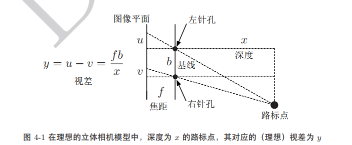

我们举一个例子详细说明：估计立体相机中路标点的位置。

双目相机中：估计深度
$$
y=u-v=\frac{fb}{x}+n
$$
其中，y为视差，x为深度，f为焦距，b为基线长度，n为测量噪声。

贝叶斯推断：
$$
p(x|y)=\frac{p(y|x)p(x)}{\int^{∞}_{-∞}p(y|x)p(x)dx}
$$
我们需要知道两个概率p(y|x),p(x)。为此，我们作两个假设：①测量噪声服从零均值高斯分布：
$$
p(y|x)=N(\frac{fb}{x},R)
$$
②假设先验也服从高斯分布：
$$
p(x)=N(\check x,\check P)
$$
我们对例子中的常量进行代数，并添加噪声绘制后验概率的分布曲线：

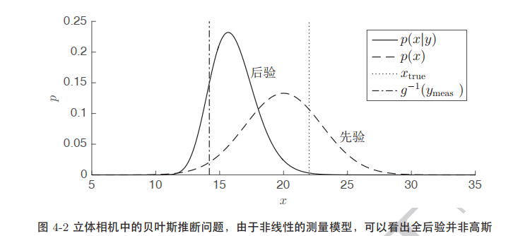

​	后验概率非对称，但由图可以看出其是单峰的，因此，**我们可以用高斯近似它**。

​	另外一点，在引入测量结果后，**得到的后验概率密度比先验更加集中**。这正式隐含在贝叶斯状态估计背后的主要思想：**测量与先验结合，得到更确定的后验状态**。

#### 4.1.1.1 贝叶斯框架

​	我们从给定的先验中，采样出“实际状态”（噪声），接着进行观测，添加噪声产生测量。

​	**贝叶斯估计是在不知道真实状态的情况下，从测量和先验构建出后验概率，即符合测量和先验的最大可能的状态。**

### 4.1.2 最大后验估计

还是上个双目相机的例子：

​	最大后验估计，即把后验概率最大化
$$
\hat x_{map}=argmax_x p(x|y)
$$
**等价最小化负对数**即可
$$
\hat x_{map}=argmax_x (-\ln(p(x|y))
$$
带入贝叶斯公式，由于分母与x无关（p(y)），因此可以不管
$$
\hat x_{map}=argmax_x (-\ln(p(y|x)-\ln(p(x)))
$$
双目相机例子：我们可以得到
$$
\hat x_{map}=argmin_xJ(x)\\
J(x)=\frac{1}{2R}(y-\frac{fb}{x})^2+\frac{1}{2\check P}(\check x-x)^2
$$

#### 4.1.2.1 估计的准确程度

​	由于MAP估计可以从给定数据和先验中找到最可能的状态xmap，那么，**MAP估计对xtrue估计的准确程度是多少？**
$$
e_{mean}(\hat x)=E_{XN}[\hat x-x_{true}]
$$
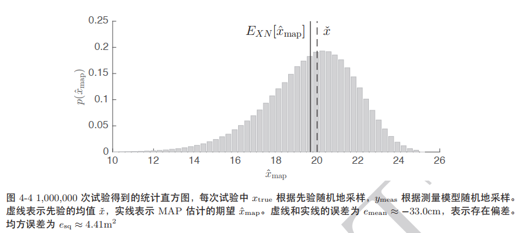

## 4.2 离散时间的递归估计

### 4.2.1 问题定义

​	和线性高斯系统一样，我们定义**运动方程**以及**观测方程**：
$$
运动方程：x_k=f(x_{k-1},v_k,w_k) ,k=1...K\\
观测方程：y_k=g(x_k,n_k),k=0...K
$$
其中，k为时间下标。函数f为非线性观测模型，函数g为非线性观测模型。**注意：没有假设任何随机变量是高斯的。**

​	图4-5展示了式4.14描述的系统随时间演变的图模型，这个系统具有**马尔可夫性**。

​	***马尔可夫性：当一个随机过程在给定现在状态及所有过去状态情况下，其未来的状态的条件概率分布仅依赖于当前状态。***

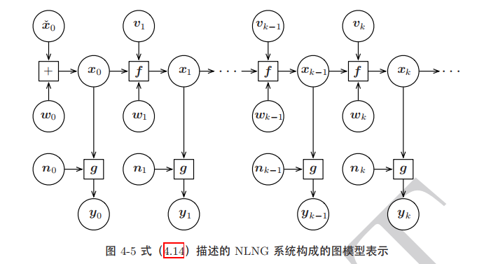

### 4.2.2 贝叶斯滤波

​	贝叶斯滤波仅使用过去以及当前的测量，构造一个完整的PDF来刻画当前状态。计算xk的**置信度(belief)**：
$$
p(x_k|\check x_0,v_{1:k},y_{0:k})
$$

在批量式线性高斯系统(LG)中，我们将其分解成：

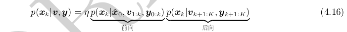

因此，在本节中，**我们将关注如何将“前向”部分转换成第归滤波器(对于非线性非高斯系统)**。

​	对于前向部分：由于所有观测都是独立的，可以将最新的观测分解出来：

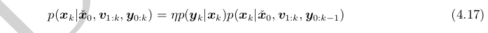

推导一下：？？？？？？？？？？？？？？？？？？？？？？？？？？？？？？？？？

这里使用了贝叶斯公式调整了依赖关系，而归一化常数使得公式满足全概率公理。**现在，我们在第二个因子中引入隐藏状态x k-1，并对其进行积分。**

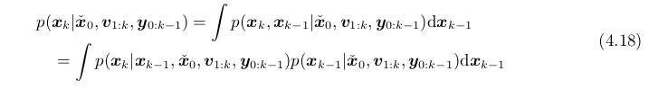

推导一下：？？？？？？？？？？？？？？？？？？？？？？？？？？？？？？？？？

隐藏状态的引入可以看作是边缘化的相反操作。**由于我们的系统具有马尔可夫性，因此可以写出：**

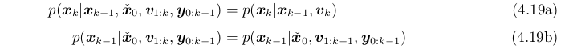

我们将式4.19和4.18带入4.17中，**得到贝叶斯滤波器：**

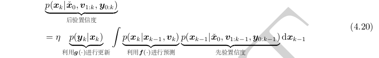

这里只考虑了批量估计中的前向，**具有预测——校正的形式**。预测阶段，先验置信度通过输入vk和运动模型f()在时间上向前传播。校正阶段，则通过观测yk和测量模型g()来更新预测估计状态，并得到后验置信度。下图展示了贝叶斯滤波器中的信息流向。**该图的要点是，我们需要掌握通过非线性函数f 和 g来传递PDF的方法(作用于函数后，概率分布可能发生变化)。**

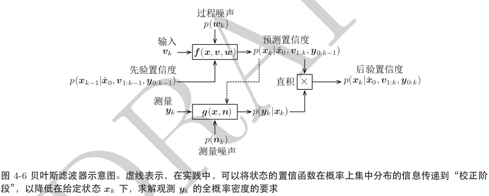

#### 4.2.2.1 贝叶斯滤波的局限性

​	贝叶斯滤波器现实中一般不能实现，主要原因两个：

1. 概率密度函数存在于无限维的空间中

### 4.2.3 EKF 扩展卡尔曼滤波

​	为了推导EKF，我们首先将xk的置信度函数限制为高斯分布：
$$
p(x_k|\check x_0,v_{1:k},y_{0:k})=N(\hat x_k,\hat P_k)
$$
我们假设噪声wk和nk也是服从高斯分布的：
$$
输入噪声:w_k =N(0,Q_k) \\
测量噪声:n_k=N(0,R_k)\\
$$

**注意：高斯PDF通过非线性函数转换后，可能成为非高斯的。**其在非线性函数映射后不一定是以加法的形式存在，例如：
$$
x_k=f(x_{k-1},v_{k})+w_k\\
y_k=g(x_k)+n_k
$$
而是如下式：
$$
运动方程：x_k=f(x_{k-1},v_k,w_k) ,k=1...K\\
观测方程：y_k=g(x_k,n_k),k=0...K
$$
**加法形式存在是乘法形式的特殊情况。**我们可以通过线性化将其恢复为加性噪声的形式。

​	由于函数g和f的非线性，我们需要**将其线性化**。我们在当前状态估计的均值处展开，对运动和观测模型进行线性化：
$$
x_k=f(x_{k-1},v_k,w_k)≈\check x_k+F_{k-1}(x_{k-1}-\hat x_{k-1})+w_k'\\
y_k=g(x_k,n_k)≈\check y_k+G_{k}(x_{k}-\check x_{k})+w_k'\\
$$
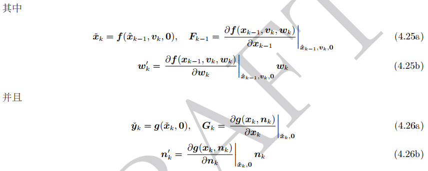

上式推导：
$$
泰勒公式。式4.25中，展开点为\hat x_{k-1},因为预测方程将上时刻\\
估计的状态变为当前时刻的先验\check x_k。\\
式4.26中，观测方程是当前时刻的观测，用于与先验\check x_k融合,\\
进而得到当前状态的最优估计\hat x_k，因此展开点为\check x_k
$$
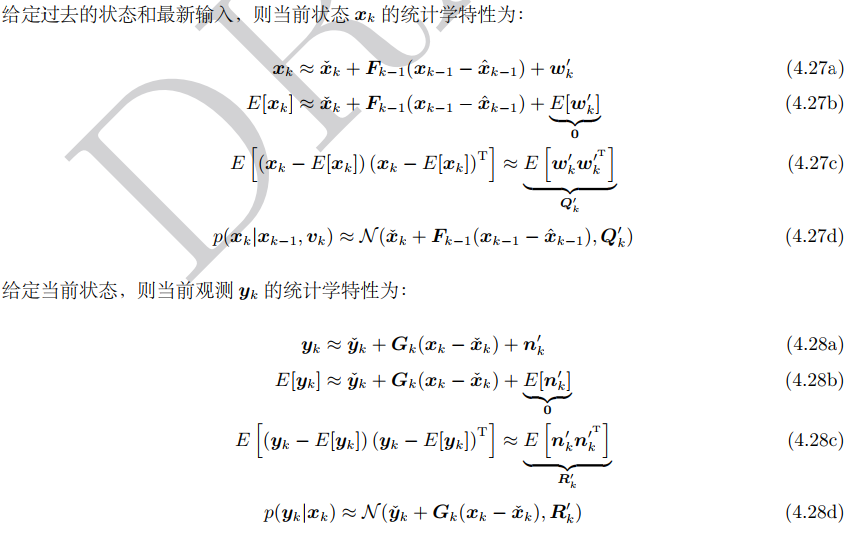

将上面的等式带入贝叶斯滤波：

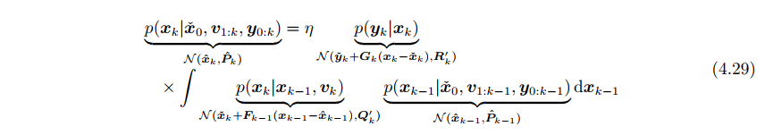

利用式2.90？？？？？？？？？？？？？将服从高斯分布的变量传入非线性函数中，可以看到积分仍是高斯的：

现剩下两个高斯PDF的归一化积，应用式2.70？？？？？？？？？？？？？可以得到：

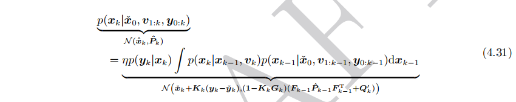

**直接给出EKF结论：**

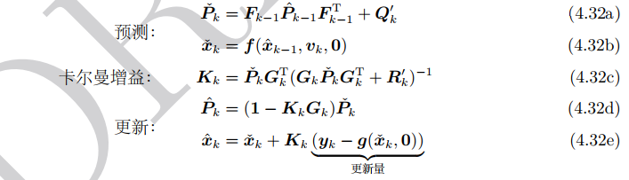

其中，Qk和Rk包含了雅可比矩阵。

​	需要注意的是， EKF 并不能保证在⼀般的⾮线性系统中能够充分地发挥作⽤。为了评估 EKF 在特定⾮线性系统上的性能，通常只能做⼀些简单的尝试。 **EKF 的主要问题在于，其线性化的⼯作点是估计状态的均值**，⽽不是真实状态。这⼀点微⼩的差异可能导致 EKF 在某些情况下快速地发散。有时EKF 的估计虽然没有明显异常，但常常是有偏差或不一致的，更经常是两者都有。

### 4.2.4 广义高斯滤波

​	广义高斯滤波的推导与利用贝叶斯推断推导卡尔曼滤波器时，就用到了这种方法。这里不在讲述，剩下一部分内容手写推导一下？？？？？？？？？？？？？？？？？

​	最终得到的广义高斯滤波校正方程中，有一些变量不能求得，因为高斯PDF带入非线性函数中通常成为非高斯的。因此这时候需要对其进行近似。

### 4.2.5 迭代扩展卡尔曼滤波

​	迭代扩展卡尔曼滤波IEKF的推导：

首先，预测步骤（f()）与EKF中基本相同，现在看**校正步骤(测量校正)**

**非线性观测模型yk**
$$
y_k=g(x_k,n_k)
$$
对其任意一个点线性化：
$$
g(x_k,n_k)\approx y_{op,k}+G_k(x_k-x_{op,k})+n_k'\\=g(x_{op,k},0)+\frac{\part g}{\part x_{k}}|_{x_{op,k,0}}(x_k-x_{op,k})+\frac{\part g}{\part n_k}|_{x_{op,k,0}}(n_k-0)
$$
根据4.2.4中的广义高斯滤波结论，（由于广义高斯滤波中一些变量由于非线性原因不能求出，因此我们在IEKF中进行线性化后求出这些变量，进而推导出IEKF）。

​	**最终，我们得到IEKF增益以及校正方程**

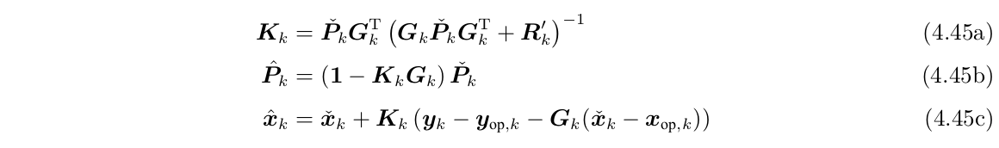

与EKF不同之处在于，线性化的点不同。**我们可以在第一次迭代中，将测量方程g的线性化点设置为先验xk，得到后验xk_hat后，再次迭代计算后验，会得到更好的结果。**退出条件可以设置为：xop_k改变的足够小时候终止。

### 4.2.6 从MAP角度看IEKF

​	一个重要问题：**EKF、IEKF与贝叶斯后验之间的关系是什么？**

​	用一张图表示一下：

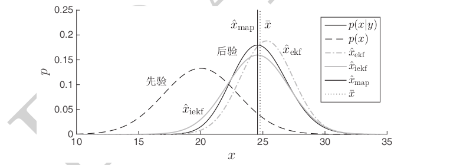

IEKF由于迭代，可以对应后验概率的极大值；而EKF可能偏离局部极大值。我们用立体相机接着举一个具体的例子：

#### 4.2.6.1 EKF与IEKF对比例子

这里争取写一个matlab程序理解这两个方案的优劣？？？？？？？？？？？？？？？？？？？？？？？？？？？？？？？？？？？？？？？？？？？？？？？？？？？？？？？？？？？？？？？？？？？？？？？？

### 4.2.7 其他将PDF传入非线性函数的方法

​	在EKF和IEKF中，我们使用一种特殊的方法将PDF传递进非线性函数中。具体来说，**在非线性模型的工作点处进行线性化，然后通过解析的线性化模型传递高斯PDF。**这一章节中，我们用一些其他方法：**蒙特卡洛方法(暴力的)，线性化方法(EKF)，sigmapoint或无迹(unscented)变换。**我们的动机是引入一些可以在贝叶斯滤波器框架中使用的方法，以获得EKF和IEKF的替代方案。

#### 4.2.7.1 蒙特卡罗方法

​	过程图如下图：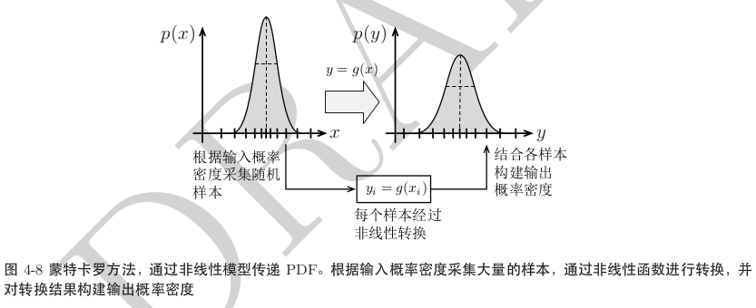

根据输入的概率密度采集大量样本，每个样本再通过非线性函数精确转换，最后从转换后的样本中构建输出概率密度(例如，通过计算矩来构建)。**大数定律确保了当样本数量接近无穷时，这种做法将会使结果收敛到正确的值。**

|                             优点                             |   缺点   |
| :----------------------------------------------------------: | :------: |
|              适用于任何PDF，而不仅仅是高斯分布               | 效率很低 |
|                 可以处理任何类型的非线性函数                 |          |
|                不需要知道非线性函数的数学形式                |          |
| 这是一个"任意时间"算法——通过调整采样点数量，可以很容易地在精度和速度上进行折中 |          |

*由于可以使用大量采样点来得到很高的精度,我们可以用蒙特卡罗法来衡量其它方法的性能。*

​	值得一提的是，**输出的概率密度均值，和输入均值通过非线性变换后的值，是不同的：**
$$
在区间[0,1]上均匀分布的随机变量x:p(x)=1\\
E(x)=\frac{1}{2}(b-a)=\frac{1}{2}\\
非线性函数：y=x^2\\
$$
则通过非线性函数后的均值为1/4，但是实际均值：
$$
\mu_y=\int_0^1p(x)x^2dx=\frac{1}{3}
$$
蒙特卡罗方法能够在有大量样本的情况下得到正确的解，但我们将看到，其他一部分方法不能。

#### 4.2.7.2 线性化方法

​	通过非线性函数传递高斯PDF最常见的方法是线性化。**严谨地说，均值实际上是通过非线性函数精确传递的，而协方差则是近似地是非线性函数的线性化**。

​	通常情况，线性化过程的工作点是PDF的均值，如下图所示：

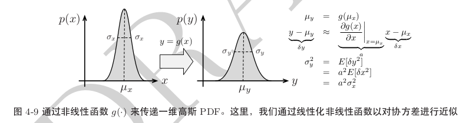

但这个过程并不准确，原因如下：

1. 通过非线性函数传递高斯PDF的结果不会是另一个高斯PDF。线性化方法仅仅保留了后验PDF的均值和协方差。
1. 通过线性化非线性函数来近似真实输出PDF的协方差
1. **线性化的工作点通常不是先验PDF的真实均值，而是我们对输入PDF的均值估计**。这也是引入误差的地方。
1. 通过简单地将PDF的均值经过非线性变换来逼近真实输出的PDF的均值。
1. 我们必须解析地，或者数值地计算非线性函数的雅可比矩阵（可能引入误差）。

​	优点显而易见，就是简单易懂且容易实现。若函数只是轻微的非线性，且输入为高斯的，那么结果会较为准确。

#### 4.2.7.3 sigmapoint变换

​	当输入概率密度大致为高斯时，sigmapoint法是蒙特卡罗方法与线性化方法的折中。下图展示了一维的sigmapoint变换：

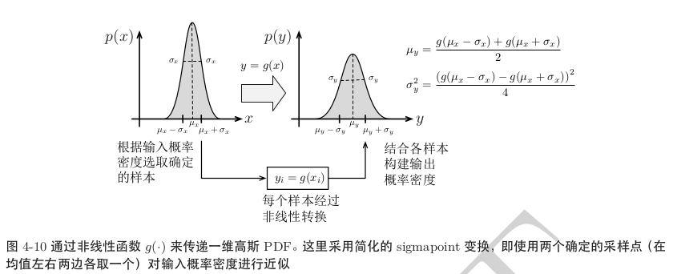

##### 具体步骤

(1)、根据输入概率密度计算出2L+1个sigmapoint:
$$
LL^T=\Sigma_{xx},(Cholesky分解，L为下三角矩阵)\\
x_0=\mu_x
x_i=\mu_x+\sqrt{L+k}col_iL\\
x_{i+L}=\mu_x-\sqrt{L+k}col_iL
$$
其中，
$$
L=dim(\mu_x)
$$
且：

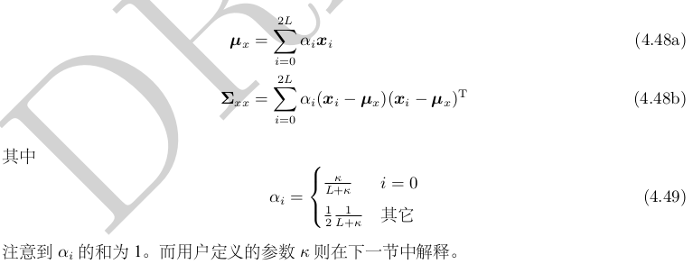

(2)把每个sigmapoint单独带入非线性函数g中：
$$
y_i=g(x_i)
$$
(3)输出概率的均值如下计算：
$$
\mu_y=\sum_{i=0}^{2L}\alpha_i y_i
$$
(4)输出概率的协方差如下计算：
$$
\Sigma_{yy}=\sum_{i=0}^{2L}\alpha_i(y_i-\mu_y)(y_i-\mu_y)^T
$$
(5)最终，得到输出概率密度：
$$
N(\mu_y,\Sigma_{yy})
$$
相比于线性化方法，该方法有很多优点：

1. 通过输入密度进行近似，可以不计算非线性函数的雅可比矩阵
2. 仅使用标准线性代数运算：Cholesky分解，外积，矩阵求和
3. 计算代价和线性化方法类似(当数值计算雅可比时)
4. 不要求非线性函数光滑可微。

#### 4.2.7.4 方案对比

### 4.2.8 粒子滤波

### 4.2.9 UKF 无迹卡尔曼滤波(sigmapoint KF)

### 4.2.10 迭代sigmapoint KF(ISPKF)

### 4.2.11 ISPKF与后验均值

### 4.2.12 滤波器分类

## 4.3 离散时间的批量估计问题

### 4.3.1 最大后验估计

### 4.3.2 贝叶斯推断

### 4.3.3 最大似然估计

## 4.4 连续时间的批量估计问题

