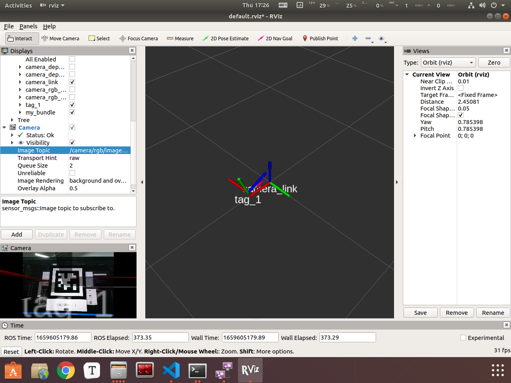
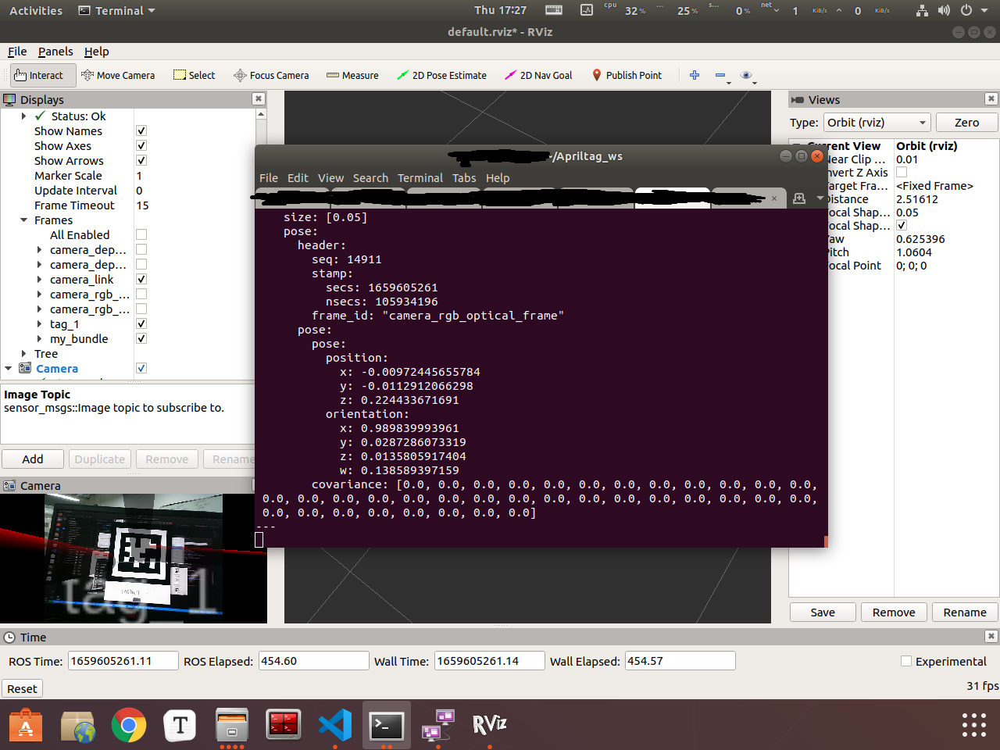
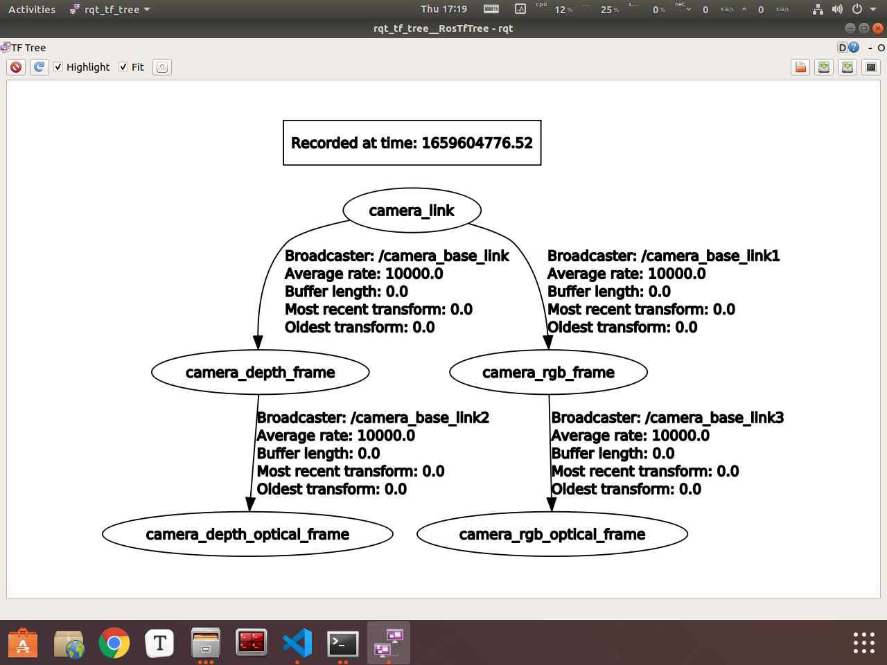

## Apriltag 识别

参考：[GitHub - AprilRobotics/apriltag_ros: A ROS wrapper of the AprilTag 3 visual fiducial detector](https://github.com/AprilRobotics/apriltag_ros)

### 1、Quick start

```sh
export ROS_DISTRO=melodic               # Set this to your distro, e.g. kinetic or melodic
source /opt/ros/$ROS_DISTRO/setup.bash  # Source your ROS distro 
mkdir -p ~/catkin_ws/src                # Make a new workspace 
cd ~/catkin_ws/src                      # Navigate to the source space
git clone https://github.com/AprilRobotics/apriltag.git      # Clone Apriltag library
git clone https://github.com/AprilRobotics/apriltag_ros.git  # Clone Apriltag ROS wrapper
cd ~/catkin_ws                          # Navigate to the workspace
rosdep install --from-paths src --ignore-src -r -y  # Install any missing packages
catkin build    # Build all packages in the workspace (catkin_make_isolated will work also)
```

需要下载两个功能包，之后使用catkin build进行编译。(catkin_make会不行)

建议将这两个功能包放在一个工作空间里面，与其他需要catkin_make编译的功能包分开。

*如果找不到catkin build命令，则执行下列语句安装：*

```sh
sudo apt-get install python-catkin-tools
```

### 2、二维码识别

#### a. 修改launch文件

​	在`apriltag_ros`功能包中，运行`continuous_detection.launch`文件，运行之前，我们要对话题名进行修改

```xml
<launch>
  <arg name="launch_prefix" default="" /> <!-- set to value="gdbserver localhost:10000" for remote debugging -->
  <arg name="node_namespace" default="apriltag_ros_continuous_node" />
  <arg name="camera_name" default="/camera/rgb" />
  <arg name="image_topic" default="image_raw" />

  <!-- Set parameters -->
  <rosparam command="load" file="~/Apriltag_ws/src/apriltag_ros/apriltag_ros/config/settings.yaml" ns="$(arg node_namespace)" />
  <rosparam command="load" file="~/Apriltag_ws/src/apriltag_ros/apriltag_ros/config/tags.yaml" ns="$(arg node_namespace)" />
  
  <node pkg="apriltag_ros" type="apriltag_ros_continuous_node" name="$(arg node_namespace)" clear_params="true" output="screen" launch-prefix="$(arg launch_prefix)" >
    <!-- Remap topics from those used in code to those on the ROS network -->
    <!-- <remap from="image_rect" to="$(arg camera_name)/$(arg image_topic)" />
    <remap from="camera_info" to="$(arg camera_name)/camera_info" /> -->
    <remap from="image_rect" to="/camera/rgb/image_raw" />
    <remap from="camera_info" to="/camera/rgb/camera_info" />
    <param name="publish_tag_detections_image" type="bool" value="true" />      <!-- default: false -->
  </node>
</launch>

```

在这里改：

```xml
    <remap from="image_rect" to="/camera/rgb/image_raw" />
    <remap from="camera_info" to="/camera/rgb/camera_info" />
```

#### b. 修改参数文件

​	`apriltag_ros/config`下，`settings.yaml`文件中，包括了一些想要识别的二维码的信息：

```yaml
# AprilTag 3 code parameters
# Find descriptions in apriltag/include/apriltag.h:struct apriltag_detector
#                      apriltag/include/apriltag.h:struct apriltag_family
tag_family:        'tag36h11' # options: tagStandard52h13, tagStandard41h12, tag36h11, tag25h9, tag16h5, tagCustom48h12, tagCircle21h7, tagCircle49h12
tag_threads:       2          # default: 2
tag_decimate:      1.0        # default: 1.0
tag_blur:          0.0        # default: 0.0
tag_refine_edges:  1          # default: 1
tag_debug:         0          # default: 0
max_hamming_dist:  2          # default: 2 (Tunable parameter with 2 being a good choice - values >=3 consume large amounts of memory. Choose the largest value possible.)
# Other parameters
publish_tf:        true       # default: false
transport_hint:    "raw"      # default: raw, see http://wiki.ros.org/image_transport#Known_Transport_Packages for options

```

tag_family 是想要识别的二维码家族，包括多种，根据需求选择即可。

​	`tags.yaml`文件中，包含了想要识别的二维码的**大小、id以及二维码集合(多个二维码一起)**。

```yaml
# 这个标签中至少要填入三个参数
standalone_tags:
  [
    {id: 1, size: 0.05},   # id 对应于生成标签的ID号，size对应标签的大小
    {id: 2, size: 0.05},
    {id: 22, size: 0.05},
    {id: 45, size: 0.05},
  
  ]
  #这个标签是根据大小和位置检测的
tag_bundles:
  [
    {
      name: 'my_bundle',
      layout:
        [
          {id: 10, size: 0.05, x: 0.0000, y: 0.0000, z: 0.0, qw: 1.0, qx: 0.0, qy: 0.0, qz: 0.0},                # id 对应于生成标签（二维码）的ID号，size对应标签的大小
          {id: 22, size: 0.05, x: 0.0000, y: 0.0000, z: 0.0, qw: 1.0, qx: 0.0, qy: 0.0, qz: 0.0},                # 我选用的是22和45号标签
           {id: 45, size: 0.05, x: 0.0000, y: 0.0000, z: 0.0, qw: 1.0, qx: 0.0, qy: 0.0, qz: 0.0},               # id 对应于生成标签（二维码）的ID号，size对应标签的大小
        ]
     } 
  ]
```

​	`standalone_tags`包括了想要识别的单个的二维码，如上述所示，**表示程序可以识别出id为1，2，22，45**的二维码，其大小为0.05m。

​	`tag_bundles`包括了想要识别的二维码集合。

​	这里是必须填的，不填不能识别。

### 3、二维码定位

运行：

```sh
roslaunch astra_camera astrapro.launch  #开启相机
roslaunch apriltag_ros continuous_detection.launch   #二维码识别
rviz									#rviz
```

定位信息在以下话题中：

```
rostopic echo /tag_detections
```

可以得到以下结果：



定位结果：



tf树信息：



​	注意：**得到的位姿是二维码在相机坐标系下的位姿，相机坐标系的信息在/xxx/xxx/camera_info中**。本例中，参考坐标系为：**camera_rgb_optical_frame**


