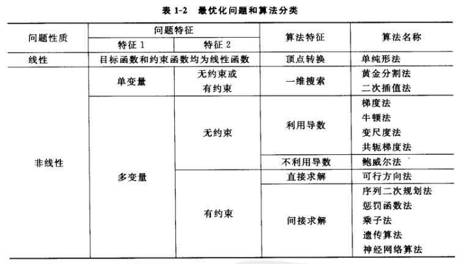

[TOC]

# 最优化问题的数学模型

## 1.1 线性规划问题的数学模型

### 1.1.1 概述

​	一般来说，数学模型由**目标函数(objective function)**、**变量(variables)**和**约束函数(constraint functions)**组成。
​	变量可以分为**自变量和因变量(independent and dependent)**。 它们也可以分为**连续变量和离散变量(continuous and discrete)**。 在模型的制定过程中，只考虑自变量。
​	对于具有许多变量的复杂问题，首先将不太重要的变量视为常数。 在制定简化模型并解决问题后，可以将这些变量作为变量处理，以提高最终解决方案的准确性。

​	大多数优化方法和算法仅适用于连续变量。 对于涉及离散变量的问题，一般的做法是假设这些变量是连续的，然后用优化方法解决问题。 最后对最优解进行离散化，得到问题的最终解。

### 1.1.2 线性规划问题的数学形式

#### 1.1.2.1 一些概念

- **域(Domain)**：分配给函数的自变量的一组值。假设有n个变量x1，x2，...，xn，则可以形成一个n维实空间，称为欧几里得空间，记为Rn。
- **约束(Constraints)**：也称为约束函数。 对于变量向量 X=[x1, x2,, xn]^T，有以下不等式或等式：

$$
g_u(X) ≤ 0 (u = 1, 2, ··· , p)\\
h_v(X) = 0 (v = 1, 2, ··· , m)
\\称为约束函数。
$$

- **可行区域(Feasible Region)**：由多个约束边界包围的区域。 该区域中的所有点都满足所有约束函数。
- **目标函数(Objective function)**：是评估优化过程的量化标准。 在本课程中，仅讨论单一目标的优化问题。
- **函数的轮廓(Contours)**：函数具有恒定值的一组点。 等高线明确显示了函数值的变化，可用于确定问题的最佳解决方案。

#### 1.1.2.2 标准形式

我们直接使用矩阵形式表示**标准形式**
$$
minS = \boldsymbol{CX} \\ 
s.t.
\left\{
\begin{aligned}
\boldsymbol{AX = b}\\
\boldsymbol{X≥0}
\end{aligned}
\right.
$$

## 1.2 最优化问题的下降迭代法

### 1.2.1 下降迭代法的基本格式

​	在最优化方法中，迭代点的产生一般采用以下形式：
$$
X=X^k+\alpha S^k
$$
其中，**Sk称为搜索方向，α称为步长因子**。

### 1.2.2 算法的收敛性与终止准则

#### 1.2.2.1 算法的收敛性

##### a.收敛性定义：

​	当迭代算法产生的点列所对应的函数值严格**单调递减**，并且**最终收敛于最优化问题的极小点**时，称此迭代算法具有**收敛性**。

##### b.收敛速度定义：

​	最优化算法的收敛速度定义为：
$$
对于与迭代次数无关的常数\sigma \in (0,1)，如果存在数\beta ≥1,使得：\\
\lim_{k->∞}\frac{||X^{k+1}-X^*||}{||X^k-X^*||^{\beta}}=\sigma
$$

1. 当β=1时，称算法具有线性收敛性（线性收敛速度）
2. 当1<β<2时，称算法具有超线性收敛性
3. 当β=2时，称算法具有二次收敛性

#### 1.2.2.2 算法终止准则

常用的终止准则有以下三种

1. **点距准则**：当相邻迭代点间的距离充分小，并且小于给定的收敛精度ε>0，即有：
   $$
   ||X^{k+1}-X^k||≤\epsilon
   $$
   时，便可认为Xk+1为最优解，终止迭代。

2. **值差准则**：在迭代点向极小点逼近的过程中，不仅相邻迭代点间的距离逐渐缩短，而且它们的函数值也越来越近。**因此，可将相邻迭代点的函数值之差作为判断准则**
   $$
   对于充分小的正数\epsilon，如果：\\
   |f(X^k)-f(X^{k+1})|≤\epsilon\\
   或者：\\
   |\frac{f(X^k)-f(X^{k+1})}{f(X^k)}|
   $$

3. **梯度准则：**梯度的模小于给定精度的点就是函数近似最优点：
   $$
   ||J(X^{k+1})||≤\epsilon
   $$
   

### 1.2.3 最优化算法分类

