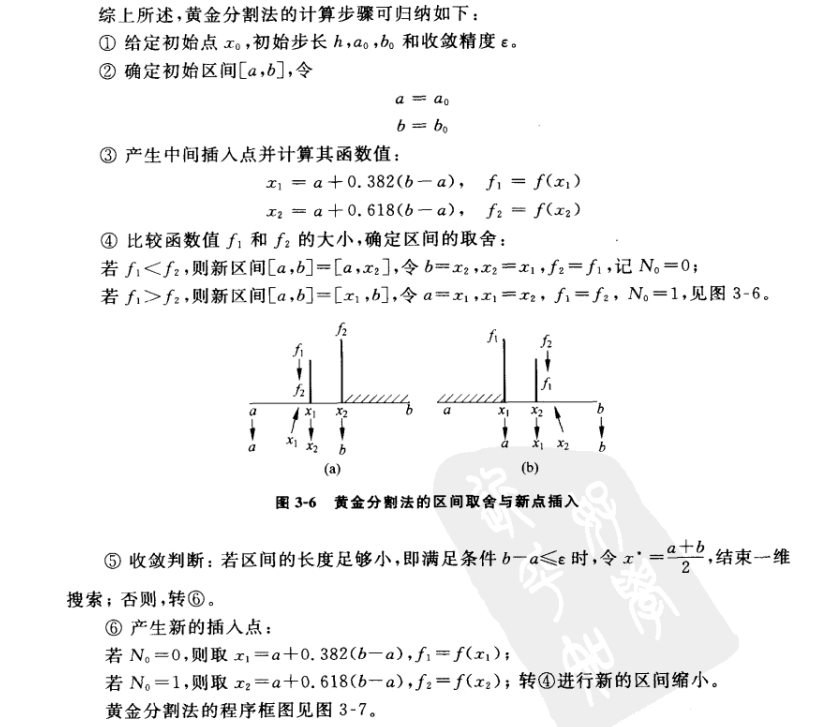

[TOC]


# 三、一维搜索

## 3.1 确定初始区间

### 3.1.1 极小点性质

​	设fx在考察去加内为一单谷函数，即区间内只存在一个极小点。**极小点左侧，函数单调下降；极小点右侧，函数单调上升**。若已知该区间内的相邻3个点x123，便可以通过比较这三个函数值的大小估计出极小点所在的方位，如下图所示：


### 3.1.2 确定初始区间的方法

​	可以在某一方向上按一定方式逐次产生一系列探测点，并比较这些点的大小，**找出“大——小——大”**规律变化的三个相邻点。


## 3.2 缩小区间

​	在区间[a , b]内，任选两个中间插入点x1和x2 (x1<x2)，并比较这两个点上的函数值：


**①若f(x1)<f(x2)，则最小值一定在[a , x2]内，则舍去区间[x2 , b]，新区间[a ,b(x2)]。**

**②若f(x1)>f(x2)，则最小值一定在[x1 , b]内，则舍去区间[a , x1]，新区间[a(x1) ,b]。**

## 3.3 黄金分割法与斐波那契法

### 3.3.1 黄金分割法


λ = 0.618




### 3.3.2 斐波那契法


## 3.4 二次插值法

​	又称作抛物线法，**它是以目标函数的二次插值函数的极小点作为新的中间插入点，进行区间缩小的一维搜索算法**。

​	在区间：[a , c ,b] (大——小——大)，用这三个点构造一个二次函数，**求得其最小值对应的点，作为新的插入点**。


总选取存在大小大的区间即可，慢慢缩小区间。


## 3.5 三次插值法

根据ppt：

1. 寻找初始区间：
   $$
   x_0已知，f(x_0)为目标函数x_0点的值，此处统一用G表示函数导数的值。因此G(x_0)含义已知。\\
   \alpha=min\{k,-2(f_0-f_e)/G_0\}=1 \ \ or \ \ 2
   $$
   我们选取α=2，现在要计算：
   $$
   \alpha=2\\
   f(x_0+\alpha)=f_{\alpha}\\
   G(x_0+\alpha)=G_{\alpha}\\
   if \ \ \begin{cases}true\quad \text if \ \ \  G_0<0且G_{\alpha}>0\\
   true\quad \text if \ \ \ G_{\alpha},G_0<0且f_0<f_{\alpha} \\
   false \quad\text{if otherwise}
   \end{cases} 
   $$
   true则区间可以，false则再取α来定区间

2. 计算中间变量
   $$
   z=\frac{3(f_0-f_{\alpha})}{\alpha}+G_0+G_{\alpha}\\
   w=\sqrt{z^2-G_0G_{\alpha}}\\
   \lambda_{m}=\frac{\alpha(w-G_0+z)}{G_{\alpha}-G_0+2w}\\
   \boldsymbol{\lambda_m+x_0}为新插入点(左端点值+\lambda_m)
   $$

3. 计算新插入点的一些值，判断如何缩小区间
   $$
   G(x_0+\lambda_m)=?\\
   f(x_0+\lambda_m)=?\\
   $$
   判断缩小区间方法和1中一样。
   $$
   x_1:=x_1\\
   x_0:=x_0+\lambda_m\\
   或者\\
   x_0:=x_0\\
   x_1:=x_0+\lambda_m
   \\具体情况根据1中策略缩小区间即可
   $$

4. 更新α，**α为区间长度。**
   $$
   \alpha=x_1-x_0
   $$

5. 计算一些值
   $$
   重新计算f(x_0+\alpha) ,G(x_0+\alpha)的值
   $$
   再计算中间变量z,w,λm。

6. 判断停止条件，如果可以停止，那终止算法。最优解：
   $$
   x^*=x_0+\lambda_m(即最后一次迭代的插入点)
   $$


## 3.6 一些例题

## 3.7 代码(matlab)

```matlab
clear;
clc;
close;
%%%%%%%%%%%%%%%%0.618法%%%%%%%%%%%%%%%%
%x1=3.4;
%x2=4.6;

x1=0;
x2=2;
err=1e-3;%error

while((x2-x1)>err)
    delta_x=x2-x1;          %区间长度
    tx1=x1+0.382*delta_x;   %中间点x1
    tx2=x1+0.618*delta_x;   %中间点x2
    
    %中间点对应的函数值
    ftx1=f(tx1);            
    ftx2=f(tx2);
    
    %缩小区间
    if(ftx1>ftx2)
        x1=tx1;
        
    else
        x2=tx2;
    end
end

%结果
x_final = (x2+x1)/2
y_val=f(x_final)

%%%%%%%%%%%%%%%%%斐波那契法%%%%%%%%%%%%%%%%%
%x1=3.4;
%x2=4.6;
x1=0;
x2=2;
%初始化斐波那契数列
F1=1;
F2=1;
Fn=F1+F2;
n=3;
Fibonacci=[F1,F2,Fn];

%构造斐波那契数列
while(Fn<((x2-x1)/err))
    F1=F2;
    F2=Fn;
    Fn=F1+F2;
    n=n+1;
    Fibonacci=[Fibonacci,Fn];
end

while(n-2>0)
    delta_x=x2-x1;%区间长度
    %中间点计算
    tx1=x1+Fibonacci(n-2)/Fibonacci(n)*delta_x;
    tx2=x1+Fibonacci(n-1)/Fibonacci(n)*delta_x;
    %中间点对应的函数值
    ftx1=f(tx1);
    ftx2=f(tx2);
    %缩小区间
    if(ftx1>ftx2)
        x1=tx1;
    else
        x2=tx2;
    end
    
    n=n-1;
end

%结果
x_final = (x2+x1)/2
y_val=f(x_final)

%%%%%%%%%%%%%%%%%%%%%二次插值法%%%%%%%%%%%%%%%%%%
%初始区间(x1,x3的函数值不要相等)
x1=0;
x2=1;
x3=2.1;
err=1e-3;

while(1)
    A=zeros(3,3);
    b=zeros(3,1);
    %y=a2*x^2+a1*x+a0
    %解的形式a=[a0,a1,a2]^T
    
    %构造系数矩阵A
    A(1,:)=[1,x1,x1^2];
    A(2,:)=[1,x2,x2^2];
    A(3,:)=[1,x3,x3^2];
    %构造b
    b(1)=f1(x1);
    b(2)=f1(x2);
    b(3)=f1(x3);
    %解方程
    a=inv(A)*b;
    %对称轴
    mid=-a(2)/(2*a(3));
    %对称轴对应的函数值
    fmid=f1(mid);
    
    %退出条件
    flag = (abs(mid-x2)<=err)&&(abs(fmid-f1(x2))<=err);
    if(flag)
        break;
    end
   
    %对应文档中的四幅图
    if(fmid>=f1(x2))
        if(mid>=x2)
            x3=mid;
        elseif(mid<x2)
            x1=mid;
        end
    elseif(fmid<f1(x2))
        if(mid>=x2)
            x1=x2;
            x2=mid;
        elseif(mid<x2)
            x3=x2;
            x2=mid;
        end
    end
end

%结果选取最小的
if(f1(mid)<f1(x2))
    x_final=mid
    y_val=f1(mid)
else
    x_final=x2
    y_val=f1(x2)    
end


%待求解的函数
function y=f(x)
    %y=sin(x)+cos(x);
    y=x^4-2*x^2-4*x+1;
end

function y=f1(x)
    y=x^4-2*x^2-4*x+1;
end

```

#### 结果


分别为**0.618法、斐波那契法和二次插值法**的结果。