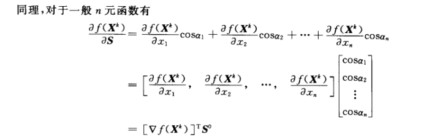
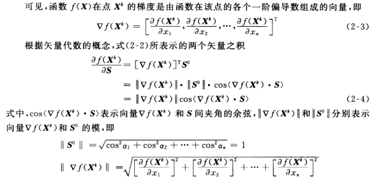
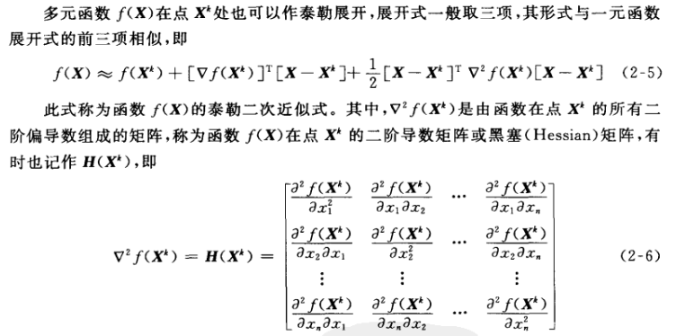

[TOC]

# 最优化设计的数学基础

## 2.1 向量与矩阵

## 2.2 方向导数与梯度

### 2.2.1 方向导数

### 2.2.2 梯度

#### 2.2.2.1 梯度特征

函数梯度具有以下特征：

1. 函数在一点的梯度是由函数在该点上的所有一阶偏导数组成的向量。**梯度的方向是该函数值上升最快的方向**，梯度的大小就是它的模。
2. 函数在一点的梯度方向与函数过该点的等值线(面)的切线(平面)相垂直
3. 梯度是函数在一点邻域内局部形态的描述。在邻域内上升快的方向，离开邻域后不一定上升得快，甚至可能下降。

## 2.3 函数的泰勒展开

## 2.4 正定二次函数

### 2.4.1 正定矩阵定义

对于任意非零向量X

1. 若有X^T HX>0 ，则称矩阵H是正定矩阵
2. 若有X^T HX<0，则称矩阵H是负定矩阵
3. 若符号不定，则称矩阵H是不定矩阵

