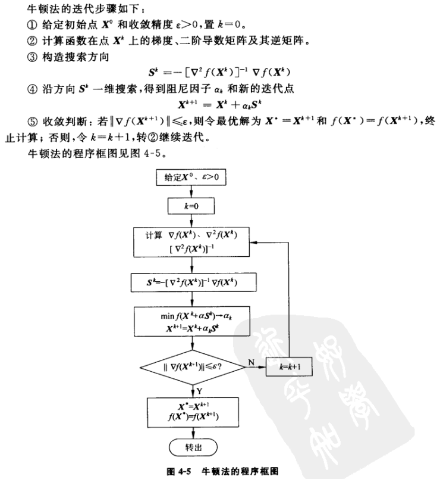
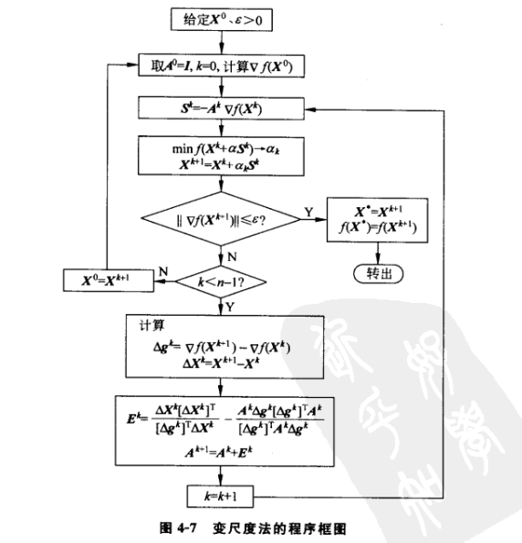

[TOC]

# 四、无约束最优化方法

## 4.1 梯度法（最速下降法）

**重点：函数沿梯度方向有最大变化率，证明见高等数学教材。（方向导数与梯度夹角）**

步骤：

①选取初始点

②计算梯度

③求最优步长，即在当前梯度方向上一维搜索即可。范围：当前点到梯度方向的x1，x2即可，初始点选取当前点，进行一维搜索求出λ

④迭代直至满足条件。
$$
X_{k+1}=X_k+λ_kP_k=X_k-λ_k▽f(X_k)
$$
**最速下降法应用于二次函数：**

根据上述描述，二次函数表述为：
$$
f(X)=\frac{1}{2}X^TQX+b^T+C
$$
求梯度，根据矩阵求导法则：

\img\2.png)

可以得到梯度公式：
$$
▽f(X)=QX+b
$$
由单变量极值的必要条件：
$$
\frac{df(X_k+λP_k)}{dλ}=▽f(X_{k+1})^TP_k=0
$$
k+1点处梯度向量与前一次搜索方向正交。则为求出λ，计算Xk+1处的梯度
$$
g_{k+1}=QX_{k+1}+b=Q(X_k+λP_k)+b=g_k+λQP_k
$$
代入上式得：
$$
g_{k+1}^TP_k=g_k^TP_k+λP_k^TQP_k=0
$$
可求得λ的值：
$$
λ_k=-\frac{g_k^TP_k}{P_k^TQP_k}
$$
这样就可以按照公式一步一步迭代，非常方便。

## 4.2 牛顿法

### 4.2.1 基本牛顿法

**直接用Hesse矩阵**，但是对一些复杂函数很难求得Hesse矩阵（或者计算量极大）。

思路：泰勒展开二次函数，取其前三项，记为新函数m(X)，根据极值条件，m(X)极小值处的梯度必为0，则可求得迭代关系：
$$
X_{k+1}=X_k-G(X_k)^{-1}g(X_k)
$$
**其中，G为f(X)的Hesse矩阵，g(X)为f(X)的梯度。**

#### 推导：(在平板)

#### 缺点

1. Hessian矩阵的逆可能非常难求解。
2. 对于一般的非线性函数，牛顿法可能不能始终保持函数的下降性。

### 4.2.2 阻尼牛顿法

​	基本牛顿法的基础上引入步长因子和一维搜索加以解决，即令：
$$
K^k=-H^{-1}(K^k)J(X^k)\\
minf(X^k+\alpha S^k) \ ->a_k\\
X^{k+1}=X^k+\alpha_k S^k
$$

详细过程与框图如下：

### 4.2.3 拟牛顿法

不需要计算海瑟矩阵就可以通过逐步递推的方式逼近牛顿方向。

#### 4.2.3.1 坐标变换

#### 4.2.3.2 拟牛顿法(变尺度法)的基本原理

## 4.3 共轭梯度法

介绍：共轭梯度法克服了最速下降法的锯齿现象；从而既提高了收敛速度，又避免了牛顿法中有关Hesse矩阵的计算，非常厉害。

思想：虽然梯度下降法的每一步都是朝着局部最优的方向前进的，但是它在不同的迭代轮数中会选择非常近似的方向，说明这个方向的误差并没通过一次更新方向和步长更新完，在这个方向上还存在误差，因此参数更新的轨迹是锯齿状。**共轭梯度法的思想是，选择一个优化方向后，本次选择的步长能够将这个方向的误差更新完，在以后的优化更新过程中不再需要朝这个方向更新了。由于每次将一个方向优化到了极小，后面的优化过程将不再影响之前优化方向上的极小值，所以理论上对N维问题求极小只用对N个方向都求出极小就行了。**

### 4.3.1 共轭方向定义及其性质

**定义：共轭方向：设Q是n阶对称正定矩阵，若向量组p1,p2,...,pm满足**
$$
p_i^TQp_j\begin{cases}
=0,i≠j\\
≠0,i=j
\end{cases}
$$
**则称该向量组P Q共轭(Q正交)**

可见，当Q=I时，上式就是通常的正交条件

**定理：共轭方向性质：设向量组P对于对称正定矩阵Q共轭，则向量组P线性无关。**

**定理：共轭梯度法：设向量组P对于对称正定矩阵Q共轭，则从任意一点X1出发，依次经过p1，p2，...，pn为搜索方向的下属算法，经n次一维搜索收敛于二次函数的最优解X**
$$
\begin{cases}
minf(X_k+λp_k)=f(X_k+λ_kp_k)\\
X_{k+1}=X_k+λ_kp_k
\end{cases}
$$
现在推导其求解二次函数的迭代公式。

### 4.3.2 共轭梯度法求解二次函数最优解

先从初始点取该点负梯度方向为搜索方向，做一维搜索得到X2。从新点求搜索方向，根据共轭条件即可。

步骤：

①初始点X1，以初始方向P1=-g1，一维搜索得到X2
$$
X_2=X_1+λ_1P_1
$$
②计算第二个方向P2，通过共轭条件可解出

取第二个方向：
$$
P_2=-g_2+β_1P_1
$$
共轭条件：
$$
P_2^TQP_1=(-g_2+β_1P_1)^TQP_1=0
$$
解出β1
$$
β_1=\frac{g_2^TQP_1}{P_1^TQP_1}
$$
③确定了P2后，从X2按照P2方向一维搜索得到λ2
$$
X_3=X_2+λ_2P_2
$$
④重复上述步骤n次(二次函数2次即可)

