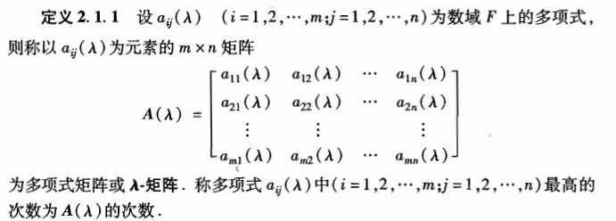
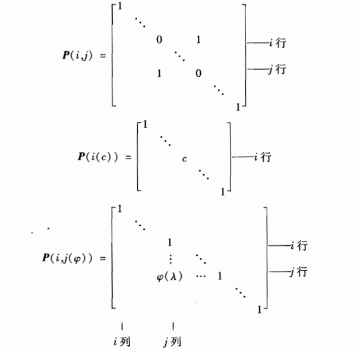

# λ-矩阵与矩阵的Jordan标准型

[TOC]

## 2.1 λ-矩阵及标准型

### 2.1.1 λ-矩阵的基本概念

介绍基本概念以及基本定理。

##### a.定义（λ-矩阵）：

*数字矩阵和特征矩阵 λE-A都是λ-矩阵的特例。一般情况下，λ-矩阵的行列式是λ的一个多项式。*

##### b.定义（λ矩阵的秩）：

（类似数字矩阵的秩）如果λ-矩阵A(λ)中有一个r(≥1)阶子事不为零，而所有r+1阶子式全为零，则称A(λ)的秩为r，rankA(λ)=r

##### c.定义（λ矩阵的逆）：

一个n阶λ-矩阵称为可逆的，如果有一个n阶λ-矩阵B(λ)，满足
$$
A(λ)B(λ)=B(λ)A(λ)=E
$$
这里E是n阶单位矩阵，B(λ)称为A(λ)的逆矩阵

##### 定理：（λ矩阵可逆条件）：

一个n阶λ-矩阵A(λ)可逆的充要条件是detA(λ)是一个非零的常数。

##### 定义：（λ-矩阵的初等变换）：

（1）矩阵的任意两行(列)互换位置

（2）非零常数c乘矩阵的某一行(列)

（3）矩阵的某一行（列）的φ(λ)倍加到另一行（列）上去，其中φ(λ)是λ的一个多项式

分别对应下面三个初等矩阵：

列变换右乘，行变换左乘即可。

##### 定义：（等价）

如果A(λ)经过有限次的初等变换后变成B(λ)，则称A(λ)与B(λ)等价。

**定理：（等价的充要条件）**

A(λ)与B(λ)等价的充分必要条件是存在两个可逆矩阵P(λ)与Q(λ)，使得
$$
B(\lambda)=P(\lambda)A(\lambda)Q(\lambda)
$$
λ矩阵等价关系满足：

①自反性：每一个λ矩阵与自己等价

②对称性：

③传递性：

### 2.1.2 λ-矩阵的Smith标准型

本节主要证明：任何一个λ矩阵等价于对角矩阵。

