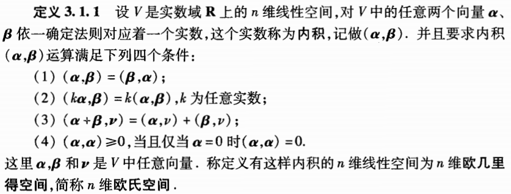
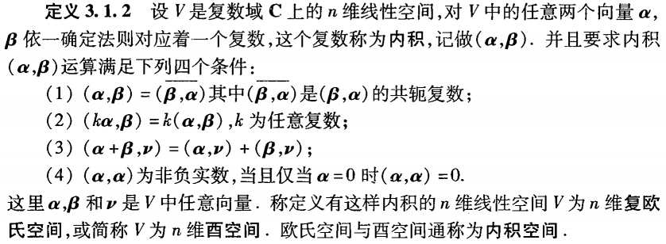
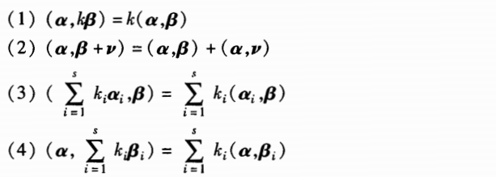
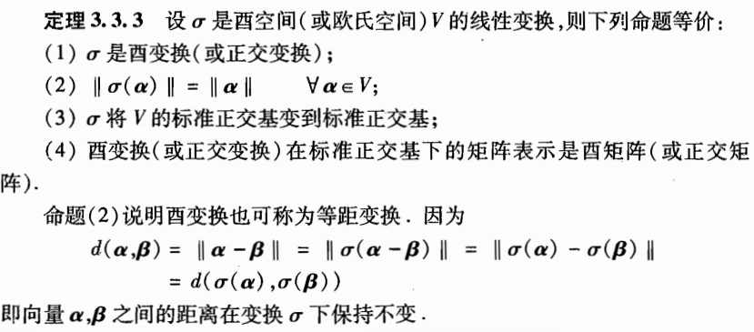

[TOC]

# 内积空间、正规矩阵、Hermite矩阵

## 一、欧氏空间

### 1.1 欧式空间、酉空间

#### 1.1.1 欧氏空间定义

#### 例题：

#### 1.1.2 酉空间定义

#### 1.1.3 复共轭转置矩阵

**定义：**设A是复数域上mxn阶矩阵，用barA表示以A的元素的共轭复数维元素组成的矩阵：
$$
A^H=(\bar A)^T
$$
A^H为A的复共轭转置矩阵。

#### 1.1.4 Hermite矩阵

$$
设A \in C^{n×n}，若A^H=A，则称A为Hermite矩阵\\
若A^H=-A,则称A为反Hermite矩阵。
$$

### 1.2 欧氏空间内积性质

根据定义，可以得到欧氏空间中内积的性质：

### 1.3 欧式空间的度量

#### 1.3.1 模长

**定义：**设V为欧式空间，向量α∈V的模长定义为：
$$
||\alpha||=\sqrt{(\alpha,\alpha)}
$$
**定理：**模长具有以下性质：

1. 

## 二、标准正交基、施密特正交化

### 2.1 正交矩阵

#### 2.1.1 正交矩阵定义

**定义1：**若n阶实矩阵A满足
$$
A^TA=AA^T=E
$$
**则称A是正交矩阵。**

#### 2.1.2 正交矩阵性质

$$
(1)A^{-1}=A^T也是正交矩阵\\
(2)detA=±1\\
(3)AB,BA\in E^{n×n}
$$

例如旋转矩阵就是正交矩阵。

#### 2.1.3 正交矩阵充要条件

​	**定理1：**矩阵A是正交矩阵的充要条件是A的n个行（列）向量是标准正交向量组。

### 2.2 正交变换

#### 2.2.1 正交变换定义

**定义：**设V是n维欧氏空间，若线性变换σ满足 任意α β∈V，都有
$$
(\sigma(\alpha),\sigma(\beta))=(\alpha,\beta)
$$
**则称，σ是V的正交变换。**

#### 2.2.2 有关正交变换几个定理

