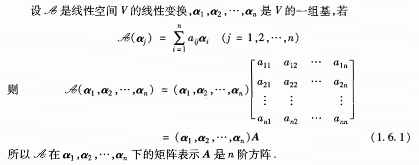
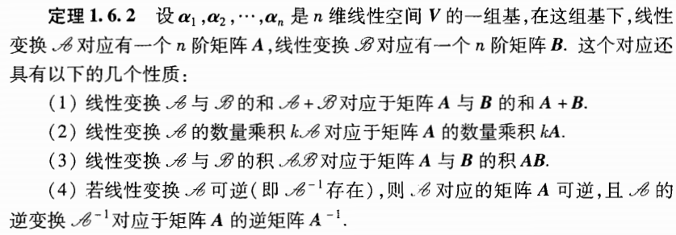
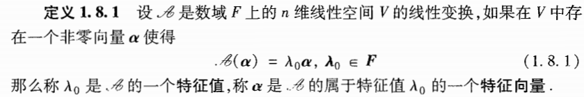
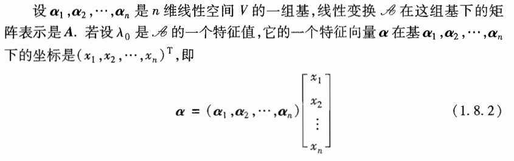
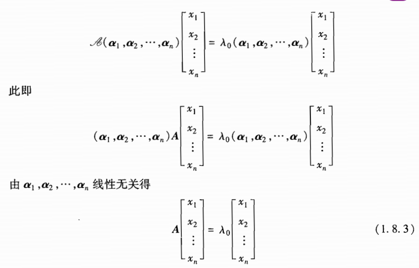
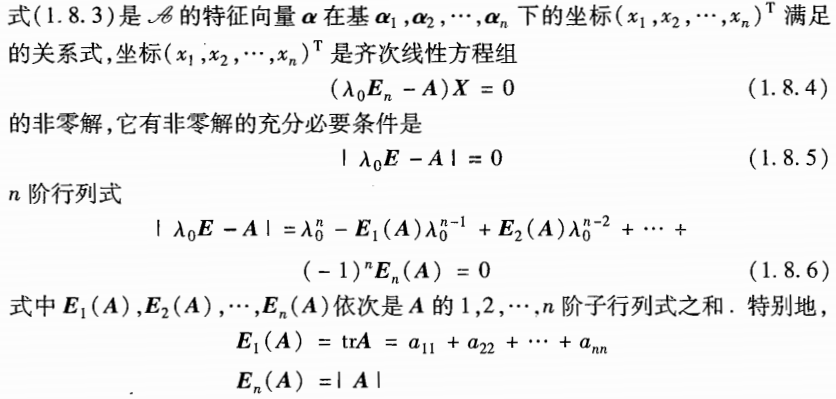
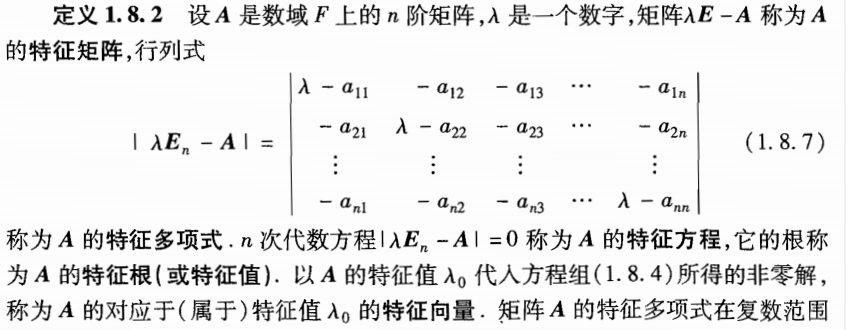

# 第一章：线性空间

[TOC]

## 一、线性空间的定义与简单性质

### 1.1 线性空间定义

​	**定义：设V是一个非空集合，P是一个数域。在集合V的元素之间定义了一种代数运算，叫做加法；这就是说，给出了一个法则，对于V中任意两个元素α与β，在V中都有唯一的一个元素γ与它们对应，称为α与β的和，记为γ=α+β。在数域P与集合V的元素之间还定义了一种运算，叫做数量乘法；这就是说，对于数域P中任一数k与V中任意元素α，在V中都有唯一的一个元素δ与它们对应，称为k与α的数量乘积，记为δ=kα。如果加法与数量乘法满足下述规则，则V称为数域P上的线性空间。**
$$
\alpha+\beta = \beta+\alpha\\
(\alpha+\beta)+\gamma=\alpha+(\beta+\gamma)\\
在V中有一个元素0，对于V中任意元素\alpha都有\\\\
0+\alpha=\alpha\\
对于V中每一个元素\alpha，都有V中的元素\beta，使得\\
\alpha+\beta=0
$$
​	**数量乘法满足：**
$$
1×\alpha=\alpha\\
k(l\alpha)=(kl)\alpha
$$
​	**数量乘法与加法满足：**
$$
(k+l)\alpha=k\alpha+l\alpha\\
k(\alpha+\beta)=k\alpha+k\beta
$$
​	以上条件中，k、l为数域P中任意数；α、β、γ为集合V中任意元素。

##### 线性空间例子：

​	n阶实方阵集合，我们有：
$$
R^{n×n}=\{A,B,C,...\}\\
满足：
\\
(1)加法交换律 \ \ A+B=B+A\\
(2)加法结合律 \ \ (A+B)+C=A+(B+C)\\
(3)存在零元 \ \ A+0=0+A=A\\
(4)存在负元 \ \ 存在-A 满足 -A+A=0\\
数乘矩阵运算具有以下性质：\\
(5) \ \ 1×A=A\\
(6) \ \ k(lA)=(kl)A\\
(7) \ \ (k+l)A=kA+lA\\
(8) \ \ k(A+B)=kA+kB
$$

### 1.2 向量的线性相关性

#### 线性组合

​	**定义：线性组合：**设V是数域F上的线性空间，a1,...,ar是V中一组向量，k1, ... , .kr 是数域F中一组数，若a可以表示成：
$$
\alpha = k_1\alpha_1+k_2\alpha_2+...+k_r\alpha_r
$$
则称α可由α1 , ... , αr **线性表示**；也称α 是 α1 , ... , αr的**线性组合**。

#### 线性相关

​	**定义(线性相关)：**设α1 ， ... ，αr ，是线性空间V中的一组向量。如果在数域F中有r个不全为零的数k1 , ... , kr，使得：
$$
k_1\alpha_1+k_2\alpha_2+...+k_r\alpha_r=0
$$
则称，α1 , ... , αr**线性相关**。

​	**定义(线性无关)：**若一组向量不线性相关，就称为线性无关。若
$$
k_1\alpha_1+k_2\alpha_2+...+k_r\alpha_r=0
$$
只有在ki = 0的情况下成立，那么向量组αi**线性无关**。

#### 有关定理

​	**定理：**设线性空间V中向量组α1 , ... , αm线性无关，且向量组αi , β线性相关，则β可由αi线性表出，且表出是唯一的。

​	证明：

 

## 二、维数、基、坐标

#### 定义：线性空间的维数

​	若在线性空间V中有n个线性无关的向量，但是没有更多数目的线性无关的向量，那么V就称为n维的；如果在V中可以找到任意多个线性无关的向量，那么V就称为无限维的

#### 定义：基：

​	在n维线性空间V中，n个线性无关的向量称为V的一组**基**。V中的任意一个向量都可以用基线性表出。

#### 定理1：线性空间中的一组基

​	如果在线性空间V中有n个线性无关的向量，且V中任一向量都可以用他们线性表出，那么V必是n维的，而这一组向量就是V的一组基。

#### 例子：用一个详细例子说明基和坐标

​	设线性空间V的一组基为：
$$
\alpha_1,\alpha_2,...,\alpha_n
$$
​	则一个向量β，可以表示为：
$$
\beta=k_1\alpha_1+k_2\alpha_2+...+k_n\alpha_n
$$
​	用矩阵表示（我们一般通常默认基的每一个向量都为列向量），则为
$$
\beta=(\alpha_1,\alpha_2,...,\alpha_n)
\begin{bmatrix}
k_1\\
k_2\\
...\\
k_n\\
\end{bmatrix}
$$
​	我们称k为β在基α下的坐标。

## 三、基变换与坐标变换

#### 3.1 基变换

​	同一个向量对不同基有不同坐标。现在来看，随着基的改变，向量的坐标是怎样变化的。

​	设λ和η是n维线性空间中的两组基，他们的关系是：
$$
\begin{cases}
η_1=a_{11}λ_1+a_{12}\lambda_2+...+a_{1n}\lambda_n\\
η_2=a_{21}λ_1+a_{22}\lambda_2+...+a_{2n}\lambda_n\\
..........\\
η_n=a_{n1}λ_1+a_{n2}\lambda_2+...+a_{nn}\lambda_n\\
\end{cases}
$$
​	设某一向量在这两组基下的坐标分别为：x和y。我们要找出x和y的关系。
$$
\alpha=\lambda x=ηy
$$
​	上式中，x和y为n×1向量，λ、η为n×n矩阵（基排成矩阵）。

​	由两个基的关系得：
$$
η=\lambda A
$$
​	其中：
$$
A=
\begin{bmatrix}
a_{11}&a_{21}&...&a_{n1}\\
a_{12}&a_{22}&...&a_{n2}\\
...&...&...&...\\
a_{1n}&a_{2n}&...&a_{nn}\\
\end{bmatrix}
$$
​	若约定基为行向量，则A将基的关系转置即可。不过定义过渡矩阵时，规定基为列向量。

​	**定义：过度矩阵，矩阵A称为由λ到η的过度矩阵，它是可逆的**

#### 3.2 坐标变换

## 四、线性子空间

### 4.1 子空间

​	**定义：数域P上线性空间V的一个非空子集和W称为V的一个线性子空间，如果W对V的两种运算也构成数域P上的线性空间**

​	首先，线性子空间也要满足线性空间的8个条件。由于V是线性空间，所以子空间只需要满足数乘封闭以及加法封闭即可。也就是，满足W对V的两种运算：

​	①如果W中包含向量α，那么W就一定同时包含数域P中的数k与α的数量乘积kα

​	②如果W中包含向量α和β，那么W就同时包含α+β。

​	注意：任意一个线性子空间的维数不能超过整个空间的维数。

### 4.2 生成子空间

​	生成子空间是子空间的特例

**定义：（生成子空间）**：
$$
设\alpha_1,...,\alpha_s是线性空间V中的一组向量，则集合：\\
span\{\alpha_1,...,\alpha_s\}=\{k_1\alpha_1+...+k_s\alpha_s|k_i\in F\}是非空集合\\
span\{\alpha_1,...,\alpha_s\}是V的线性子空间，且称其为：由向量\alpha_i生成的生成子空间。
$$
**定理：生成子空间的维度 与 生成其向量组的秩(极大线性无关组中向量的个数)相等。向量组α的任何一个极大线性无关组均可作为 生成子空间 的一个基。**

### 4.3 子空间的交、和

#### 交空间

​	设V1,V2是线性空间V的两个子空间，命
$$
V_3=V_1 ∩ V_2=\{\alpha |\alpha \in V_1 且\alpha\in V_2\}
$$
可以验证V3构成V的线性子空间，称V3为V1与V2的交空间。

#### 和空间

​	命
$$
V_1+V_2=\{\alpha=\alpha_1+\alpha_2|\alpha_1 \in V_1且\alpha_2 \in V_2\}
$$
可以验证：V1+V2构成V的线性子空间，V1+V2为V1与V2的和空间。

#### 有关两个生成子空间的和空间定理

$$
设V_1=span\{\alpha_1,...,\alpha_s\}\\
V_1=span\{\beta_1,...,\beta_l\}\\
则：\\
V_1+V_2=span\{\alpha_1,...,\alpha_s , \beta_1,...,\beta_l\}
$$

#### 维数公式

设V1与V2是线性空间V中的两个子空间，则：
$$
dimV_1+dimV_2=dim(V_1+V_2)+dim(V_1 ∩V_2)
$$

### 4.4 子空间的直和、补子空间

#### 子空间的直和

定义：设V1,V2是线性空间V的两个子空间，若V1∩V2 = {0}，则称V1与V2的空间V1+V2是直和，如下表示：
$$
V_1 \oplus V_2
$$
**定理：**设V1,V2是线性空间V的两个子空间，则下列命题等价：
$$
①V_1+V_2是直和\\
②dim(V_1+V_2)=dimV_1+dimV_2\\
③设\alpha_i是V_1的一组基，\beta_i是V_2的一组基，则\alpha_i与\beta_i是V_1+V_2的一组基
$$

##### 直和分解：

​	设W，W1 , W2是线性空间V的三个子空间，且有：
$$
W=W_1\oplus W_2
$$
则称W有一个直和分解。

## 五、线性映射

## 六、线性映射的值域和核

## 七、线性变换的矩阵与线性变换的运算

### 7.1 线性变换的矩阵表示

​	本节及以下几节的线性映射A都是指线性空间V到线性空间V的映射，**特称这样的A为线性空间V的线性变换。**由于线性变换是线性空间V到它自身的映射，所以只需要取V的一组基α1 ， ... ，αn即可。

#### 例题：

### 7.2 线性变换的运算

#### 乘积

设A、B是线性空间V的两个线性变换，定义他们的**乘积**AB危：
$$
AB(α)=A(B(\alpha)) , (\alpha \in V)
$$

#### 加法

$$
(A+B)(\alpha)=A(\alpha)+B(\alpha)
$$

#### 数量乘法

$$
(kA)(\alpha)=kA(\alpha)
$$

#### 可逆

$$
AB=BA=E
$$

#### 线性变换的矩阵

#### 例题：

## 八、线性同构

## 九、线性变换的特征值与特征向量

线性变换的特征值与特征向量是非常重要的概念。

### 9.1 线性变换的特征值与特征向量

#### 9.1.1 特征值与特征向量定义

从几何上看，变换前后的特征值向量仍然共线，即方向不变(λ0>0)，方向相反(λ0<0)，或变为零向量(λ0=0)。**线性变换A的作用是将α拉长缩短λ0倍，这个倍数λ0即为A的一个特征值。**

#### 9.1.2 特征值与特征向量的计算

我们对其进行线性变换

手动推导一下：？？？？？？？？？？？？？

#### 9.1.3 特征矩阵(特征值与特征向量求法)

#### 9.1.4 几个定理(特征值)

**定理1：相似矩阵有相同的特征值**

**定理2：**
$$
若\xi = (x_1,...,x_n)^T是n阶矩阵A的属于特征值λ的特征向量，\\
B=P^{-1}AP，则P^{-1}\xi是B的属于特征值λ的特征向量
$$

#### 9.1.5 例题

### 9.2 特征值、特征向量的性质

#### 9.2.1 特征子空间

​	**定义：**n阶方阵A有n个特征值，对于每个特征值可求得其对应的特征向量，这些特征向量加上零向量构成n维向量空间的一个子空间，称为**特征子空间**。

#### 9.2.2 几何、代数重复度

​	**定义：**设A是n阶方阵，它的r个互不相同的特征值为λ1，λ2，...，λr，对应的重根数分别为p1，p2，...，pr，**则称pi为λi的代数重复度。特征子空间Vλ的维数qi称为λi的几何重复度。**

#### 9.2.3 特征向量重要结论

​	**定理1：**设λ1 ,  ... , λr 是A的r个互不相同的特征值，αi是对应于λi的特征向量，则α1 , ... , αr 线性无关

​	**定理2：**设λ1 ,  ... , λr 是A的r个互不相同的特征值，qi是λi的几何重复度，αi1, ... , α iqi 是对应于λi的qi个线性无关的特征向量，则A的所有这些特征向量 αij 仍然线性无关。

​	**定理3：**矩阵A的任一特征值λi的几何重复度qi不大于它的代数重复度pi。

这里要加强记忆？？？？？？？？？？？？？？？？？？？

## 十、线性变换的不变子空间

## 十一、矩阵的相似对角形

​	线性变换理论要研究的一个主要问题是：对于n维线性空间V上的线性变换A，是否存在V的一个基使得A在这个基下的矩阵维对角矩阵。

#### 对角化定义

​	**定义：**数域F上的n维线性空间V的线性变换A**称为可对角化的**，如果V中存在一个基，使得A在这个基下的矩阵为对角矩阵。

​	**定义：**若n阶矩阵A与对角矩阵相似，**则称A可对角化**，**也称A是单纯矩阵**。

### 11.1 矩阵A可对角化条件

#### ※可对角化条件

**定理1：**n阶矩阵A可对角化的充要条件是A有n个线性无关的特征向量。

证明？？？？？？？？？？？？？？？？？？？？？？？

**定理2：**矩阵A可对角化的充要条件是A的每一个特征值的几何重复度等于代数重复度。

**推论：**若矩阵A的特征根全是单根，则A可对角化

### 11.2 可交换情况：AB=BA

通常来讲，矩阵乘法不可交换，但满足一定条件时，可交换。

#### 可交换条件

**定理1：**若A与B乘法可交换，则A的任何特征子空间都是B的不变子空间。

**定理2：**若A与B乘法可交换，则A的任何特征子空间中都有B的特征向量。

证明？？？？？？？？？？？？？？？？？

**推论1：**若A与B乘法可交换，则A与B必有公共的特征向量。

**推论2：**若A与B乘法可交换，λi是A的k个相异特征值，则A与B至少有k个线性无关的公共特征向量。

### 11.3 同时对角化

## 十二、课件英文关键词

#### CH1

初等矩阵

高斯消元

| 关键词            | 翻译               |
| :---------------- | ------------------ |
| Order of matrix   | 矩阵的阶数 例如mxn |
| Symmetric         | 对称的             |
| complex conjugate | 复共轭矩阵         |
| upper triangular  | 上三角             |
| retrieval         | 检索               |
| elementary matrix | 初等矩阵           |
| Row Echelon Form  | 行阶梯形式         |
| overdetermined    | 超定的(m>n)        |
| underdetermined   | 欠定的(m<n)        |
|                   |                    |
|                   |                    |
|                   |                    |

#### CH2

行列式定义

需要复习行列式性质

克莱姆法则 解齐次方程组

| 关键词            | 翻译       |
| ----------------- | ---------- |
| determinant       | 行列式     |
| parallelogram     | 平行四边形 |
| trivial subspaces | 平凡子空间 |
| intersection      | 集合的交   |
| direct sum        | 子空间直和 |
| span              | 生成       |
|                   |            |
|                   |            |
|                   |            |

#### CH3

线性空间、子空间、线性无关、基、坐标系、坐标变换。

