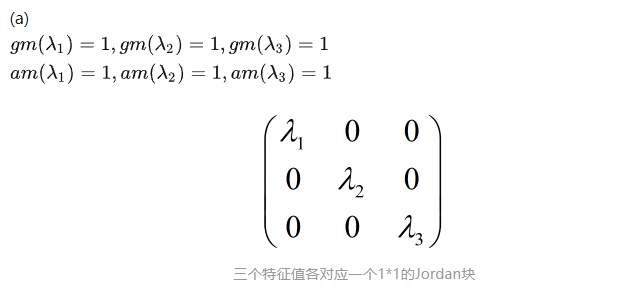
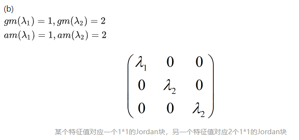
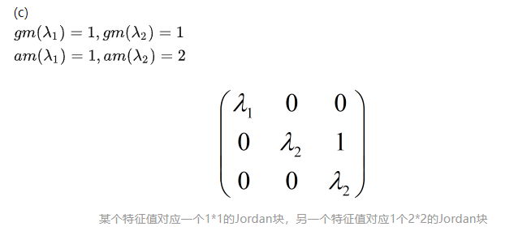
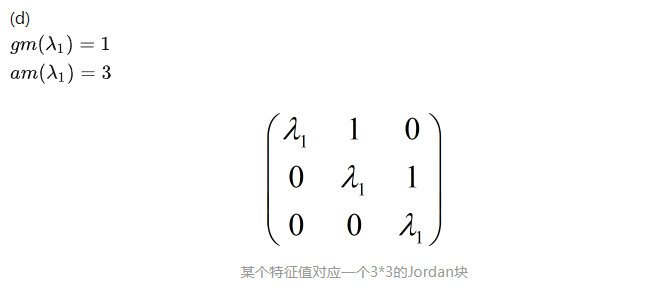
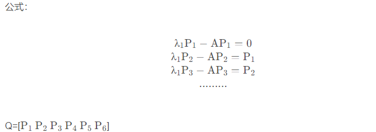

[TOC]

# 若尔当标准型

https://zhuanlan.zhihu.com/p/470026382

## 一、Jordan标准型的定义

### 1.1 若尔当块

$$
形式为：J(\lambda,t)=
\begin{bmatrix}
\lambda&1&...&0&0\\
0&\lambda&1&...&0\\
...&...&...&...&...\\
0&0&0&\lambda&1\\
0&0&0&0&\lambda
\end{bmatrix}_{t×t}
$$

的矩阵称为若尔当块。λ为复数，t为正实数，即若尔当块的维度。

### 1.2 若尔当标准型

由若干个若尔当块组成的准对角矩阵称为若尔当标准型：
$$
J=diag(J_1,...,J_i)
$$
其中Ji为若尔当块。

## 二、把矩阵转化为Jordan标准型

### 2.1 辅助知识

#### 2.1.1 代数重数与几何重数

#### 2.1.2 子空间的直和

#### 2.1.3 特征多项式和特征空间的变换不变性

### 2.2 化为Jordan标准型的条件

​	任意一个方阵A都可以化为Jordan标准型。
$$
P^{-1}AP=J
$$

### 2.3 三阶矩阵的Jordan标准型

四种情况

## 三、广义特征空间

### 3.1 广义特征空间定义

**定义：**
$$
设A为m×m矩阵。如果p≥1是一个整数，那么A的p重广义特征空间可以定义为：
\\
E^p_A(\lambda)=Nullsp((A-\lambda I)^p)=\{ \boldsymbol v \in C^m: (A-\lambda I)^p 
 \boldsymbol v= \boldsymbol 0 \}
$$
对应的广义特征空间的维度为：
$$
dimE^p_A(\lambda)=m-rank((A-\lambda I)^p)
$$

### 3.2 广义特征向量

#### **简易法求广义特征向量**

https://blog.csdn.net/qq_42017767/article/details/108937706

当几何重数<代数重数时，矩阵只能化为若尔当标准型，且变换矩阵P由广义特征向量组成。

## 四、例题

