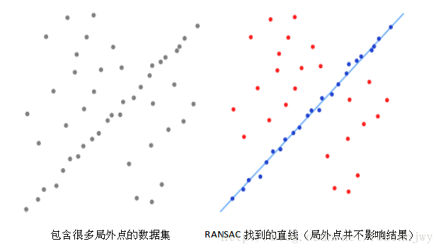

# RANSAC

https://blog.csdn.net/thequitesunshine007/article/details/120529830

## RANSAC算法概述

​	RANSAC是“RANdom SAmple Consensus（随机抽样一致）”的缩写。它可以从一组包含“局外点”的观测数据集中，通过迭代方式估计数学模型的参数。它是一种不确定的算法——它有一定的概率得出一个合理的结果；为了提高概率必须提高迭代次数。

## RANSAC算法拟合直线

​	通俗来讲，算法过程就是，**随机取两个点拟合出一个直线，然后看整体样本中每个点的误差。误差值超过一定阈值时认为是外点。通过多次迭代，找出包含内点最多的模型即可。**

​	**误差模型一般需要严格设定，不同尺度的误差可能会带来检测结果的不同。或者我们进行建模，消除误差中的尺度单位。**

​	这种方法拟合模型时，可以得到该模型的外点数量，若一个模型外点比例较多，那么认为测量值(点)误差大。比如在检测空间圆时，为了排除轮廓检测的误检测，可以用此方法滤除错误的轮廓检测(错误的轮廓检测包含非常多的外点)。

## RANSAC拟合空间圆

代码目前不进行公开。